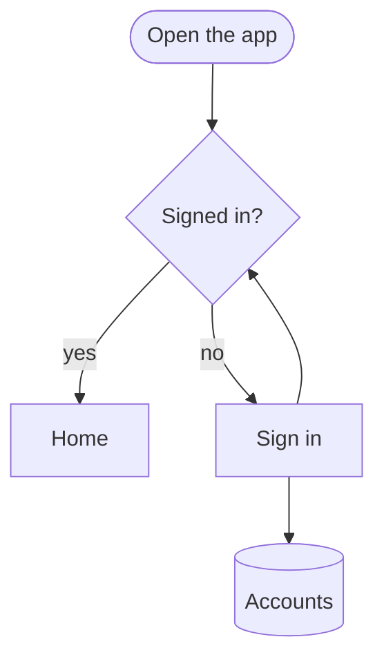

# 21 · Block diagrams — Ensemble diagram language

Agents are the primary authors. People edit lightly. The language is line-oriented on purpose: one statement per line, ids you can point at, and a shape named in words. A later step turns that text into a JSON document, lays the blocks out, and draws them. You never have to write the JSON.

The editor stores the text. Dragging, connecting, renaming, locking, and reorganizing write back through the printer, into the same language, with positions kept in a `layout` section at the bottom.

Minimum window for the editor: **1024 × 640** CSS pixels. Below that, Ensemble shows a short message instead of the canvas.

## Pipeline

```text
text  →  parse  →  model (JSON)  →  layout  →  render
```

1. **Parse.** Each line is read on its own. A line that cannot be read is reported with its line number and skipped. Every other line still applies.
2. **Model.** Version 1 document. Blocks, groups, lines, text boxes, and positions are maps keyed by stable ids (see [JSON model](#json-model)).
3. **Layout.** ELK layered layout, with crossing minimisation. Locked blocks keep their x,y. This runs in a web worker when the browser allows it.
4. **Render.** The Hub draws with React Flow. The same geometry (SVG paths and the 8 ports) lives in a DOM-free package, so another renderer can replace it.

`parseDiagram(text)` also accepts a Mermaid `flowchart` or `graph`. The editor then rewrites it as Ensemble text.

`src/diagnostics.test.ts` checks a 500-node input against a 250 ms CPU-time budget. Parallel-process preemption is not counted as parser work; browser/UI responsiveness is a separate measurement.

## One diagram

```udl
title Login flow
direction down

node start "Start" shape circle
node form "Enter login" shape parallelogram
node check "Valid?" shape diamond
node home "Dashboard" shape rounded
node err "Show error" shape rounded color red
node db "Users DB" shape cylinder

edge start > form
edge form > check
edge check > home : "yes"
edge check > err : "no"
edge err > form
edge form -- db : "lookup"
```

Rules of thumb:

- Quote every label.
- Give every block an id (`start`, `check`, `db`) and refer to that id from lines.
- Put the shape on the block, not on the line.
- Leave positions out until someone has dragged or pressed Reorganize. The printer adds a `layout` section.

## Grammar

```text
document   = { statement }
statement  = title | direction | curve | node | edge | group | text | layout | comment | blank

comment    = "#" rest-of-line | "//" rest-of-line
blank      = empty line

title      = "title" [":"] rest-of-line
direction  = ( "direction" | "dir" ) [":"] direction-name
direction-name
           = "down" | "up" | "left" | "right"
           | "tb" | "td" | "bt" | "lr" | "rl"
           | "top-down" | "bottom-up" | "left-right" | "right-left"

curve      = "curve" curve-name
curve-name = "straight" | "curved" | "elbow"

node       = ( "node" | "block" ) id quoted-label { property }
           | id quoted-label shape-marker
           | label shape-marker

edge       = [ "edge" | "connect" | "link" ] endpoint { arrow endpoint } [ ":" label ] [ "curve" curve-name ]
           | [ "edge" | "connect" | "link" ] endpoint arrow endpoint { "," endpoint } [ ":" label ] [ "curve" curve-name ]

group      = "group" id [quoted-label] ["locked"] "{" { statement } "}"
           | "group" id [quoted-label] ["locked"] newline
               indented statements

text       = ( "text" | "textbox" ) id quoted-label ["locked"]

layout     = "layout" [ "{" ] { layout-line } [ "}" ]
layout-line= id x y [width height] ["locked" | "pinned"]

id         = letter { letter | digit | "_" | "-" }
endpoint   = id-or-quoted-label [ "." port ]
arrow      = ">" | "->" | "=>" | "→" | "-->" | "~~>"
           | "--" | ".."
           | "<>" | "<->" | "<-->"
           | "<" | "<-" | "<--"
property   = "shape" shape | "color" color | "locked" | "pinned"
           | "(" [shape-list] | "[" [shape-list]
shape-list = value { "," value } [missing ")" or "]"]
shape-marker = property that names a shape
```

Keywords are case-insensitive. A colon right after a keyword is optional (`title: Login`). Comments are whole lines only, so a label may contain `#`.

Ids are the map keys. Matching is case-insensitive. If a line names a label instead of an id and two blocks share that label, the first one wins and the parser warns.

## Shapes

Fifteen shapes. The name on the right is what the printer writes.

| Write this | Means | Typical use |
|---|---|---|
| `rectangle`, `rect`, `box`, `square`, `process` | rectangle | a step, a service, a default block |
| `rounded`, `round`, `pill`, `stadium` | rounded | a screen or a softer step |
| `diamond`, `decision`, `choice`, `if`, `rhombus` | diamond | a question |
| `circle` | circle | start or end |
| `ellipse`, `oval` | ellipse | start or end when you want it wider |
| `cylinder`, `database`, `db`, `datastore`, `storage` | cylinder | a database or store |
| `server`, `rack` | server | a process or machine |
| `triangle`, `delta` | triangle | a merge or a marker |
| `parallelogram`, `io`, `input`, `output`, `data` | parallelogram | input or output |
| `document`, `doc`, `file` | document | a file or report |
| `cloud` | cloud | an external system or network |
| `actor`, `person`, `user`, `stick` | actor | a person |
| `hexagon`, `hex`, `prepare`, `preparation` | hexagon | preparation, or a firewall-style node |
| `note`, `sticky`, `comment` | note | a note stuck to the diagram |
| `trapezoid`, `trap`, `manual` | trapezoid | a manual step |

Unknown names become a rectangle, with a warning. A close miss (`dimond`) becomes the nearest shape, with a warning. Names shorter than 4 letters are not guessed, so `box` stays an alias and `red` stays a color.

Colors: `slate` (also `gray` / `grey`), `red`, `orange`, `amber` (also `yellow`), `green`, `teal`, `blue`, `indigo`, `purple` (also `violet`), `pink`. A `#rgb` or `#rrggbb` value is also kept. Anything else is ignored, with a warning.

Leave `color` off and the shape picks its own soft fill, with a stronger border and readable text. The same names are drawn lighter on a light canvas and deeper on a dark one. `color red` (or any name, or a hex) replaces that default.

| Shape | Default colour | Used for |
|---|---|---|
| rectangle, rounded, parallelogram | blue | a step or process |
| diamond, document, note | amber | a decision, or paper |
| circle, ellipse | green | a start or an end |
| cylinder | teal | a database or store |
| server | indigo | a service or machine |
| triangle, trapezoid | orange | a marker or a manual step |
| cloud | purple | an outside system |
| actor | pink | a person |
| hexagon | red | a gate or a check |

### Ports

Every shape has eight connection points on its outline:

`n` `ne` `e` `se` `s` `sw` `w` `nw`

Also accepted: `top`, `right`, `bottom`, `left`, `topright`, `topleft`, `bottomright`, `bottomleft`, and the compass words `north`, `south`, `east`, `west`, `northeast`, `northwest`, `southeast`, `southwest`.

```udl
title Query path
direction right

node api "API" shape server
node db "Users DB" shape cylinder

edge api.right > db.left : "query"
```

The printer writes the short names (`api.e`, `db.w`). If you leave the port off, the canvas picks the pair of outline points that are closest. That choice is not written back until you drag a connector from a specific point.

Rectangle points are the midpoints of the four sides and the four corners. Cylinder points sit on the top ellipse, the side of the body, and the bottom ellipse. A diamond's `ne` is the midpoint of the upper-right edge, not the corner of the bounding box. The other shapes follow the same rule: the point is on the stroke, not the box around it.

## Lines

| You write | Meaning |
|---|---|
| `edge a > b` | solid arrow into `b` |
| `edge a -> b` or `edge a => b` | same as `>` |
| `edge a --> b` | dashed arrow |
| `edge a -- b` | solid line, no arrow |
| `edge a .. b` | dashed line, no arrow |
| `edge a <> b` | arrow at both ends |
| `edge a <--> b` | dashed, both ends |
| `edge a < b` | arrow into `a` |
| `edge a > b : "yes"` | label on the line |
| `curve curved` | every line on this diagram is a curve, unless a line says otherwise |
| `edge a > b curve elbow` | this line turns at right angles |
| `edge a > b curve straight` | this line stays straight even when the diagram default is curved |

A chain `edge a > b > c` is two lines. The label, if you add one, belongs to the last hop. A fan `edge a > b, c` is two lines that share the label.

`curve` is `straight` (the default), `curved`, or `elbow`. Elbow is an orthogonal path: it leaves a port, turns at a right angle, and enters the other port. Put `curve` once at the top of the diagram, and again on a line only when that line should differ. The printer omits a line's curve when it matches the diagram.

```udl
title Curves
direction right
curve elbow

node api "API" shape server
node db "Users DB" shape cylinder
node cache "Cache" shape cylinder

edge api > db
edge api > cache curve curved : "optional"
```

Two lines between the same pair of blocks can still overlap. Prefer different blocks, or name different ports (`a.n > b.s` and `a.s > b.n`), when both directions matter.

## Groups

Groups are labeled frames. They can nest. Members are the blocks, text boxes, and groups written inside them.

Braces:

```udl
title Checkout
direction down

group edge "Edge" {
  node web "Web app" shape rounded
  node mobile "Mobile app" shape rounded
}
group backend "Backend" {
  group data "Data" {
    node db "Orders" shape cylinder
    node cache "Cache" shape cylinder
  }
  node api "API" shape server
}

edge web > api
edge mobile > api
edge api > db
edge api > cache
```

Or indentation, four spaces or a tab (a tab counts as two spaces). A less-indented line closes the open indented group. Braces close only with `}`.

```udl
title Indented group
direction down

group backend "Backend"
  node api "API" shape server
  node db "Orders" shape cylinder

node user "Customer" shape actor

edge user > api
edge api > db
```

Deleting a group on the canvas keeps its members and moves them up to the parent.

## Text boxes

A text box is not a shape. It is free text you can drag. It does not take connectors.

```udl
title Cutoff
direction down

node job "Nightly job" shape server
text caption "Runs at 02:00. Pages the on-call person if it fails."
```

`textbox` is the same keyword as `text`. The note *shape* (`shape note`) is a block with a folded corner. Use `text` when you only want words.

## Layout and locked blocks

Positions are not part of the story of the diagram. They live in `layout`, one block per line:

```text
layout
  id x y width height [locked]
```

`x` and `y` are the top-left of the block in CSS pixels. Reorganize rewrites this section.

**Fit vertically** lays the diagram top to bottom with tighter spacing and writes `direction down`. **Fit horizontally** lays it left to right and writes `direction right`. Both leave locked blocks where they are. Reorganize keeps the direction the diagram already has.

`locked` on a block, a text box, a group, or a layout line means Reorganize, Fit vertically, and Fit horizontally will not move it. A locked group also holds every member that already has a position. The first time something has no position, layout assigns one. After that, the lock keeps it.

Dragging a locked block on the canvas updates its saved position. The lock stops Reorganize, not your hand.

```udl
title Floor
direction right

node lobby "Lobby" shape rectangle locked
node desk "Desk" shape rectangle
node room "Room" shape rectangle

edge lobby > desk
edge desk > room

layout
  lobby 40 48 168 64 locked
  desk 280 48 168 64
  room 520 48 168 64
```

## What the parser forgives

These are warnings or skipped lines. They do not wipe the diagram.

1. One statement per line. Blank lines are ignored. A line whose first non-space characters are `#` or `//` is a comment.
2. A line that is not a statement is an **error**, named with its line number, and skipped. Blocks and lines around it still exist.
3. A missing `)`, `]`, or closing quote is a **warning**. The statement is still used.
4. A missing `:` before a line label is a **warning**. The leftover words become the label.
5. Shape and color names ignore case, spaces, and underscores. The alias table above is exact and does not warn.
6. A shape within two single-character edits of a known name (and at least 4 letters long) is a **warning**, and that shape is used. Otherwise the block is a rectangle and the parser warns.
7. An unknown color is a **warning** and the block keeps the default color.
8. An endpoint that was never declared creates a rectangle and warns. Prefer declaring blocks yourself so the shape is right.
9. Declaring the same id twice warns. The later line wins.
10. Keywords may be uppercase. `block`, `connect`, and `link` mean `node` and `edge`. `pinned` means `locked`.
11. A `}` with no group, or a layout row for an unknown id, is reported and skipped.
12. If the first real line is `flowchart` or `graph`, the whole text is read as Mermaid. Style, class, and click lines in Mermaid warn and are ignored.

```udl-loose
title Loose reading
direction down

node start "Start" (circle
node choice "Valid?" shape dimond
edge start > choice yes
edge choice > "Dashboard"
```

The broken line in the middle does not remove the blocks around it:

```udl-broken
title Still here
direction down

node start "Start" shape circle
this line is nonsense !!!
node next "Next" shape rectangle

edge start > next
```

## Mermaid import

A flowchart copied from Mermaid is accepted as-is. After import, Save writes Ensemble text (ids, `shape` words, `edge` lines). Supported piece of Mermaid:

- Header `flowchart` or `graph`, with `TD`, `TB`, `BT`, `LR`, `RL`.
- Shapes: `[rect]`, `(rounded)`, `([stadium])`, `[[subroutine]]`, `[(cylinder)]`, `((circle))`, `{diamond}`, `{{hexagon}}`, `[/parallelogram/]`, `[\parallelogram\]`, `[/trapezoid\]`, `[\trapezoid/]`, `>triangle]`.
- Arrows: `-->`, `---|label|`, `-->|label|`, `-- text -->`, `---`, `-.->`, `==>`, `<-->`.
- `subgraph id [Label]` … `end`.



Other Mermaid diagram types (sequence, class, ER) are not this importer. Describe them with the statements above. The sequence-style example below is just blocks in a row.

## More examples

### System architecture

```udl
title Billing system
direction right

node user "Customer" shape actor
node web "Billing site" shape rounded
node gw "Gateway" shape hexagon

group platform "Platform" {
  node api "Billing API" shape server
  node pay "Payments" shape rectangle
  node db "Ledger" shape cylinder
  node bus "Events" shape parallelogram
}

node mail "Email provider" shape cloud

edge user > web
edge web > gw
edge gw > api
edge api > pay
edge api > db
edge api > bus
edge pay > mail : "receipt"
```

### Network

```udl
title Office network
direction right

node people "Staff" shape actor
node wifi "Wi-Fi" shape cloud
node fw "Firewall" shape hexagon
node sw "Core switch" shape rectangle
node app "App server" shape server
node db "Directory" shape cylinder
node wan "Internet" shape cloud

edge people > wifi
edge wifi > sw
edge sw > fw
edge fw > wan
edge sw > app
edge app > db
```

### Data pipeline

```udl
title Nightly warehouse
direction right

node src "App database" shape cylinder
node extract "Extract" shape parallelogram
node clean "Clean rows" shape rectangle
node check "Quality ok?" shape diamond
node warehouse "Warehouse" shape cylinder
node report "Daily report" shape document
node alert "Page on-call" shape note

edge src > extract : "snapshot"
edge extract > clean
edge clean > check
edge check > warehouse : "yes"
edge warehouse > report
edge check > alert : "no"
```

### Decision tree

```udl
title Refund
direction down

node ask "Refund asked" shape rectangle
node window "Inside 30 days?" shape diamond
node used "Item used?" shape diamond
node approve "Approve refund" shape rounded color green
node deny "Deny" shape rounded color red
node review "Manual review" shape note

edge ask > window
edge window > used : "yes"
edge window > deny : "no"
edge used > review : "yes"
edge used > approve : "no"
```

### Org chart

```udl
title Support team
direction down

node lead "Team lead" shape actor
node alex "Alex" shape actor
node blair "Blair" shape actor
node chen "Chen" shape actor

edge lead > alex
edge lead > blair
edge lead > chen
```

### Sequence-style flow

Straight lines only, so this is the order of messages, not a UML lifeline.

```udl
title Place an order
direction right

node user "Customer" shape actor
node shop "Shop" shape rounded
node pay "Payments" shape rectangle
node db "Orders" shape cylinder

edge user > shop : "place order"
edge shop > pay : "charge"
edge pay > shop : "approved"
edge shop > db : "save"
edge shop > user : "confirmation"
```

### Shapes on one diagram

```udl
title Shape key
direction right

node step "Step" shape rectangle
node screen "Screen" shape rounded
node ask "Ask" shape diamond
node begin "Begin" shape circle
node wide "Wide start" shape ellipse
node store "Store" shape cylinder
node host "Host" shape server
node mark "Mark" shape triangle
node io "Input" shape parallelogram
node file "File" shape document
node net "Network" shape cloud
node who "Person" shape actor
node prep "Prepare" shape hexagon
node sticky "Sticky" shape note
node hand "By hand" shape trapezoid

edge step > screen
edge screen > ask
edge ask > begin
edge begin > wide
edge wide > store
edge store > host
edge host > mark
edge mark > io
edge io > file
edge file > net
edge net > who
edge who > prep
edge prep > sticky
edge sticky > hand
```

### Short form

The canonical form is `node` / `edge`. A short line is accepted when it is obviously a block (it has a shape) or obviously a line (it has an arrow).

```udl
title Short form
direction down

start "Start" (circle)
form "Enter login" (parallelogram)

start > form
```

## JSON model

Schema version is `1`. Do not author this by hand. It is the contract between the parser, the layout, the canvas, and the database. Ids are keys so a later collaboration layer can store each map as a Y.Map. The row in the database also has its own integer `version` that increments on each save. That number is the document revision, not this schema version.

```json
{
  "version": 1,
  "meta": { "title": "Login flow", "direction": "down", "curve": "straight" },
  "nodes": {
    "start": { "label": "Start", "shape": "circle", "color": null, "group": null, "locked": false },
    "db": { "label": "Users DB", "shape": "cylinder", "color": null, "group": "backend", "locked": false }
  },
  "groups": {
    "backend": { "label": "Backend", "parent": null, "locked": false }
  },
  "edges": {
    "e1": {
      "from": { "node": "start", "port": null },
      "to": { "node": "db", "port": "n" },
      "label": "lookup",
      "line": "solid",
      "arrow": { "start": "none", "end": "arrow" },
      "curve": "straight"
    }
  },
  "texts": {
    "caption": { "text": "Draft", "group": null, "locked": false }
  },
  "layout": {
    "start": { "x": 40, "y": 40, "w": 104, "h": 104 }
  }
}
```

`direction` is `down`, `up`, `left`, or `right`. `curve` is `straight`, `curved`, or `elbow`, on the diagram and on each line. A document saved before curves existed is read as `straight`. `line` is `solid` or `dashed`. `color` is a palette name, a hex color, or `null`. `port` is one of the eight names, or `null`.

`direction: down` flows top to bottom. `right` flows left to right.

## Editor

- **Reorganize** runs layout again and writes the new `layout` section. Locked blocks stay put.
- **Fit vertically** and **Fit horizontally** do the same with a compact top-down or left-to-right direction, and they update the `direction` line.
- **Lock** on the selection, or `locked` in the text, is the same flag.
- **Add a text box** inserts a `text` statement.
- **Add a block** inserts a `node` statement.
- Export is PNG, JPG, or PDF of the whole diagram, from the same geometry.
- The editor needs a window at least 1024 by 640 pixels.
- On a diagram, Alt+Shift+R reorganizes, Alt+Shift+L locks the selection, Alt+Shift+N adds a text box, Alt+Shift+F shows only the canvas, and Delete removes the selection. Esc leaves the canvas-only view. `g` then `d` opens the diagram list from anywhere.

Package: `packages/block-diagrams`. It has no React and no DOM. The Hub UI is only the renderer and the save buttons.
