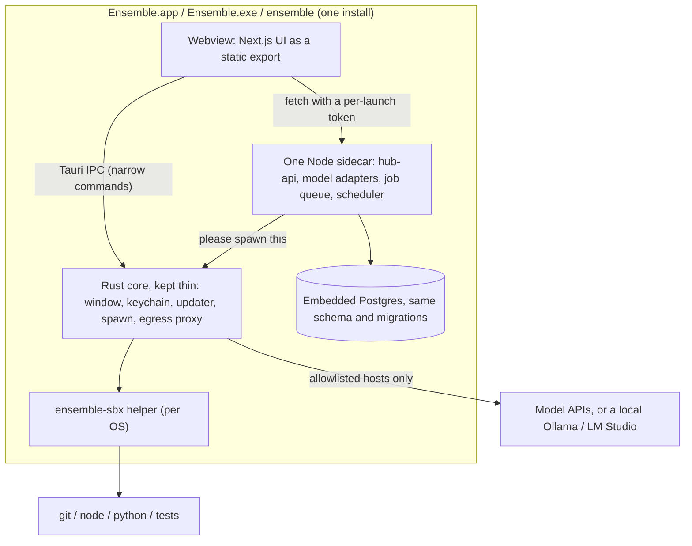

# 23 · Ensemble desktop, local-first: cross-platform design

Status: Revised after review · Author: cross platform ensemble · 2 Oct 2026 (IST)
Consolidates the 2 Oct design call with Shivani, and her review of the same day. Detailed sandboxing design: [24 · Desktop sandboxing](24_DESKTOP_SANDBOXING.md).

## Changes after review (2 Oct 2026)

Shivani's review is accepted. This draft now says:

- Storage is embedded Postgres, via PGlite or an embedded Postgres binary. The SQLite migration is dropped. The schema and migrations stay the same for the web, desktop and hosted versions.
- One sidecar. The Python model adapters move into hub-api. The app ships that Node binary plus `ensemble-sbx`. The Rust core stays thin.
- The packaged skeleton comes first, on all three OSes, including the updater. macOS on today's Seatbelt is next. Google and GitHub OAuth approval starts in parallel.
- The trusted base includes hub-api. Unattended work cannot touch a path outside the trusted folder. Trust is per device and covers paths only. "Review only" does not prompt on every command.

Checked against `main` while revising. Where the tree disagrees with the review, the text says what the code shows.

---

## 0. Summary

- Ensemble ships first as a **local-first desktop app** for macOS, Windows and Linux. It installs like Notion (DMG, a Windows installer or zip, a Linux package), shows no terminal, and needs **no Ensemble server**.
- "Local-only" means the database stays on the machine. Prompts still go to the model vendor the person configured. **Ollama, which the runtime already supports, or LM Studio is the fully offline mode.** Connectors leave the machine when the person turns them on.
- It's built on **Tauri 2**: a thin Rust core, the existing Next.js UI in the system webview, **embedded Postgres** (the same schema as the server), a **localhost-only API**, and the existing job queue inside that API.
- The download is **one Node sidecar** (hub-api, with the model adapters ported in) plus the **`ensemble-sbx` helper**. There is no Python sidecar and no Rust port of the API.
- Agents work on real repos under **OS-native sandboxes**. All three sit behind one Rust interface. Only the core can start the helper. See doc 24.
- **Trusted folders** never prompt inside. **Run unattended** requires a trusted folder, and a path outside that folder is blocked. Everything sensitive goes through **Needs me**.
- We **build on the code that already exists** in `apps/hub-api/src/workspace/`. `worker.ts` and `agent.ts` already run jobs. See [doc 18](18_WHAT_IS_REAL.md).
- **No Mac App Store. No Flatpak.**

---

## 1. Three versions, local-first first

| Version | Where agents run | Data | Hosting cost | Status |
|---|---|---|---|---|
| **1. Local-first desktop** | The person's own computer, sandboxed | Embedded Postgres on the device, same schema | **None** | **Current focus**, all three desktop OSes |
| 2. Web | Cloud VMs | Server Postgres | VMs plus database | Later |
| 3. Hosted (managed) | Our servers, with optional local runner | Postgres | Paid tiers | Eventual |

- The UI, the schema and most domain logic are shared. The desktop changes the process layout and the sandbox, and it does not change the tables.
- Desktop v0 ([PR #22](https://github.com/ensemblework/ensemble/pull/22), branch `desktop`, not on `main`) is a Tauri shell that loads a hosted URL. Its CI already builds unsigned macOS, Windows and Linux bundles. That shell becomes the frame for version 1, which loads the **bundled** UI.

---

## 2. Install and first run (Notion-like)

| OS | Format | Notes |
|---|---|---|
| macOS | **DMG** (universal, Apple Silicon and Intel) | Drag to Applications. Signed with Developer ID and notarised once the $99-a-year Apple account exists. Until then it's unsigned. On macOS Sequoia and later, right-click then Open does not bypass Gatekeeper. The person uses **System Settings → Privacy & Security → Open Anyway**. **No Mac App Store** (it would force the App Sandbox, which conflicts with running developer tools on the person's repos). |
| Windows | **NSIS `.exe` installer** plus a portable **`.zip`** | Per-user install, no admin needed. Defender and SmartScreen flag unsigned NSIS binaries. v1 does not pretend to sandbox strongly: it is **Ask mode, or the Linux sandbox via WSL2**. A strong native sandbox comes later. |
| Linux | **AppImage** plus **`.deb`** (`.rpm` later) | **No Flatpak.** The `.deb` installs the AppArmor profile the helper needs on Ubuntu 24.04. An AppImage cannot install that profile, so on Ubuntu 24.04 it falls back to Landlock only. Secret Service is often missing on a minimal desktop, so the keychain needs a fallback. |

**The updater ships from day one.** Tauri's update signing is free. It has to cope with a job that is still running, migrate on launch only after a backup, and refuse a database written by a newer version (§3.4).

**No visible terminal, ever:**
- The Windows binary uses `#![windows_subsystem = "windows"]`. Every child process starts with `CREATE_NO_WINDOW`, so no console flashes.
- Background commands run from the Rust core with `std::process::Command` or a Tauri **sidecar** (`bundle.externalBin`). The **Tauri shell plugin is not exposed to the webview**. If it's used at all, its scope lists only our sidecars, with fixed arguments.
- Logs go to the app's log folder and the in-app activity view, not to a console. An **Export diagnostics** button (or opt-in crash reporting) is how a failure leaves the machine.

**First run:**
1. A welcome screen asks for a workspace folder, defaulting to `~/ensemble-workspace`.
2. Then the person adds at least one model, with **Test** (§9). A local Ollama or LM Studio server counts, and is the offline choice.
3. Optional connectors come next.
4. There's no account sign-up. One install is a single local user.

---

## 3. Local-first architecture

### 3.1 Pieces
- **Rust core (Tauri 2), kept thin.** It owns the window, the OS keychain, the process supervisor, the egress proxy, the sandbox launcher and the Git gate. It does not grow into a second API. There is no Rust port of hub-api.
- **Trusted base.** The core, `ensemble-sbx`, and the hub-api sidecar. hub-api holds the database and the connector tokens, and it reads attacker-controlled text, so a prompt injection lands there. That is acceptable because tool execution is sandboxed and writes are gated: the model can ask, and the sandbox plus the Git ceiling decide. Today that sandbox exists only on macOS (`sandboxAvailable` in `guard.ts`). Linux and Windows still have the argument allow-list and the path jail only, which is why they are later in the build order.
- **Spawn.** `runner.ts` currently calls `sandbox-exec` itself (`spawn("/usr/bin/sandbox-exec", …)`). "Only the core spawns" means rewriting `runner.ts` so the sidecar asks the core, and the core is the only process that starts `ensemble-sbx` or a sandboxed command.
- **UI.** `apps/hub-web` built as a **static export** and bundled with the app. The conversion is concrete (§11). Same code as the web version, and fixes go upstream.
- **One Node sidecar.** The existing Fastify `hub-api`, packaged as a single Node binary, with the model adapters ported in from `apps/agent-runtime` (§3.5).
  - It binds **only to `127.0.0.1` on a random port**, and requires a per-launch bearer token that the core passes to the webview.
  - It checks `Host` and `Origin` (against DNS rebinding) and refuses any request without the token.
  - Node needs the macOS **JIT entitlement** (`com.apple.security.cs.allow-jit`) once the app is signed with the hardened runtime.
- **Job queue.** The existing `workspace/worker.ts` queue and `workspace/agent.ts` loop, inside the sidecar, supervised by the core.
  - It restarts on crash, and on launch it marks interrupted jobs the way `worker.ts` already does (`recover`).
  - It keeps running while the window is closed, with a tray icon reusing quick capture.
  - It stops cleanly on quit. The app uses Tauri's **single-instance** plugin so a second launch does not start a second queue. The PR #22 shell already keeps a single instance.
- **Storage.** Embedded Postgres in the OS app-data folder. Details in §3.3. Redis is not a second database migration: pause, cancel and the activity list use `lib/redis.ts` today, and on the desktop that state lives in the Node process.

### 3.2 What goes out
- There is **no Ensemble server** in version 1. Outbound connections are:
  1. the model provider the person configured, or nothing extra when that provider is Ollama or LM Studio on localhost,
  2. the connectors they enabled (GitHub, Google and so on), and
  3. update checks against GitHub Releases, which can be turned off.
- One allowlist in the Rust core covers both the app's own HTTP client and the egress proxy that sandboxed agent commands must use. The agent's network allowlist (package registries and the repo's remote) is per task. See doc 24 §5.
- OAuth is in §3.4. It cannot wait until the end: Gmail's scope is the long pole.

### 3.3 Storage: embedded Postgres

The schema on `main` (`apps/hub-api/prisma/schema.prisma`) has **72 models** and **30 `String[]` list fields**. There are no other scalar arrays. The 2 Oct review counted 31 list fields; the file has 30. It also uses the `vector`, `pg_trgm` and `uuid-ossp` extensions, and `artifacts.search_vector` is a `tsvector`. Embeddings are `vector(3072)`.

Production code has little Postgres-only SQL. The two that matter are `ON CONFLICT … IS DISTINCT FROM` in `jobs/claim.ts` and `FOR UPDATE` in `pages/store.ts`. Health checks also run `SELECT 1`. `apps/agent-runtime/ensemble_agent/credentials.py` connects with **psycopg** and reads `model_credentials` itself. That connection disappears when the adapters move into hub-api, which already has `lib/secrets.ts` for the same `v1:` ciphertext.

**Do not migrate to SQLite.** Prisma has no `String[]` on SQLite, and a second schema would fork every migration. Use one of these, so the schema and the migration history stay identical for the web app, the desktop app and the hosted app:

- **PGlite**, Postgres compiled to WASM, running inside the Node sidecar. It has pgvector and full-text search.
- **An embedded Postgres binary**, listening on a Unix socket or a loopback port.

**A one-day spike comes first:** PGlite plus Prisma, against this schema. The spike has to apply the real migrations, including pgvector, `pg_trgm`, `uuid-ossp` and the `tsvector` column, and run the two raw statements. If PGlite cannot host them, the embedded binary is the desktop database. Either way the Prisma schema does not change.

The database file lives in the OS app-data folder. The sandbox cannot read or write that folder (§3.4, doc 24). There is an automatic daily backup copy, on the same disk. The backup is a convenience, not an off-machine copy.

**The keychain key protects credentials only.** Model keys and connector tokens stay in the `v1:` AES-256-GCM format from `vault.py` and `secrets.ts`. The master key moves from `.ensemble/secret.key` into the OS keychain (macOS Keychain, Windows Credential Manager or DPAPI, Linux Secret Service, with a fallback when Secret Service is missing). The core hands it to the sidecar at start through an inherited pipe. The rows for tasks, pages and the ledger are not sealed with that key. Losing the keychain entry means signing in and pasting keys again. It does not wipe the database. Keychain access-control lists are tied to the code signature, so an ad-hoc build may prompt after every update until the app is signed with a stable Developer ID.

### 3.4 Local-only realities

**The scheduler runs only while the machine is awake.** `jobs/scheduler.ts` is an in-process `setInterval` of 60 seconds, plus one tick at startup. A fetch slot runs when the local clock equals a configured minute (`settings.fetch.times.includes(now.time)`). Sleep through that minute and the slot is skipped. Retention already catches up: `retentionDue` in `lib/clock.ts` runs a missed day even before 03:30. Fetch slots need the same catch-up on wake. Disable App Nap so a backgrounded window does not freeze the clock. The single-instance plugin keeps one scheduler.

**OAuth, started now.** Today's connectors are a web OAuth app (`connectors/oauth.ts`). Google's scopes include `https://www.googleapis.com/auth/gmail.readonly` and `calendar.readonly`. GitHub uses the web authorize URL and a client secret held by the instance.

- `gmail.readonly` is a restricted scope. Publishing it needs Google's verification, may need a paid security assessment, and an unverified app is capped at 100 test users. Google has an on-device carve-out. **Confirm that carve-out before relying on it.** This approval is the long pole, so it starts in parallel with the skeleton.
- A random API port needs Google's **"Desktop app"** client type, which allows any loopback port. The web client in doc 18, pinned to `http://localhost:4000/api/connectors/google/callback`, does not fit.
- GitHub uses the **device flow**, so the binary does not contain a client secret.

**Discovery file.** A random port breaks clients that assume `127.0.0.1:4000`. `apps/context-bridge/src/config.ts` defaults to `http://127.0.0.1:4000`, and `scripts/ensemble-hook.mjs` defaults to the same URL. The core writes a discovery file, port, token and process id, mode `0600`, in the app-data folder. context-bridge and the hook read it. The sandbox is denied that file.

**Updates.** Ship the updater from the first install.

- An update must not cut off a running job. Finish or pause it, then update.
- On launch, back up the database, then run migrations.
- Refuse to open a database written by a newer app version.

**Diagnostics.** Opt-in crash reporting, or an Export diagnostics button. The default is that a crash stays on the machine.

### 3.5 One sidecar, and the Python runtime

`apps/agent-runtime` is **4,392 lines of Python outside tests** (5,384 including tests). `ensemble_agent/models.py` is 1,258 of those lines: httpx calls to the vendors. The rest is the orchestrator, tools, policy and plots. The review described the package as mostly those httpx calls. The adapters are the part to port. The other lines are not a second desktop service.

Port the model adapters to TypeScript inside hub-api, and ship **one Node binary plus `ensemble-sbx`**. A frozen Python sidecar (PyInstaller or similar) brings antivirus false positives, notarisation entitlements, a slow cold start, a build per architecture, and pandas and matplotlib in the download. We don't ship one.

`ensemble_agent/plots/sandbox.py` runs the plot with `[sys.executable, runner.py]`. That path is the frozen binary once the runtime is packaged, so the child is not a normal Python. The same file tries to confine the script by monkeypatching `subprocess.run` and `socket`, blocking some imports, and installing an audit hook. That is not an OS sandbox. Plots run the **person's own Python through `ensemble-sbx`**, or they move to JavaScript. See doc 24.

---

## 4. OS-native sandboxing (summary of doc 24)

| OS | v1 mechanism | Strength |
|---|---|---|
| macOS | Today's Seatbelt (`sandbox-exec`), then `ensemble-sbx` | Strong, once the profile fixes in doc 24 land. Reads: system and toolchain allowed, `$HOME` denied by default, then specific subfolders allowed |
| Linux | `ensemble-sbx`: namespaces, Landlock, seccomp, with port forwarding for dev servers | Strong where the helper is installed. An AppImage on Ubuntu 24.04 is Landlock only, because it cannot install AppArmor |
| Windows | **Ask before every command, or WSL2** | v1 does not use low integrity as the boundary. Low integrity does not stop reads, and npm, git, pip and MSBuild break there. A strong native sandbox comes later |

- One Rust interface (`ensemble-sandbox`, with `SandboxPolicy` and `spawn`) over a **tiny per-OS helper (`ensemble-sbx`)**. **Only the app core can start the helper.**
- **Docker is optional.** It's an opt-in container mode for untrusted third-party code, used only if Docker or Podman is already installed. The sandbox must not be able to talk to the Docker socket. See doc 24.

---

## 5. Stacked tasks

- **Run-ID checkouts.** Each fresh task clones into `<workspace>/runs/<job-id>` on its own branch, `ensemble/<run-id>/<slug>`. It's always a clone, never a worktree.
- **Links between tasks are declared at plan time.**
  - "Continue from" means the same folder, run one after the other.
  - "Reads from" means a read-only view of another task's checkout, pinned to a commit.
  - "Writes to" means sharing or branching off another task's checkout, behind a lock.
  - There's one review screen for the whole stack.
- **A review task reuses the exact checkout and branch.** It works read-only, and checks the branch and HEAD before starting. It waits on the existing `chain:` lock so it never sees half-written work, and needs no credentials even for private repos. Details are in doc 24 §5.10.

## 6. Git rules (enforced by the app core)

- The **agent never holds Git credentials.** Clone, fetch and push credentials stay in the core, scoped to that repo's remote.
- **Push is fast-forward only, to the run's own branch.**
- Refused or sent to Needs me: `main`, `master`, the repo's default branch, protected patterns, force-push, deleting branches or tags, and changing remotes or config.
- Repo hooks are disabled (`core.hooksPath=/dev/null`, which already exists in `gitHardening`).
- GitHub branch protection is the backstop.

## 7. Permissions and Needs me

| Tier | Examples | UX |
|---|---|---|
| **Auto** | Inside the task's trusted scope: edit, build, test, cache writes, localhost dev ports, allowlisted fetches | Silent, logged |
| **Once per stack** | Links between tasks, domains predicted at plan time | One review screen when the stack is created |
| **Always ask** | Paths outside the trusted scope, new domains, using a credential (push, opening a PR), repo Git hooks, global installs | **Needs me**: Allow once, Allow for this run, Always, Deny |
| **Never** | Keychain, browser profiles, `~/.ssh` private keys, system folders, Ensemble's own code and app data, `sudo`, `osascript`, `launchctl`, `open` and similar | Hard deny, in the OS profile, with the reason given |

The `NEVER` set in `guard.ts` is checked against **argv[0] only**. `python`, `node`, `make`, `npm` and `sh script.sh` can still start `osascript`, `ssh` or `open`. The floor has to live in the Seatbelt profile and in seccomp. Doc 24 lists the escape tests.

- A Needs me item parks only that step. Other work continues, nothing auto-allows on timeout, and identical requests are batched.

### 7.1 Trusted directory
**If the person has marked a folder as trusted, no Allow once or Allow always prompt is shown for any command inside it. Prompts appear only for paths outside it.**
- The default workspace is trusted out of the box.
- Trust is stored **per device**, after resolving links, and can be revoked in Settings. It is not synced.
- **Trust covers paths only.** A new network domain still follows the job's allowlist.
- Folders that `resolveWorkFolder` refuses can never be trusted.
- Trust lifts prompts, not the hard floor: the never list, secret denies and the Git ceiling still apply.
- A trusted folder can still plant a file that runs later, outside the sandbox, when the person opens the folder in their editor. Flag changes to `.vscode/tasks.json` (`runOn`: folderOpen), `.envrc`, `.husky/`, package.json lifecycle scripts and the Makefile in the review diff. Doc 24.

### 7.2 Run unattended
- **Allows work inside the trusted folder with nobody present.** There are no prompts there, but the hard floor still applies and every auto-allowed action is logged.
- **Paths outside the trusted folder are blocked**, and the task summary lists what was blocked. Nobody is there to approve them.
- **Unattended plus an untrusted folder is an error**, checked both at assignment and at run time. The message is: *"Run unattended can't be used with a folder you haven't trusted. Trust this folder, or turn off Run unattended."*

### 7.3 Agent on a repo outside the workspace
- Example: the person cloned and edited a repo on their Desktop and wants a bug review.
- The folder is added to the task's sandbox scope as an **explicitly granted path**. Adding that grant fires the **trust prompt**, with the choices Trust this folder, Just for this task, Review only (don't trust), or Cancel.
- **Review only** is read-only and has no network. It does not prompt on every command. A prompt appears only when the agent asks for more access: a write, the network, a credential, or a path outside the grant.
- `~/Desktop/acme-api` can raise a TCC prompt ("Ensemble wants to access your Desktop"), including while the runner has no window in front. The app has to expect that prompt.
- The default is an **in-place, read-only review** of the person's uncommitted changes. Nothing is cloned, and switching branches or stashing is refused.

## 8. Default workspace
- The default is `~/ensemble-workspace` on macOS and Linux and `%USERPROFILE%\ensemble-workspace` on Windows, the same as today's `ENSEMBLE_WORKSPACE_ROOT`.
- It can be changed in Settings (a folder picker with Reset to default), or overridden with the environment variable for development.
- Changing it never moves files. Old runs keep their paths.

## 9. API keys
- **Settings, then Models.** There's one field per provider and a **Test** button that makes a real minimal call and shows OK, "invalid key", "no quota" or "network blocked". This already exists, `POST /api/models/test` in `routes/system.ts`.
- **Encrypted at rest** with the `v1:` format. On the desktop the master key is in the OS keychain, and it wraps credentials only (§3.3).
- Keys never reach the webview after saving (the UI shows only the last four characters, as `hint` already does), and never reach sandboxed commands.
- Ollama is already a provider, defaulting to `http://127.0.0.1:11434`. LM Studio is the other offline server to accept the same way. Neither is required for a vendor key.

## 10. Build on what exists

This work extends the existing code. Details are in doc 24 §1A.
- **Already there:**
  - `guard.ts`: folder jail, command allow-list, Git ceiling, clean environment, Seatbelt profile.
  - `runner.ts`: process-group kill, and the `sandbox-exec` spawn that moves into the core.
  - `worker.ts`: the durable queue, started from `index.ts`, with per-folder and chain locks.
  - `agent.ts`: the job, end to end. Model turns still go through agent-runtime until the adapters are ported.
  - The `WorkspaceJob` fields.
  - The Needs me decisions and `DecisionRule`.
  - The `runWithoutAsking` setting. It is stored and shown in Settings. The runner does not read it yet.
  - The **`unattended` field**, which exists but is hardcoded to `false` in `routes/agents.ts`.
  - The Assign dialog: its own checkout, continue an earlier task, or a folder on this Mac.
- **The gap:** **Linux and Windows have no OS sandbox today.** `sandboxAvailable` is macOS-only.
  - The macOS profile is `(allow default)`. The target is system and toolchain reads allowed, `$HOME` denied by default, then the workspace, the cache and specific toolchain subfolders. See doc 24, G1.
  - The profile denies exec of `/usr/bin/osascript`, `/usr/bin/sudo`, `/usr/bin/security` and `/bin/launchctl`. It does not deny `/usr/bin/open`.
  - The folder picker is macOS-only (`osascript` in `routes/agents.ts`) and is replaced by the Tauri dialog.

## 11. Upstream UI fixes, and the static export

- The desktop app uses the **same UI code** as the web app, with no fork.
- Any UI bug found while porting is **fixed upstream in `apps/hub-web`**, in coordination with ensemble-app and Testing ensemble.
- Desktop-only behaviour goes behind a small `isDesktop` capability check.

The static export has to convert what the server does today:

- `apps/hub-web/middleware.ts` checks the session by calling hub-api. A static export has no middleware. The guard becomes client-side.
- `next.config.ts` rewrites `/api/:path*` and `/health` to the hub-api origin. Those become a configurable API base in `lib/api`.
- Seven dynamic route folders need a client render, or `generateStaticParams` where the set is known: `connect/[app]`, `diagrams/[id]`, `marketplace/[id]`, `plots/[id]`, `projects/[id]`, `tasks/[id]`, and the catch-all `(hub)/[...slug]`.

---

## 12. Drawbacks and risks

- **Gmail verification is the long pole.** Restricted scope, a possible paid assessment, a 100-user cap, and an on-device carve-out that still needs confirming. Starting it during the skeleton does not make it short.
- **PGlite may not host every extension.** The spike exists so we find that in a day and use the embedded binary, which is a larger download.
- **hub-api is inside the trust boundary.** A prompt-injected page is read by the same process that holds connector tokens. The sandbox and the write gates are what make that acceptable, and they are incomplete on Linux and Windows today.
- **Windows v1 is Ask mode or WSL2.** Low integrity does not hide `~\.ssh` and it breaks developer tools. Say so in the UI.
- **macOS `sandbox-exec` is deprecated** (though widely used). The first macOS ship uses it, behind the trait, with the escape tests in doc 24. The helper replaces the direct call afterwards.
- **Unsigned builds** hit the Sequoia Open Anyway flow, SmartScreen, and a keychain prompt on every ad-hoc update.
- **The scheduler does not run while the machine sleeps.** Catch-up on wake covers fetch slots. It does not cover a machine that is off.
- **Backups sit on the same disk.** They survive a bad migration. They do not survive a dead drive.
- **Trust and unattended mode are powerful.** A malicious script inside a trusted repo can still damage that repo, and it can plant a hook that runs later outside the sandbox. Git history is the recovery path. The review diff flags the plantable files.
- **An AppImage on Ubuntu 24.04 is a weaker sandbox** until the person installs the `.deb` profile.

## 13. Open questions

1. ~~In unattended mode, should paths outside the trusted folder be allowed or blocked?~~ **Closed: blocked**, and listed in the task summary.
2. ~~Should we move to SQLite, or keep a Prisma provider switch?~~ **Closed: embed Postgres.** PGlite or an embedded binary, chosen by the one-day spike. The schema stays one schema.
3. ~~Should we keep the Node API and Python runtime as sidecars, or port the API to Rust?~~ **Closed: one Node sidecar, adapters ported into hub-api, Rust core kept thin.**
4. ~~OAuth client IDs for a no-server app?~~ **Closed for the desktop:** Google "Desktop app" client, GitHub device flow, Gmail and GitHub first. The on-device carve-out for `gmail.readonly` still has to be confirmed (question 11).
5. ~~Should a trusted folder also skip prompts for new network domains?~~ **Closed: no. Trust covers paths only.**
6. ~~Is trust per device, or synced?~~ **Closed: per device.**
7. Code signing: when should we buy the Apple Developer account, and do we want a Windows certificate? Unsigned CI installers ship before either exists. Ad-hoc keychain prompts and SmartScreen are the cost.
8. ~~Updates: GitHub Releases with the Tauri updater, or nothing until the apps are signed?~~ **Closed: the updater ships from day one.** Signing the updates is free. Handle a running job, back up, then migrate, and refuse a newer database.
9. ~~Is `docs/18_WHAT_IS_REAL.md` out of date about Assign to agent?~~ **Closed: yes.** `worker.ts` and `agent.ts` run jobs. Doc 18 is updated.
10. ~~Linux packages from day one?~~ **Closed: AppImage and `.deb`. No Flatpak. `.rpm` later.**
11. Does Google's on-device carve-out cover `gmail.readonly` for this desktop app? Confirm before the connector depends on it.

## 14. Build order

0. **Spike (one day).** PGlite plus Prisma, on the real schema and the two raw SQL statements. If it fails, the sidecar uses an embedded Postgres binary on a socket or a loopback port.
1. **Packaged skeleton, all three OSes.** The PR #22 Tauri shell, the static UI, one Node sidecar with the database, the updater, and the discovery file. Unsigned CI installers for macOS, Windows and Linux.
2. **macOS on today's Seatbelt.** The profile fixes: Unix sockets, `open` and LaunchServices, the app-data deny, `$HOME` denied by default. Plus the trust rules, the unattended rules, and `runner.ts` asking the core to spawn.
3. **OAuth approvals, in parallel with 1 and 2.** Google verification for `gmail.readonly`, the Desktop app client, and the GitHub device flow. This is the long pole.
4. **Linux helper.** `ensemble-sandbox` and `ensemble-sbx` on Linux, including port forwarding for dev servers. Then port macOS off the direct `sandbox-exec` call and onto the helper.
5. **Windows v1.** Ask before every command, or WSL2. A strong native sandbox later.
6. **Later.** Optional Docker container mode, the web version on cloud VMs, then the hosted version.
