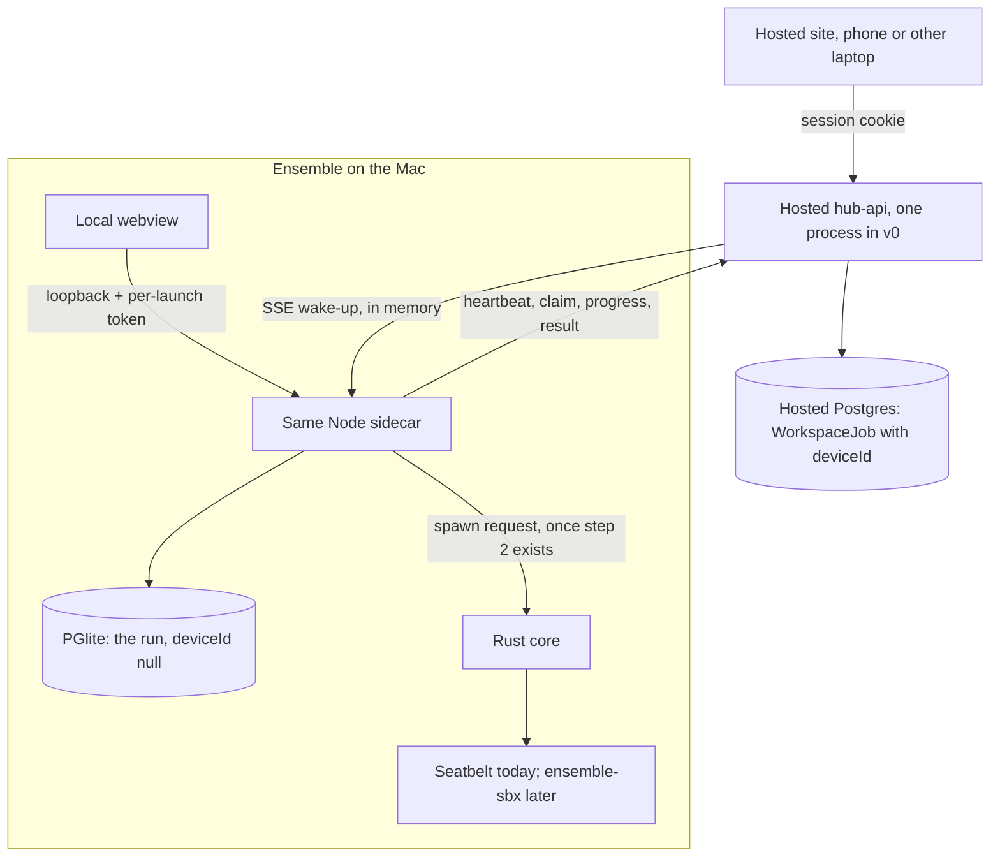
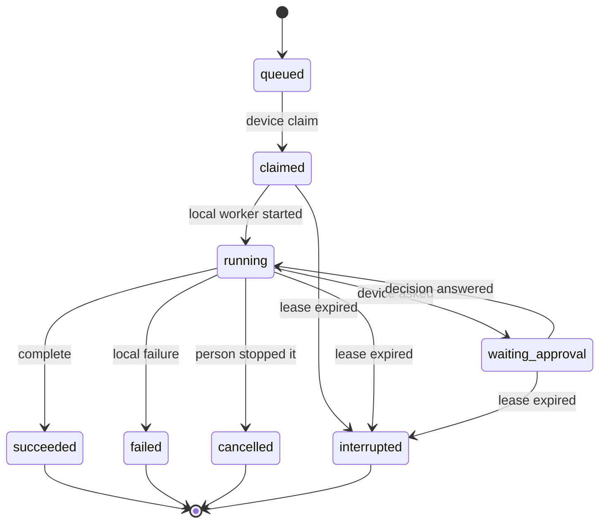

# 25 · Remote tasks on your computer

Status: Draft for review · 2 Oct 2026
Sections: **Hosting** (§3), **ensemble-app** (§4, the API and the site), **desktop and sandbox** (the rest).
Hosting and ensemble-app review their sections before this merges. Do not merge on the desktop owner's behalf.

Companions: [23 · Local desktop design](23_LOCAL_DESKTOP_DESIGN.md), [24 · Desktop sandboxing](24_DESKTOP_SANDBOXING.md).

Checked against `main` at `c6cc889` (PR #32 is merged). Where a note disagrees with the tree, the text says what the code does.

## 0. Summary

v0 of the hosted app is Postgres, Next.js, and the API. The person also has the desktop app open on their Mac. From the hosted site, on a phone or another laptop, they assign a task. The task runs on that Mac, because a cloud VM is too expensive. It uses the Mac's model key and git credentials, and the same sandbox, trust, permission, and unattended rules as a task started in the desktop app.

The hosted side carries the assignment, the progress, the approvals, and the result. It does not carry keys, credentials, or file contents. If the Mac is offline, the task waits. It does not run on the server instead.

The local UI and the hosted site are two front doors to one on-device runner. Remote assignment is a new way to reach that runner, so the Mac treats the server as untrusted input.

Desktop step 1 is on `main` (PR #32): Tauri, a static export, one Node sidecar on PGlite, and the discovery file. The sandbox broker, the trust rules, and the Git gate in docs 23 and 24 are designed and not built.

The headline path is walkthrough (a) in §9: from the phone, clone a private repo, change it, commit, and push. That path first works after the Git gate lands, which is desktop steps 2 and 4 (doc 23 §14, doc 24 §9), and after the person turns on the Mac setting in §5.1. Until the Git gate lands, private clone and push are refused, so the first real end-to-end test uses public-repo tasks. The protocol can be built before either.

### Must-fix before remote tasks ship

These two are blockers. Remote tasks do not ship with either one still open.

1. **`deviceId: null` on the server job loop.** `tick()` in `apps/hub-api/src/workspace/worker.ts` loads every `queued` job (the query is line 107) and `claim()` runs it in this process. `recover()` (line 144) marks every `running`, `stopping`, and `waiting_approval` job `failed` ("Interrupted: Ensemble restarted…") on API boot. A device job is a `WorkspaceJob` with `deviceId` set (§4). Without `where: { deviceId: null }` on both, a restart fails the Mac's job, and the server runs it with the server's model key. The desktop sidecar uses a different database (PGlite). Its own jobs stay `deviceId: null`, so the same filter still runs local work.
2. **`POST /api/tokens` can mint more tokens.** `POST /api/connect/token` refuses callers that are not a browser session (`routes/connect.ts`: `authVia` must be `session`, `bypass`, or `desktop`). `POST /api/tokens` in `routes/auth.ts` has no such check. A leaked `full` token can mint another `full` token. ensemble-app is doing the session check as its own small PR, the same check as the bridge key. That PR is separate from the remote-task work. It lands before any `device` token is issued. A `device` token is also limited to `/api/devices/self/*` (§4.3), and `identify` today maps every scope other than `bridge` to `full` (`lib/auth.ts`).

---

## 1. What already runs an assignment

This is an extension of the current queue, not a second agent. ensemble-app's inventory is in §4. The short version:

| Piece | Where | What it does today |
|---|---|---|
| Assign | `POST /api/agent/assign` in `apps/hub-api/src/routes/agents.ts` | Creates a `WorkspaceJob` and calls `kick()`. `unattended` is hardcoded `false` (line 154). Provider and model come from `settings.models[task.complexity]`. |
| Queue | `apps/hub-api/src/workspace/worker.ts` | `startAgentQueue` is called from `index.ts`. Every 1.5 s, `tick()` claims queued jobs. |
| Claim | `worker.ts` `claim` (line 51) | `updateMany` where `id` and `status = queued`. `count === 1` wins. Sets `leaseOwner` to the process pid. No `SKIP LOCKED` anywhere in the repo. |
| Run | `workspace/agent.ts` `executeJob` | Prepares the folder, calls agent-runtime one turn at a time, runs tools. |
| Policy | `workspace/guard.ts`, `workspace/tools.ts` | Folder jail, argv allow-list, Git ceiling, Seatbelt profile on macOS. |
| Needs me | `tools.ts` `askPerson`, `lib/decisions.ts` | Writes `AgentDecision` (`source: "ensemble"`, `sessionId = job.id`). Answer is `POST /api/decisions/:id/decide`. Wait is `GET /api/decisions/:id/wait`. |
| Live UI | `lib/sse.ts`, `GET /api/events` | In-memory SSE. A ping every 25 s. Frames are invalidation hints. |
| Desktop process | `apps/hub-api/src/desktop/main.ts`, `apps/desktop/src-tauri/src/sidecar.rs` | One Node process. PGlite. Binds `127.0.0.1` on a random port. Writes `api.json` mode `0600`. `REDIS_URL=memory://desktop`. Starts the same hub, so the same queue. |

`WorkspaceJob` already has `externalRoot`, `useCredentials`, `delivery`, `unattended`, `leaseOwner`, and `leaseUntil` (schema lines 469–470). `claim()` writes `leaseOwner` and nothing reads it back. `leaseUntil` is never written. There is no lease expiry. `recover()` is how a dead process gives up a job, and it fails the row.

`orchestration.runWithoutAsking` defaults to `true` (`packages/shared-types/src/assistant.ts`). Settings shows it. The description says folders outside the workspace still ask, unless the run is unattended (`apps/hub-web/components/settings/sections.tsx`). The runner does not read the flag. Doc 24 §5.9 is the rule we implement: unattended on an untrusted folder is `UNATTENDED_REQUIRES_TRUST`. That code does not exist yet.

`WorkspaceJobStatus` today is `queued`, `running`, `stopping`, `waiting_approval`, `blocked`, `succeeded`, `failed`, `cancelled`. §4 adds `claimed` and `interrupted` to that enum. It does not add a second status vocabulary.

---

## 2. One runner, two front doors

Desktop and sandbox.



- A task started in the local UI is a `WorkspaceJob` in PGlite with `deviceId` null. `kick()` runs it. Nothing is sent to the hosted API.
- A task started on the hosted site is a `WorkspaceJob` in hosted Postgres with `deviceId` set (§4). The hosted `tick()` and `recover()` skip those rows. The sidecar claims the hosted row, then creates a **local** job with `deviceId` null and the same instructions, and runs it through `claim` → `executeJob` → `guard` → `tools`. Same locks (`dir:` and `chain:`), same Needs me, same limits. The hosted id is what progress and complete refer to.
- Device-runner mode is a client inside that sidecar, started only when a local flag is on. Default off. The flag lives in the app-data folder. The server cannot turn it on.
- The client opens out to the hosted API. It does not listen. The loopback bind, the discovery file, and `ENSEMBLE_DESKTOP_TOKEN` stay as they are. That launch token is for the local webview. It is not the hosted device token.
- `ENSEMBLE_SITE_URL` is the site the desktop window loads (`apps/desktop/src-tauri/src/site.rs`: that variable, then a saved value, then the compile-time value, then `http://localhost:3000`). `ENSEMBLE_REMOTE_API` is the remote-tasks API address that #43 adds. It is the hosted API base the desktop sidecar uses for remote tasks: pairing, claim, heartbeat, and events.

The sandbox, the trust rules, and the Git gate apply unchanged, once they exist.

- Sandbox: Seatbelt, then `ensemble-sbx` (bwrap or the helper's own namespaces on Linux, Ask or WSL2 on Windows). `runner.ts` still `spawn`s `/usr/bin/sandbox-exec` itself. The profile is `(allow default)` with a few denies. Linux and Windows have no OS sandbox (`sandboxAvailable` is Darwin only).
- Run-ID clones: a fresh repo task clones into `<workspace>/runs/<job-id>` on `ensemble/<run-id>/<slug>`. Always a clone. Doc 23 §5.
- Git gate, as designed: the agent never sees credentials. The core pushes fast-forward only, to the run's own branch, with the Mac's credentials. That is how a private repo works without putting a token in the sandbox. It is not what the code does today. `lib/git-auth.ts` puts `ENSEMBLE_GIT_TOKEN` in the child environment, and `useCredentials` points `HOME` at the real home and lifts the Seatbelt deny on `.ssh`, `.config/gh`, and `Library/Keychains`.
- Permission tiers, Needs me, trusted folders, and Run unattended: doc 23 §7 and doc 24 §5.8–5.11. Trust is per device and is not synced.

Until the Git gate exists (desktop steps 2 and 4), the sidecar refuses a private clone and a remote push. A public-repo task can proceed (§0). After the gate, a remote fast-forward push to the run's own branch still needs the Mac setting in §5.1, which is off by default. The sandbox PR removes `ENSEMBLE_GIT_TOKEN` from the agent's environment. The app side does the push.

---

## 3. Hosting

Hosting. v0 is one API process. Later scaling is a different transport, and it is not Redis pub/sub on Lambda.

### 3.1 One process in v0

The hosted setup runs one API process and one agent process. Tickets, SSE subscribers, and OAuth `state` stay in that process. v0 of remote tasks assumes that. The live stream (`lib/sse.ts`) and approval wake-ups (`decisionBus` in `lib/decisions.ts`) stay in that process. That is fine for v0. Do not add a bus in order to ship the wake-ups. `device.revoked` is the exception: removing a computer publishes that one notice on Redis pub/sub so every API process closes the stream it is holding. The other frames stay in-process.

The Mac connects out. The phone does not open a port on the home network. While the app is open and remote tasks are enabled, the sidecar signs in with its device token and keeps a connection to `https://api.ensemblework.com`.

- Heartbeat: `POST /api/devices/self/heartbeat` about every 30 s (§4, and `ENSEMBLE_REMOTE_HEARTBEAT_MS` default `30_000` in `apps/hub-api/src/remote/contract.ts`). This is the online dot and the lease renewal. It is not the Redis activity heartbeat. That function lives in `lib/activity.ts` and is called from `workspace/agent.ts` and `assistant/agent.ts` to refresh an activity key. The `Device` model is `model Device` in `apps/hub-api/prisma/schema.prisma`.
- The notify channel is `GET /api/devices/self/events`, backed by the same `sseHub`, on a `device:<id>` key (§4). The browser keeps using `GET /api/events`. `infra/deploy/Caddyfile.example` flushes both paths with `flush_interval -1`. The handler `hijack`s the socket (`apps/hub-api/src/lib/sse.ts`), so the global compress plugin does not buffer those frames.
- Frames are wake-up hints. The Mac still calls claim or the decision long-poll. A dropped stream is not a dropped task.

### 3.2 Later: a second server, or Lambda

These are not v0. Flagged for Hosting.

- **Two or more always-on API servers.** The in-memory hub and `decisionBus` do not cross processes. Redis pub/sub is the fit for that case only: one subscriber per process, one publish per wake-up. Do not publish per log line. Upstash Free is 500,000 commands a month. A quiet pub/sub on top of the existing activity traffic can fit; a per-line channel will not. Postgres `LISTEN/NOTIFY` also needs a connection that stays open, so it is an always-on option, not a Lambda one. Device **writes** (claim, heartbeat, progress, complete) stay Postgres either way. They are not Redis commands.
- **Lambda.** Redis pub/sub does not fit. A Lambda invocation cannot hold a subscription open. `LISTEN/NOTIFY` does not fit for the same reason. On Lambda, the device channel and the browser channel go through Supabase Realtime or API Gateway WebSockets. Claim, heartbeat, progress, and complete stay plain requests so that move does not change the device.

### 3.3 Claim, lease, secrets, free tier

The claim itself is §4.3: one conditional `updateMany`, no `SKIP LOCKED`, a `leaseToken` the device sends back on every write, `leaseUntil` of 120 s (`LEASE_MS` in `apps/hub-api/src/devices/constants.ts`). Claim sets that window. Heartbeat renews it only when `leaseUntil` is still in the future. Progress and ask extend it the same way and refuse a lease that has already expired (`apps/hub-api/src/devices/routes.ts`). The sweep that expires a lease runs on the scheduler's 60 s tick, after `expireStale()` (`jobs/scheduler.ts` uses `setInterval` of `60_000` and calls `sweepExpiredDeviceLeases`). It only touches rows with `deviceId` set. A dead Mac therefore shows as `interrupted` 120 to 180 s after its last heartbeat, not at exactly 120 s. If `ENSEMBLE_SCHEDULER=off`, `startScheduler` returns without the interval, so the sweep never runs and the lease does not expire. The VM sets `ENSEMBLE_SERVER_RUNNER=off` so unassigned code jobs are not run on the server (`serverRunnerEnabled` in `devices/constants.ts`, enforced in `workspace/assign.ts`).

Model keys and GitHub credentials stay on the Mac (doc 23 §3.3 and §9). Server `model_credentials` are for server-side calls. `apps/agent-runtime/ensemble_agent/credentials.py` reads the model keys. The morning fetch reaches a model through `complete()` in `lib/runtime.ts` (`jobs/scheduler.ts` → `connectors/sync.ts` → `triage()`). The morning brief (`cowork/service.ts` `deliverMorningBrief`) does not call a model. A device job never takes either path.

Logs: the Mac batches about every 2 s or 64 KB. The server stores at most 64 KB per chunk and 2 MB per job (`MAX_CHUNK_BYTES` and `MAX_JOB_LOG_BYTES` in `apps/hub-api/src/devices/constants.ts`), redacted with `redactText()` (`lib/redact.ts`). `runRetention` deletes chunks older than 30 days. Those caps are in the code whichever database the host uses. The host can choose between Supabase Free (500 MB) and Postgres on the VM.

### 3.4 Trying it before it is hosted

The numbered check is §4.6. `ENSEMBLE_SITE_URL` is the site the desktop window loads. `ENSEMBLE_REMOTE_API` is the remote-tasks API address that #43 adds. It is the hosted API base the desktop sidecar uses for remote tasks: pairing, claim, heartbeat, and events. It must be http or https, and trailing slashes are trimmed. When it is set, it overrides the API address saved at pairing. When it is unset, the Mac uses the address typed during pairing. For a local tunnel test, set `ENSEMBLE_REMOTE_API=http://localhost:<api-port>`. The stream still has to be unbuffered on that hop.

---

## 4. Web app and API

ensemble-app. Checked against `main` on 2 Oct 2026. Paths are relative to the repo root. The sandbox and trust rules come from doc 23 §7 and doc 24 §5.8–5.9. This section is the hosted API and the site. The Mac's enforcement is §5 and §6.

### 4.1 What exists today

**How agent work is stored**

- `apps/hub-api/prisma/schema.prisma`:
  - `Task` (line 163) has `owner: TaskOwner` (`me | agent | unassigned`) and `status: TaskStatus` (`proposed | todo | in_progress | waiting_approval | blocked | done | dropped`). The allowed moves are in `apps/hub-api/src/lib/state-machine.ts`.
  - The assignment itself is a `WorkspaceJob` row (line 416). Its `status: WorkspaceJobStatus` is `queued | running | stopping | waiting_approval | blocked | succeeded | failed | cancelled`. It already carries `delivery`, `askBeforePublish`, `useCredentials`, `unattended`, `externalRoot`, `progress`, and `summary`, plus `leaseOwner` and `leaseUntil` (lines 469–470).
  - `WorkspaceEvent` (line 552) is the per-job log: one row per event, ordered by `sequence`. `Run` (line 337) and `RunStep` hold the run record.
- `POST /api/agent/assign` in `apps/hub-api/src/routes/agents.ts` (line 87) creates the job. It sets `task.owner = "agent"`, writes a `TaskTransition` and a ledger entry, publishes `task` and `workspace` SSE frames, and calls `kick()`. It hardcodes `unattended: false`. It picks `provider` and `model` from the server's tier settings (`settings.models[task.complexity]`).
- Other reads: `GET /api/agent/jobs?taskId=` and `GET /api/agent/jobs/:id` (the latest 150 `WorkspaceEvent`s, `agents.ts` line 254). `POST /api/agent/jobs/:id/stop`. `POST /api/agent/pause`, `stop-all`, and `resume`. Task CRUD is in `routes/tasks.ts`, and board moves are in `routes/board.ts`.

**Live event stream**

- Server: `apps/hub-api/src/lib/sse.ts` (`SseHub`, an in-memory `Map<userId, Set<reply>>`, ping every 25 s). The routes are in `apps/hub-api/src/routes/misc.ts`: `POST /api/events/ticket` (one use, 60 s, kept in an in-process `Map`) and then `GET /api/events?ticket=`.
- Client: `apps/hub-web/components/live.tsx` (`LiveProvider` / `useLive`, plus an `INVALIDATES` map from event name to React Query keys). The stream URL comes from `apps/hub-web/lib/events.ts`.
- Frames are only invalidation hints (`{ id }`). They carry no event id, and there is no `Last-Event-ID` replay. A reconnect refetches.
- `components/agent/job-card.tsx` polls every 2.5 s for an open running job and every 3 s for the job list while a job is live. A phone without the stream still updates.
- v0 keeps this in the one API process (§3.1). A second process or Lambda is §3.2, not a v0 dependency.

**Scoped API tokens**

- Migration: `apps/hub-api/prisma/migrations/20260929150000_api_token_scope/migration.sql` adds `api_tokens.scope TEXT DEFAULT 'full'`.
- Model: `ApiToken` (schema line 1492). Stored as a sha256 hash with a `prefix`, plus `lastUsedAt` and `revokedAt`.
- Auth: `identify()` in `apps/hub-api/src/lib/auth.ts` accepts `Bearer ens_…`, then the `onRequest` hook in `apps/hub-api/src/index.ts` applies `readOnlyTokenRejected()` from `apps/hub-api/src/bridge/auth.ts`.
- Two scopes today. `full` acts as the user on every route. `bridge` can only `GET` `/api/bridge`. Any other string is treated as `full` (`auth.ts` line 127).
- `POST /api/connect/token` refuses token-authenticated callers, so a leaked bridge key cannot mint another. **`POST /api/tokens` has no such check**, so a `full` token can mint more `full` tokens. That fix is a must-fix above, and it is ensemble-app's next PR.
- `ENSEMBLE_DESKTOP_TOKEN` (`via: "desktop"`) is a per-launch secret for the local sidecar from PR #32, pinned to `ENSEMBLE_DEV_USER_ID`. It is not a hosted device token.
- The hash, prefix, `lastUsedAt`, and revoke columns are reused as they are. Neither current scope fits: `full` is too broad, and `bridge` is read-only. The new scope is `device`, allowed only on `/api/devices/self/*`. No `Device` model exists.

**Claim pattern**

- `apps/hub-api/src/jobs/claim.ts` `claimSlot()`: `INSERT … ON CONFLICT DO UPDATE … WHERE cursor IS DISTINCT FROM … RETURNING`. Tested in `jobs/claim.integration.test.ts`. That is a scheduler slot, not a job queue. Do not call it for device jobs.
- `worker.ts` `claim()` is the pattern to copy: `updateMany({ where: { id, status: "queued" }, data: { status: "running", leaseOwner: pid } })` and `count === 1`.
- Reminders in `jobs/retention.ts` (`dispatchDueReminders`) use the same compare-and-set inside a transaction (`updateMany` where `nextNotificationAt` still matches).
- **`SKIP LOCKED` is not in the repo.** `FOR UPDATE` exists on tasks in `pages/store.ts`. It is not how jobs are claimed.
- `leaseOwner` is written (the pid) and never consulted. `leaseUntil` is never written. No lease expiry exists.
- `recover()` marks every `running | stopping | waiting_approval` job failed when the API boots. `tick()` claims every `queued` job. Both need `deviceId: null` (must-fix).

**Approvals ("Needs me")**

- Page: `apps/hub-web/app/(hub)/needs-me/page.tsx`. Ensemble agent questions and commit/push approvals render as `EnsembleCard` in `apps/hub-web/components/needs-me/editor-decisions.tsx`. That card already sends `scope: "once"`. The editor-hook cards still offer "this session" and "always".
- The workspace agent records these as `AgentDecision` rows (schema line 1537) with `source: "ensemble"`, `sessionId = job.id`, and `detail` holding `taskId`, `jobId`, and `options`. `askPerson()` in `workspace/tools.ts` creates them, plus an urgent `Notification` and an SSE `decision` frame.
- They are answered by `POST /api/decisions/:id/decide` (`allow | deny`, `scope: once | session | always`, `reason` as a free-text answer) in `routes/decisions.ts`. That route writes the ledger. For a device decision the route accepts only `scope: "once"`: no `session` or `always` rule, and no free text on a permission. For a device question, `reason` is the chosen option: the same string the computer sent in `options`. Any other reason, including free text, is 400. The stored scope is `once`.
- A waiter long-polls `GET /api/decisions/:id/wait?timeout≤55`. The wake-up is `decisionBus`, an in-process `EventEmitter` in `lib/decisions.ts`. The device reuses this wait. v0 is one process, so the bus is enough (§3.1).
- The older `Approval` model (line 607) and `POST /api/approvals/:id/decide` in `routes/board.ts` belong to `Run` approvals (email, PR, Teams). Workspace jobs do not use them. Device jobs do not either.

**Server-side model and git keys**

- `ModelCredential` (line 1509) is encrypted with `lib/secrets.ts`. Model keys are written and read by agent-runtime (`apps/agent-runtime/ensemble_agent/credentials.py`).
- The GitHub git token sits in the same table as `provider = "github_git"` (`lib/git-auth.ts` `githubToken()`, and `GET|PUT|DELETE /api/secrets/github` in `routes/system.ts`).
- Callers that use those rows: `GET /api/models`, `/api/model-keys*`, and `POST /api/models/test` (`routes/system.ts`, the models handlers through the test route at line 209). `complete()` in `lib/runtime.ts`, which the morning fetch calls via `triage()`. Every workspace-job model turn (`lib/model-turn.ts` posts to `{AGENT_RUNTIME_URL}/api/chat/tools`).
- Device jobs do not call any of these. `provider` and `model` on a device job are a label the Mac may ignore in favour of its own key.

### 4.2 Data model

One additive Prisma migration under `apps/hub-api/prisma/migrations/`, applied with `pnpm db:migrate` (`prisma migrate deploy`). No `migrate reset`. No `db push`. That is how `api_token_scope` had to be backfilled. PGlite on the desktop applies the same migration.

```prisma
model Device {
  id           String    @id @default(uuid())
  userId       String    @map("user_id")
  name         String                         // shown in the picker, for example "Office Mac"
  platform     String                         // macos | linux | windows
  appVersion   String?   @map("app_version")
  tokenId      String    @unique @map("token_id") // ApiToken with scope "device"
  capabilities Json      @default("{}")      // sandbox strength, max concurrent jobs, folder labels; never paths to secrets
  lastSeenAt   DateTime? @map("last_seen_at")
  createdAt    DateTime  @default(now()) @map("created_at")
  revokedAt    DateTime? @map("revoked_at")

  @@index([userId, revokedAt])
  @@map("devices")
}
```

- **Target device.** `WorkspaceJob.deviceId String?`, FK to `Device` (`onDelete: SetNull`), index `[deviceId, status, sequence]`. Null means today's server-run job. The local PGlite copy of a claimed run stays null so the sidecar's own `tick()` still executes it (§2).
- **Statuses.** Add `claimed` and `interrupted` with `ALTER TYPE … ADD VALUE`. The names from the product note map onto the existing enum so the board, the job card, and Needs me keep working:
  - queued → `queued`
  - claimed → `claimed` (new)
  - running → `running`
  - needs_approval → `waiting_approval`
  - done → `succeeded`
  - failed → `failed`
  - interrupted → `interrupted` (new)
  - `cancelled` already exists and stays. Whether to rename the old values is open question 1.
- **Lease.** Reuse `leaseOwner` (the device id, not a pid) and `leaseUntil`. Add `leaseToken String?` (random, returned by claim, required on progress, ask, and complete), `claimedAt`, `lastProgressAt`, and `attempt Int @default(0)`. The heartbeat extends `leaseUntil` for the running ids this device still holds. A write with the wrong token, or a lease that has expired, does not update the row.
- **Log chunks.** `WorkspaceLogChunk { id, jobId, seqFrom, seqTo, text, bytes, createdAt }`, index `[jobId, seqFrom]`, cascade from `WorkspaceJob`. The Mac batches every ~2 s or 64 KB. The server allows 64 KB per chunk and 2 MB per job, then stores one "log truncated" marker. Text passes through `redactText()`. `runRetention` deletes chunks older than 30 days. Nothing prunes `WorkspaceEvent` today; it stays cascade-only, and it stays the place for milestones (`prepared`, `tool`, `needs_me`).
- **Tokens.** `ApiToken.scope = "device"` needs no column change. Add `deviceTokenRejected(scope, method, path)` beside `readOnlyTokenRejected`, and call it from the same hook in `index.ts`. A device token may only call `/api/devices/self/*`.

`ApiToken` gains `devices Device[]`. Folder labels live in `Device.capabilities`, not in a second table. The label is what the person already added on the Mac. A secret path is not a label.

### 4.3 Endpoints

Plain request/response, plus one stream. Each handler is stateless. The stream is the only long-lived part, and claim plus heartbeat still work if it drops.

| Route | Auth | Does |
|---|---|---|
| `POST /api/devices/pair` | session only (same `authVia` check as `/api/connect/token`) | Returns a one-time 8-character code that lasts 10 minutes. |
| `POST /api/devices/register` | pairing code | Body: `{code, name, platform, appVersion, capabilities}`. Creates the `Device` and its `device`-scoped token, and returns the token once. |
| `GET /api/devices` | session | Lists devices. `online` means `lastSeenAt` within 90 s. |
| `DELETE /api/devices/:id` | session | Sets `revokedAt` and revokes the token. Claimed or running jobs become `interrupted`. Queued jobs become `failed` with "Device removed". |
| `POST /api/devices/self/heartbeat` | device | Every 30 s. Body: `{runningJobIds, appVersion, capabilities}`. Updates `lastSeenAt`, extends leases on the listed jobs this device holds only while `leaseUntil` is still in the future, and returns `{cancel: jobIds}` from `cancelRequestedAt`. |
| `POST /api/devices/self/claim` | device | Compare-and-set, same shape as `worker.ts` `claim()`: `updateMany` where `{id, deviceId, status: "queued"}` to `claimed`, `leaseUntil = now + 120s`, and a new `leaseToken`. Returns the job spec, or 204 when there is nothing to claim. |
| `POST /api/devices/self/jobs/:id/progress` | device + leaseToken | `{status?, progress, events[], logs: {seqFrom, seqTo, text}}`. A duplicate `seqFrom` is ignored. Extends the lease. |
| `POST /api/devices/self/jobs/:id/ask` | device + leaseToken | Creates an `AgentDecision` (`source: "ensemble"`, `sessionId = job.id`, `detail.deviceId`) and sets `waiting_approval`. Returns `{decisionId}`. |
| `GET /api/devices/self/decisions/:id` | device | Long poll. Reuses `waitFor()`. Answered, expired, or still pending. The row includes `reason`. For a question, that is the chosen option. |
| `POST /api/decisions/:id/decide` | session (existing) | The approval. For a device decision, only `scope: "once"`. No session rule, no always rule, no free text on a permission. A question sends the chosen option as `reason`. Any other reason is 400. The stored scope is `once`. A `run_branch_push` decision returns 403: only the computer can grant that push. |
| `POST /api/devices/self/jobs/:id/complete` | device + leaseToken | `{outcome, summary, results: [{kind: "pr" \| "commit" \| "branch", url, sha?}]}`. Updates `Run`, `Task`, and `TaskTransition`, and writes the ledger entry and the notification, the way `agent.ts` finishes a job. |
| `GET /api/devices/self/events` | device | SSE on `sseHub`, channel key `device:<id>`. Frames: `job.queued`, `job.cancel`, `decision.answered`. `job.queued` and `job.cancel` are `{id}`. `decision.answered` is `{id, status, decision, scope, reason}`: `reason` is the chosen option for a question, and null for a permission. Each frame is still a wake-up. The computer still calls claim or the long-poll, and the long-poll returns the same `reason`. |

`device.revoked` is not one of those wake-ups. When the computer is removed, or its device token is revoked, every open stream for that device receives `event: device.revoked` and `data: {"deviceId":"<id>","reason":"revoked"}`, and then the server closes the stream. The notice is published on Redis pub/sub (`ensemble:device:revoked`) so each hub-api process closes the sockets it holds. A later request with the revoked token is still 401. `job.queued`, `job.cancel`, and `decision.answered` are unchanged.

**Assign.** `POST /api/agent/assign` gains an optional `deviceId`. When it is set:

- The device belongs to the user and is not revoked.
- `unattended` is false. The web does not send a trust grant. The folder must be one of the labels in that device's `capabilities`. Anything else is rejected with "Trust this folder on your Mac first."
- `provider` and `model` are stored as a request label. The server does not call agent-runtime for this job.
- `kick()` is not called. The server publishes `job.queued` on the device channel.

The Mac re-checks the job (§5). A folder it does not trust, or a setting it does not allow, completes as `failed` with the reason.

**Worker changes, both required:**

- `tick()` and `recover()` filter `deviceId: null`. Otherwise a server restart fails device jobs, and the server runs them with server keys.
- A sweep on the scheduler's 60 s tick moves device jobs in `claimed`, `running`, or `waiting_approval` with `leaseUntil < now` to `interrupted`. A dead Mac shows as `interrupted` 120 to 180 s after its last heartbeat (§3.3). They are not re-queued. The person uses Run again (§4.4), which creates a new job with `continueFromJobId`.



`queued` while the Mac is away stays `queued`. "Waiting for your Mac" is the job card copy when the device's `lastSeenAt` is older than 90 s. It is not a status.

### 4.4 Web UI

Reuse `components/ui.tsx` (`Tag`, `Segmented`, `SectionCard`, `SettingRow`, `Spinner`) and the existing tones. No new visual language.

- **Assign dialog** (`components/agent/assign-dialog.tsx`): a "Run on" control. It lists each device, with a `bg-ok` dot when online (the same dot as `components/connect/bits.tsx`) or "last seen …" otherwise. The server appears in that list only when this deployment is allowed to run code jobs. Picking an offline device is allowed. The summary reads "Queued until <Mac> is back". For a device, the folder field is a picker over the device's labels. Unattended and trust controls are hidden. The copy says "Change these on the Mac." The server is never a silent fallback when the device is offline.
- **Job card** (`components/agent/job-card.tsx`): `claimed` is "Starting on <Mac>", blue. `queued` with the device offline is "Waiting for your Mac", gray. `interrupted` is "Interrupted · <Mac> went offline", orange, with "Run again". Run again creates a new job with `continueFromJobId`. The log view reads `GET /api/agent/jobs/:id/logs?after=seq` and keeps the existing poll.
- **Live:** add `device: [["devices"], ["workspace"]]` to `INVALIDATES` in `components/live.tsx`.
- **Approval card:** a device variant of `EnsembleCard`. Full-width Yes and No, 44 px targets, when the computer did not offer options. A question with options shows those options instead of Yes. Choosing one sends that string as `reason`. No "always", no "this session", no free text on a permission. It shows the computer's name and the command or target. It stays on the Needs me list, so the notification bell and `url: "/needs-me"` are unchanged. A run-branch push the computer still asks about is read-only: “Approve this on <device>”, with no Yes. A fast-forward push to the run's own branch follows the computer's setting in §5.1. Every other high-risk ask still tells the person to confirm on the computer, and the device does not continue on the phone's Yes for that ask.
- **Results:** `results` render as links ("Pull request #12", "Commit a1b2c3d") on the job card and on `components/task/task-page.tsx`. The site does not render a diff from the Mac.
- **Settings → Devices:** a `SectionCard` on the pattern of the token list in `components/settings/setup.tsx` (`EditorsSection`) and the Revoke button in `components/connect/bridge-key.tsx`. Each row shows name, platform, online dot, app version, last seen, and Revoke. "Pair a device" shows the 8-character code. The person types that code into the Mac. The Mac's remote-API setting is §2.

### 4.5 What the server never stores

- Model API keys, base URLs with embedded keys, or provider tokens for device jobs. Device jobs do not read `ModelCredential`. The server does not call `/api/models`, `complete()`, or `/api/chat/tools` for them.
- Git credentials. No SSH keys, keychain items, `gh` tokens, or the `github_git` secret. Pushes happen on the Mac. The server stores the resulting URL or SHA.
- Trust decisions, unattended state, and sandbox profiles. They stay on the device (doc 24 §5.8). The v0 assign route forces `unattended: false`.
- File contents, environment variables, or diffs, beyond the capped redacted log chunks and the summary.
- The device token in plaintext. Only the sha256 and the prefix, as for `ApiToken` today.

### 4.6 Single-machine test

1. Postgres, then hub-api on `:4000`. `HUB_API_PORT=4000 HUB_WEB_ORIGIN=http://localhost:3000`, then `pnpm db:migrate`, then `pnpm dev:api`.
2. hub-web on `:3000` with `NEXT_PUBLIC_HUB_API=http://127.0.0.1:4000 pnpm dev:web`. Sign up.
3. Desktop app from PR #32. Its PGlite sidecar stays on a random loopback port. `ENSEMBLE_SITE_URL` is the site the desktop window loads. `ENSEMBLE_REMOTE_API` is the remote-tasks API address that #43 adds. For this machine, set `ENSEMBLE_REMOTE_API=http://127.0.0.1:4000`.
4. Pair from Settings → Devices. The dot is green within 30 s.
5. Assign a code task to the Mac. It moves through claimed, running, progress, and logs. Answer Yes/No. The result link shows.
6. Quit the app mid-run. The job shows `interrupted` 120 to 180 s after the last heartbeat (§3.3). Assign while the app is quit: "Waiting for your Mac", and it runs on relaunch. Revoke: the next device call is 401. Restart hub-api: `recover()` does not fail device jobs.
7. Phone, optional. Two quick `trycloudflare.com` tunnels give the site and the API unrelated hostnames, so the login cookie isn't shared between them (the Safari/webview problem), and `ENSEMBLE_COOKIE_DOMAIN` can't be set to `trycloudflare.com`. Once the domain is bought, use one named Cloudflare tunnel with `app-test.<domain>` and `api-test.<domain>`, and set `ENSEMBLE_COOKIE_DOMAIN=.<domain>`. Until then, quick tunnels are fine for the device side only, because it uses a bearer token plus the polling fallback.
8. Automated: a claim race (two claims, one wins), on the pattern of `jobs/claim.integration.test.ts`. A `worker.test.ts` case that server ticks skip `deviceId` jobs, and that `recover()` skips them too. Retention of log chunks. `deviceTokenRejected` tests next to the bridge auth tests. The desktop tests in §10 sit on top of these.

---

## 5. What a remote request may do

Desktop and sandbox. A stolen session cookie, or a compromised API process, must not become a shell on the Mac. The sidecar enforces policy. It does not ask the server what is allowed.

| Rule | What the device does |
|---|---|
| Remote tasks are off until the person turns them on | The switch is on the Mac, next to `ENSEMBLE_REMOTE_API`, the remote-tasks API address that #43 adds. `ENSEMBLE_SITE_URL` is only the site the desktop window loads. Pairing (§4.3) exchanges the code. A hosted row cannot start the client. |
| The server sends a job spec, not a command | Instructions, repo URL, folder label, delivery, model id. No shell argv. Task text is untrusted prompt input, the same as instructions typed locally. |
| No new trust from the network | The assign route already rejects an unknown folder and forces `unattended: false`. The device checks again. A label it did not publish completes as `failed`. |
| Phone answers are once | The decide route stores no `always` or `session` rule for a device decision. The device does not import `DecisionRule` rows from the server. |
| Revocation | The next call returns 401. The sidecar stops remote-originated local jobs, drops the token, and turns the local flag off. Jobs the person started in the local UI keep running. |
| Audit | The local ledger (`appendLedger`) records pair, enable, disable, claim, refusal, and revocation. The hosted ledger records the assign and the phone's answer. The full local ledger is not uploaded. |

### 5.1 Phone approvals

Approvals are `AgentDecision` rows. The device creates one with `POST /api/devices/self/jobs/:id/ask` and waits on `GET /api/devices/self/decisions/:id`, which is `waitFor()` (§4.3). The phone answers with the existing decide route, `scope: "once"` only.

**Ordinary.** Yes or No, for a question the device itself wrote (a command inside an already granted folder, a clarification). The device applies it only when its local decision is still pending and the action hash matches. First answer wins, including an answer given on the Mac. Nothing auto-allows on timeout.

**Run-branch push.** A setting on the computer, off by default, and only switchable on from the computer itself: "Remote tasks may push to their own run branch (`ensemble/<run-id>/…`) in repos you trust." With it on, a fast-forward push to the run's own branch on a trusted repo needs no confirmation on the computer, so the phone flow (clone a private repo, change it, commit, push) works end to end. The app side does the push. The agent never sees the git token. The sandbox PR removes `ENSEMBLE_GIT_TOKEN` from the agent's environment. Pushes to any other branch, force pushes, and granting new trust still need the computer. If the computer still posts the ask with tier `run_branch_push`, Needs me shows it read-only (“Approve this on <device>”) and `POST /api/decisions/:id/decide` returns 403. Only the computer can grant that push.

**High-risk.** A push to any other branch, a force push, granting new trust, adding a folder, or widening a grant. A phone Yes is not enough. The card names the Mac and says to confirm there. The sidecar shows the local Needs-me card and does not continue on a hosted `allow` for that tier.

That is the cheap control that still holds if the server is the attacker. A password check on the server does not, because a compromised server can skip it. A signature the server cannot mint is the later upgrade: a WebAuthn assertion over the decision id and the action hash, verified on the Mac with a public key pinned at pairing. `TerminalPasskey` is not that key. `humanOnly` in `apps/hub-api/src/routes/terminal.ts` refuses any origin whose host is not `localhost`. A phone on `https://app.<domain>` cannot assert it. A hosted-domain passkey is one prompt, not a second account system. v0 does not block on it.

A stolen cookie can still answer an ordinary question the device already asked. It cannot invent a new grant.

### 5.2 Rate limits

`docs/19_CROSS_PLATFORM.md` does not define rate limits. The limits that exist are `apps/hub-api/src/lib/rate-limit.ts`: login is 30 per 15 minutes per IP, and minting a token is 20 per 15 minutes per signed-in user. `classifyRateLimit` matches `POST /api/tokens`, `POST /api/connect/token`, and two reserved paths. Pairing's mint has to be classified or it is unlimited. Heartbeat and progress get their own in-memory cap, on the order of 120 requests a minute per device. That cap is per process, which matches the one-process v0.

---

## 6. Folders outside the workspace, and unattended

Desktop and sandbox. Doc 24 §5.11. The sandbox does not know "the workspace". It applies the paths the task was given. `externalRoot` is that grant today. `resolveWorkFolder` still runs first: `~/Desktop` itself, a symlink, a secret folder, and Ensemble's own source are refused. `~/Desktop/acme-api` passes the jail and still needs a decision on the Mac.

The phone cannot type that path. The assign route only accepts a label the Mac has already published in `capabilities` (§4.2). Publishing happens when the person adds the folder on the Mac. A new folder is confirmed there, not from the phone. The default for a folder outside the workspace is **Review only**: read-only, no network, no prompt per command inside the grant, a prompt when the agent asks for a write, the network, a credential, or another path.

`~/Desktop/acme-api` can raise a macOS TCC prompt. The app has to expect that, including when the window is not in front (doc 23 §7.3).

The v0 site does not offer Run unattended. The route requires `unattended: false`, and the dialog hides the control. If a job arrives with the flag set anyway, the device allows it only when that folder is already trusted on the Mac. Otherwise it completes `failed` with `UNATTENDED_REQUIRES_TRUST` and the message from doc 24 §5.9: "Run unattended can't be used with a folder you haven't trusted. Trust this folder, or turn off Run unattended." Unattended does not create trust. Paths outside the trusted folder are blocked and listed in the summary, same as local. The runner does not implement this yet (§1).

---

## 7. What syncs

Desktop and sandbox, aligned with §4.5.

| Syncs | Stays on the Mac |
|---|---|
| Status, one-line progress, milestone events | File contents, `.env`, keychain items |
| Needs-me questions after `redactText()` (title, tool, redacted command) | Model keys and git tokens |
| Result links (PR, commit, branch) and an optional SHA | The local ledger, trust rules, `DecisionRule`s |
| Folder labels the Mac published | A directory listing, a diff |

v0 does not upload a diff. The local review diff stays on the Mac. Log chunks are the only command text that leaves, capped and redacted (§4.2).

The local `WorkspaceJob` is the source of truth for the run. The hosted row is the mirror. The device writes it only while the lease token matches and `leaseUntil` is still ahead. A stale client cannot finish a row the sweep has already marked `interrupted`.

Conflicts:

- **Phone and Mac both answer.** The first pending decision to leave `pending` wins. The other UI shows that answer. The device applies only that one.
- **Two devices.** The job names one `deviceId`. The other device's `updateMany` matches zero rows.
- **Mac sleeps or the app quits.** §8. The hosted sweep sets `interrupted`. It does not re-queue. Run again creates a new hosted job with `continueFromJobId`. The Mac continues the existing checkout when that folder is still there, and does not clone a second copy.
- **API restart.** `recover()` skips device jobs. A local sidecar restart still runs today's `recover()` on PGlite, which fails the local row. The hosted row stays on its lease until the sweep or the sidecar reports the failure.

---

## 8. Sleep and wake

Desktop and sandbox. Doc 23 §3.4: the scheduler is an in-process timer, and App Nap must be disabled so a backgrounded window does not freeze it. The device heartbeat is the same kind of timer. The Rust shell disables App Nap for the sidecar while remote tasks are on. A frozen timer looks like an offline Mac, and the lease expires while the job is still running.

Real sleep suspends the process. Heartbeats stop. The lease is 120 s (§4.3). The sweep runs on the scheduler's 60 s tick, so the row shows `interrupted` 120 to 180 s after the last heartbeat (§3.3). There is no automatic reclaim. On wake the person uses Run again if they want the work to continue. A sleep shorter than the lease just resumes, because the lease has not expired.

The 120 s figure is a proposal (open question 3). It is long enough that one missed heartbeat does not kill a job, and short enough that a quit Mac does not sit on `running`.

---

## 9. Walkthroughs

### a. Private repo, from a phone

The Mac is open, remote tasks are on, the Git gate from doc 23 §6 is in this build (desktop steps 2 and 4), and the run-branch push setting (§5.1) is on. The person picks that Mac, pastes `owner/private-repo`, and asks for a change pushed on a new branch.

The site writes `queued` with `deviceId` set and does not call `kick()`. The sidecar claims it (`claimed`, with a `leaseToken`) and creates the local job. The app side clones into `runs/<job-id>` with the Mac's GitHub credential. The agent never sees the token. Edits and tests run in the sandbox. Push is fast-forward, only to `ensemble/<run-id>/<slug>`, and the app side performs it. No Mac confirmation, because the setting is on and the repo is trusted. Complete sends the commit or PR link. The phone shows the link.

Until that Git gate is in the build, the sidecar refuses the private clone and the push and completes `failed` with a reason that names the missing gate. It does not put `ENSEMBLE_GIT_TOKEN` in the child's environment. The first end-to-end test before then is a public repo (§0).

### b. A folder on the Desktop, read-only

The person adds `~/Desktop/acme-api` on the Mac and chooses Review only. That label is what the next heartbeat publishes. The phone picks the label. It cannot type a path the Mac has not published. The job uses `externalRoot`, read-only, no network, in place, `branchMode = as-is`. Switching branches or stashing is refused (doc 24 §5.11). The summary goes to the phone. Nothing is pushed. No diff is uploaded.

### c. Unattended on a trusted folder

The v0 site cannot turn this on: assign forces `unattended: false`, and the dialog hides the control. The device rule, for a job that arrives with the flag anyway, is doc 24 §5.9. `~/ensemble-workspace` counts as trusted once that rule exists (doc 23 §7.1). An untrusted folder fails with `UNATTENDED_REQUIRES_TRUST`. The Mac does not pop a trust dialog that would make the assignment succeed. Inside a trusted folder there are no Allow prompts. The hard floor still applies. An outside path is blocked and listed. This runner behaviour is not built yet.

### d. The Mac is offline

The site still saves `queued`. The dot is off (`lastSeenAt` older than 90 s, or never). The card says "Waiting for your Mac". The hosted `tick()` does not claim the row, because `deviceId` is set. When the Mac is next open and the flag is on, the sidecar claims whatever is still `queued` for it. A task that was `running` when the lid closed follows §8.

---

## 10. Test plan

Desktop and sandbox, plus §4.6. First on one machine. A phone check of the signed-in site uses the named tunnel in §4.6 step 7. Until that tunnel exists, a quick tunnel covers the device side only.

| Test | Pass |
|---|---|
| Double claim | Two concurrent claims. One `updateMany` returns 1. The other returns 0. One local job. |
| Lease expiry | Stop the heartbeat. After `leaseUntil`, status is `interrupted`, not `running`. The row is not queued again. |
| Lease token | Progress with the wrong token, or after expiry, does not change the row. |
| Revoked token | `revokedAt` set. Next heartbeat is 401. An in-flight remote job stops. A locally started job does not. |
| `recover()` and `tick()` | Restart the API, and enqueue a device job. `recover()` leaves the device job alone. `tick()` does not execute it and does not call agent-runtime. |
| Remote trust escalation | An unknown folder, or `unattended: true`, or a decide call with `scope: "always"`. The route rejects it, or the device completes `failed`. No local trust row appears. |
| No secrets | After a run, `workspace_jobs`, `workspace_log_chunks`, and API logs contain no model key, no git token, no `ENSEMBLE_GIT_TOKEN`, and no file body. |
| Phone approval | An ordinary question reaches the Mac through the long-poll and the tool continues. With the §5.1 setting on, a fast-forward push to `ensemble/<run-id>/…` on a trusted repo continues without a Mac prompt. A push to any other branch, a force push, or a new trust grant does not continue until the Mac answers. |
| No server fallback | Device offline. The row stays `queued`. agent-runtime on the server is not called. |
| Token mint | A `full` bearer cannot `POST /api/tokens` once the session guard lands. A `device` bearer cannot call `/api/tokens` or `/api/agent/assign`. |

Also: Run again reuses the checkout via `continueFromJobId`. A second device cannot claim. Log bytes stop at 2 MB per job. Chunks older than 30 days are deleted.

---

## 11. Build order

Small PRs. Remote tasks stay default-off in anything we ship. A developer can turn the flag on to run the tests.

| # | PR | Owner | Notes |
|---|---|---|---|
| 0 | `POST /api/tokens` requires a browser session, same check as `/api/connect/token` | ensemble-app | Its own small PR, separate from the remote-task work. Must-fix. Before any device token exists. |
| 1 | Migration: `Device`, `WorkspaceJob.deviceId`, `claimed` and `interrupted`, lease columns, `WorkspaceLogChunk` | ensemble-app | `migrate deploy` only. |
| 2 | `scope = device` is not `full`. Allow-list is `/api/devices/self/*`. `tick()` and `recover()` filter `deviceId: null`. | ensemble-app | Must-fix. The filter ships in the same PR as the first code that can write `deviceId`. |
| 3 | Pair, register, heartbeat, device list, revoke. `ENSEMBLE_REMOTE_API`, the remote-tasks API address, and the pairing field in the desktop app. | ensemble-app for the routes and Settings, desktop owner for the client | |
| 4 | Claim, progress, ask, complete, lease sweep. Sidecar creates the local job and uses the existing worker. | ensemble-app for the API, desktop owner for the client | |
| 5 | Assign dialog, job card, Needs me Yes/No, result links. The run-branch push setting (§5.1) is off by default and only the Mac can turn it on. Other pushes and new trust stay confirm-on-Mac. | ensemble-app for the UI, desktop owner for the setting and for ignoring a high-risk phone allow | |
| 6 | Tests in §10 and §4.6 | Testing ensemble | The `recover` / `tick` test is part of PR 2 if it can land there. |
| 7 | Retention of log chunks. Tunnel notes only if needed. | Hosting | v0 does not add Redis pub/sub. |

The Git gate is desktop steps 2 and 4 (doc 23 §14, doc 24 §9). Step 2 is the macOS Seatbelt fixes, trust, unattended, and `runner.ts` asking the core to spawn. Step 4 ports macOS onto `ensemble-sbx`. Until both land, private clone and push are refused (§0). That blocks:

- the §5.1 run-branch push, including a private clone
- accepting remote `useCredentials` on the path that puts a token in the child
- honouring `unattended` as a real "nobody is here" mode, because the runner does not read `unattended` or `runWithoutAsking` yet
- telling a person that Review only is an OS boundary

Protocol PRs 1–5 do not wait for those steps. The first end-to-end test is a public repo. Review-only remote tasks can be tested against today's jail, with the `(allow default)` gap stated on the task.

---

## 12. Risks

- **The server is inside the attack path.** A stolen cookie can approve an ordinary question the Mac already asked, and can queue task text the agent will read. Task text is prompt injection aimed at a process that holds local tokens. The hard floor and the Git gate are what contain it, and they are not built.
- **`scope` collapses to `full`.** A device token minted before PR 2 is an account key.
- **`POST /api/tokens`.** A leaked `full` token mints more `full` tokens until ensemble-app's own small PR adds the session check.
- **Forgetting `deviceId: null`.** The hosted worker runs the job, or `recover()` fails it on the next deploy.
- **Today's git path puts the token in the child.** The §5.1 setting stays off, and private clone and push stay refused, until the Git gate is in and `ENSEMBLE_GIT_TOKEN` is out of the agent's environment.
- **App Nap.** A backgrounded Mac stops heartbeating and the 120 s lease dies under a job that is still running.
- **In-memory stream.** Fine for the one process v0. A second API process silently splits the wake-ups. `device.revoked` is the exception and uses Redis pub/sub so every process closes that computer's stream (§3.1). Lambda cannot hold that subscription (§3.2).
- **Folder labels.** They are stored so the phone can show a picker. They are not file contents. A database leak still shows which folders the person added. `capabilities` must not grow real secret paths.
- **Logs.** A command line can contain a secret `redactText()` does not know. The 2 MB cap and the 30-day delete limit the damage.
- **High-risk as a server boolean.** The device decides the tier when it asks. It does not trust a tier echoed back with the allow.
- **One schema, two databases.** The migration is additive and lands on PGlite as well as Supabase. A bad migration breaks the desktop app too.

---

## 13. Open questions

From ensemble-app, Hosting, and the desktop owner. Recommendations are the v0 this draft already uses, unless the question says otherwise.

1. **Rename `WorkspaceJobStatus`?** The requested words were `done` and `needs_approval`. v0 keeps `succeeded` and `waiting_approval` and adds `claimed` and `interrupted`. Renaming touches the web types and every `status ===` check. Recommendation: do not rename.
2. **Folder labels or real paths?** v0 publishes labels in `Device.capabilities`. A raw path from the phone is rejected. Recommendation: labels. Paths tell the server the Mac's layout; labels still name a folder the person added, which is enough for the picker and is the leak in §12.
3. **Lease and heartbeat.** Proposal: lease 120 s, heartbeat 30 s, online dot 90 s. The sweep is on the 60 s scheduler tick, so `interrupted` shows 120 to 180 s after the last heartbeat (§3.3). Should a `queued` device job expire after N days, or wait until the Mac returns? Recommendation: wait. Expiry of a queue the person forgot is a later retention rule, not the lease.
4. **Wake-ups beyond one process.** v0 keeps SSE and `decisionBus` in memory, because Hosting already runs one API process. Two always-on API servers can add Redis pub/sub. Lambda cannot: a function does not hold a subscription. Lambda uses Supabase Realtime or API Gateway WebSockets. Long polling is the fallback the claim and decision routes already have. Recommendation: ship v0 with no bus.
5. **`POST /api/tokens` session guard.** Yes. Same check as `/api/connect/token`. ensemble-app is doing it as its own small PR. Must-fix before a device token exists.
6. **Pairing UX.** v0 is an 8-character code from Settings, typed into the Mac (`POST /api/devices/pair`, then `POST /api/devices/register`). A browser sign-in launched from the app can replace the code later. Either way the Mac needs `ENSEMBLE_REMOTE_API`, the remote-tasks API address that #43 adds. `ENSEMBLE_SITE_URL` is the site the desktop window loads, not that API.
7. **Run again after a push.** "Run again" creates a new job with `continueFromJobId`. For a job that may have pushed, the card should say the branch might already exist. Recommendation: offer it, and let the Mac refuse a second push to a branch that moved. Open on the copy, not on whether the button exists.
8. **Server-side code jobs on the hosted app.** v0 still has them: `deviceId` null is today's runner. The assign dialog shows the server only when that deployment is allowed to run code. Recommendation: keep the server runner for research and for an explicit "run here", and never select it because a Mac is offline.
9. **Hosted passkey for high-risk.** v0 is confirm on the Mac (§5.1). A WebAuthn assertion whose relying party is `app.<domain>` can replace that later. Recommendation: not in the first phone release.
10. **Research tasks.** `WorkspaceJob.kind = research` can run without a checkout. If the phone targets a device, it still runs on the device, so the model key stays local. Recommendation: do not special-case research onto the server.
