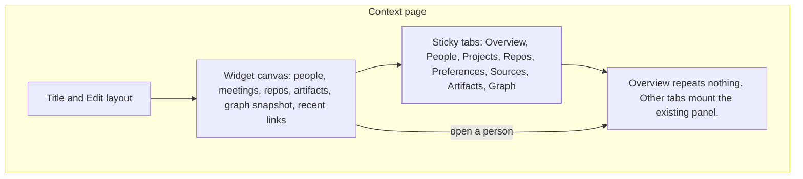

# Widgets and role templates

Implemented on `feature-2` after the owner approved this spec. The sections below are the contract the code follows.

## Changes in this revision

`feature-one` is complete at `1741548` (cowork: meetings, recap, capture, morning brief, stale nudges, shortcuts). This revision rereads `git diff origin/main...origin/feature-one` against `main` at `bdae3a2` and replaces the collision list with a trial merge. The throwaway branch was not pushed.

Textual conflicts, if the plan's file edits land before `feature-one`: `today/page.tsx`, `hub-api/src/index.ts`, `hub-web/lib/api.ts`, `packages/shared-types/src/index.ts`. `schema.prisma` auto-merged. `README.md` conflicts between current `main` and `feature-one` and is not a widgets edit. Build order is: merge `feature-one` to `main` first, then rebase this docs branch onto that `main`. Meeting cues and stale nudges become Today widgets that wrap the components `feature-one` already shipped. The Reading pile Today row no longer says "Artifacts is not on Today".

The rest of the plan was written against `feature-2`'s parent `fd1d356`. Where `feature-one` changes that ground truth, the sections below say so.

Ensemble sits between a planner and an IDE. The thing people pay for is the Context graph (people, repos, projects, tasks, meetings, artifacts), not a pile of charts and not a chat column. Widgets are lenses onto that graph. A template is a starting layout plus a few real rows, not a theme and not a config file.

## 1. Today as a resizable widget canvas

Today (`apps/hub-web/app/(hub)/today/page.tsx`) is already the home page: an orbit of counts, a work calendar, focus, proposals, and rails for deliverables and reminders (`components/today/rail.tsx`, `components/today/work-calendar.tsx`). Data arrives in one call, `GET /api/today/home` (`apps/hub-api/src/routes/views.ts`), then later edits refetch the slice. Widgets wrap those blocks. They do not invent a second home.

`feature-one` inserts two more blocks on that page, and the canvas should wrap them rather than replace them with new UI:

| Block | Already built | Widget |
|---|---|---|
| Meeting cues | `components/today/meeting-cues.tsx`, `GET /api/meetings/cues` | `meeting-cues`. Prep, live, and follow-up cards. Returns nothing when there are no cues, and the tile does the same so an empty day does not show a blank card. |
| Still relevant | `components/today/stale-nudges.tsx`, `GET /api/nudges`, `POST /api/nudges/:taskId` | `stale-nudges`. Keep, snooze, done, trash. Snooze and keep write `Task.nudgePausedUntil`. The widget does not add a second pause column. Hidden when the list is empty. |
| Morning brief | Scheduler calls `deliverMorningBrief`. Settings `morningBrief.enabled` / `morningBrief.time` (default on, 08:00). The bell shows the note. `GET /api/brief/today` | `morning-brief`, S or M. It reads the note that was already delivered. It does not schedule a second brief and it does not send mail. |
| Week recap | `/recap`, `GET /api/recap/week` | Not a canvas. An S tile may link there. The page stays one document. |

Quick capture (`ShortcutsHost`, `POST /api/capture`) and the top-bar ask field stay chrome. They are not tiles. The ask field already searches the hub. A widget does not add another one.

### Patterns worth borrowing

| Source | Pattern | Take | Leave |
|---|---|---|---|
| [Notion dashboards](https://www.notion.com/help/dashboards) | View mode vs edit mode. Widgets are views, not the database. Cap of 4 per row and 12 per dashboard, called out as a performance limit. Row height is dragged; width is dragged between neighbours. [Charts](https://www.notion.com/help/charts) are one widget kind. [Write-up](https://matthiasfrank.de/en/notion-dashboards-database-view/). | Edit mode is explicit. 12-widget cap. View mode cannot accidentally wreck the layout. | Widgets are not arbitrary database views. No global filter builder. No second dashboard stacked on the page to dodge the cap. Users do not author widget types. |
| [iOS 18 home screen](https://9to5mac.com/2024/07/16/ios-18-lets-you-change-widget-sizes-right-from-your-home-screen/) | Jiggle / edit mode, a corner handle that snaps to the next family, and a long-press menu of sizes. Families are [small, medium, large, extra large](https://developer.apple.com/documentation/widgetkit/preparing-widgets-for-additional-contexts-and-appearances) (`systemSmall` 2×2, `systemMedium` 4×2, `systemLarge` 4×4, `systemExtraLarge` on iPad). [MacRumors walkthrough](https://www.macrumors.com/guide/ios-18-home-screen/). | Discrete size classes, a visible handle, edit mode, snap. | Smart Stacks (widgets hidden behind a swipe). Free gaps that shove other tiles onto a new page. App-icon conversion. |
| [Android widgets](https://developer.android.com/develop/ui/views/appwidgets/layouts) | `targetCellWidth` / `targetCellHeight` are the default span in launcher cells. `minResize*` / `maxResize*` bound the drag. `resizeMode` is horizontal, vertical, or both. Handles show on touch-and-hold. [Glance attributes](https://developer.android.com/develop/ui/compose/glance/create-app-widget). [Quality rules](https://developer.android.com/develop/adaptive-apps/quality-guidelines/widget-quality): hit the grid edges, 48×48 dp targets, do not grow into empty padding. | Per-type min and max span. Resize snaps to cells. Touch targets stay large. | dp-based continuous resize. A different layout file per pixel size. |
| [Linear dashboards](https://linear.app/docs/dashboards) | Insights (chart, table, single number) collected on one page, with a dashboard filter and a personal scope. [Changelog](https://linear.app/changelog/2025-07-24-dashboards). | Drill from a number to the underlying rows. Personal, not a shared BI board. | A chart product. Enterprise-only dashboard objects. Cross-team filters. |
| [ClickUp dashboards](https://clickup.com/blog/dashboard-examples-in-clickup/) | Drag, resize, live widgets over tasks. Views (where you work) stay separate from dashboards (where you look). | That split: the board stays a board. | Embed widgets, workload charts, and a widget catalog large enough that most tiles decorate. |
| [Things widgets](https://culturedcode.com/things/support/articles/2803567/) | One list widget, S/M/L/XL, each instance pointed at a different list. [Launch post](https://culturedcode.com/things/blog/2020/09/the-all-new-widgets/). | Size changes what you see (a count vs a list), and each instance has a small config. | Calendar events inside the list widget. Stacks. |
| [Todoist widgets](https://www.todoist.com/help/articles/use-a-todoist-widget-on-an-apple-device-ptRdme) | Tasks at S/M/L, a medium stats tile, a small add-task tile. Medium and large can complete a task. | Complete and add from the tile when the size is large enough. | Karma / productivity scores. |
| TickTick ([App Store](https://apps.apple.com/us/app/ticktick-to-do-list-calendar/id626144601)) | Many home-screen tiles: lists, calendar, habits, focus timer. | A calendar tile next to a list. | Habits, pomodoro, countdowns. Not this product. |
| [Anytype sidebar widgets](https://doc.anytype.io/anytype/basics/sidebar/widgets) | A widget is a live lens (compact, detailed, or a link) into an object you already have. | Density changes with size. Start with few widgets. | Putting lenses in the 220px sidebar. That column is navigation (`components/shell/sidebar.tsx`). |
| [Obsidian Canvas](https://obsidian.md/canvas) | Freeform cards and arrows. | Nothing for Today. The graph tab is already the map. | An infinite canvas. It fights snap, keyboard layout, and the JS budget. |
| [Coda](https://coda.io/) | A doc that behaves like a small app: tables, buttons, formulas. | Buttons that run a real action (add a task, open a person). | A formula language. End users do not get code or config. |
| [Craft](https://www.craft.do/) | Quiet cards, strong type, dark-capable. | Visual calm. Widget chrome stays a hairline border and the existing `tile` class. | Block-level freeform layout. Task pages already have TipTap for that. |
| [Sunsama](https://www.sunsama.com/) | The day is a plan: now, next, shutdown. | Order widgets as a plan (focus, then calendar, then waiting). | A guided ritual wizard on every open. |
| [Motion](https://www.usemotion.com/) | The calendar eats the task list and auto-places work. | Show the calendar beside focus. | Auto-scheduling. `todayFocus` stays a choice (`auto` / `keep` / `hidden` on `Task`). |

### Size classes

The canvas is a cell grid. A widget occupies a rectangle of cells. The user never picks a pixel size. Dragging the handle steps to the next allowed class, the way iOS 18 steps between families and Android steps between cells.

| Class | Cells at 12 columns (wide) | What it may show |
|---|---|---|
| S | 3 × 2 | One number, one next item, or a short stack of three rows. No editor, no chart. |
| M | 6 × 2 | A short list (about five rows) or a compact calendar. |
| L | 6 × 4 | The working list: focus, proposals, people, artifacts. |
| XL | 12 × 4 | One primary list or the graph snapshot. At most one XL per surface. |

Every widget type declares `sizes: { min, max, default }` and a content plan per class. The registry refuses a class outside that range (Android `minResize*` / `maxResize*`). Examples:

| Widget | Min | Max | Default | S | M | L / XL |
|---|---|---|---|---|---|---|
| Orbit | S | M | M | Five counts, no labels if they wrap | Counts with labels, as today | — |
| Focus | M | XL | L | — | Five tasks | Full focus list, complete in place |
| Proposals | M | L | M | — | Three proposals, actions on hover | Actions always visible |
| Calendar | S | L | M | Next event only | Work week, as today | Week plus the day's titles |
| Deliverables | S | L | M | Next due date | Five rows | Rows plus add |
| Reminders | S | M | S | Next reminder | The rail | — |
| Needs-me count | S | S | S | Count, links to `/needs-me` | — | — |
| People | S | L | M | Three names | Cards | Cards plus last touch |
| Meetings | S | L | M | Next cue | `meeting-cues` cards | Cards plus the note excerpt. Opens `/meetings`. |
| Still relevant | M | L | M | — | The nudge list | Same, with the reason line |
| Morning brief | S | M | S | One line of the delivered note | The note, link to the bell | — |
| Week recap | S | S | S | Link to `/recap` | — | — |
| Repos | S | L | M | One tracked repo | List | List plus project link |
| Artifacts | S | L | M | Latest title | Eight titles | Titles plus kind |
| Graph snapshot | M | XL | L | — | Counts and three edges | The existing graph, capped nodes |
| Recent links | S | M | M | Three links | Eight links | — |
| Column summary | S | S | S | Five counts | — | — |
| WIP | S | M | M | In-progress count vs cap | Count plus the names | — |
| Blocked | S | M | M | Count | The blocked titles | — |
| Week done | S | L | M | A number | Seven daily counts | The counts plus titles |

Growing a widget only reveals rows that were already loaded for that widget. It does not add a new query. Shrinking clips with a "N more" link. Empty space inside a tile is a bug (Android's quality rule).

### Edit mode

View mode is the default, as in Notion. Dragging a task, completing it, or opening it does not move the tile.

Edit mode:

1. A text button, "Edit layout", in the page header. Not a hidden gesture.
2. Tiles pick up a 1px accent outline. Motion respects `appearance.reduceMotion` (no jiggle when that is on; a static outline instead).
3. A corner handle, 44×44 px (Android asks for 48 dp). Pointer-drag steps through the allowed classes and draws the target rectangle. It does not reflow neighbours until drop.
4. A size menu on the handle (S / M / L / XL, illegal sizes disabled) for people who will not drag.
5. Drag the tile body to another cell. Drop snaps. If the rectangle does not fit, the tile returns. Nothing is pushed onto a second page.
6. Remove is a button on the tile, not a drag-to-trash. Add is a picker of registered types not already present. One instance of each type per surface in v1 (Things allows many; we do not, until someone asks).
7. Done saves. Cancel restores the snapshot taken when edit mode opened.
8. "Reset to template" is a separate confirm. It restores placements from the template the account picked. It does not delete tasks, people, or pages.

Packing is row-major, top to bottom, no overlap, no holes wider than a cell that a later S could fill. That is enough. Masonry and free coordinates are out.

### Keyboard and touch

- Edit mode: Tab reaches tiles, then the handle, then Remove. Arrow keys move the focused tile by one cell (`@dnd-kit` keyboard sensor, already how the board moves cards). `[` and `]` step size. Escape cancels the gesture or leaves edit mode. Enter on Done saves.
- View mode: existing Today keys (J/K, M, A, L, D, O) keep working inside the focus and proposal widgets. They do nothing when focus is on the canvas chrome.
- Do not bind a global "edit layout" letter. `ShortcutsHost` (`components/shell/shortcuts-host.tsx`) already owns the window keydown. C starts quick capture when you are not typing. Edit layout stays the header button. A later shortcut, if one is wanted, is registered in that host, not a second listener in `layout.tsx`.
- Touch: the handle is the only resize affordance. The tile body scrolls the page in view mode and drags only in edit mode, after a short hold, so a flick still scrolls.
- Each tile is `role="region"` with an accessible name. The handle is a button, `aria-label` includes the current class ("Resize Focus, medium").

### Responsive behaviour

The sidebar is 220px and hidden below the `md` breakpoint (`app/(hub)/layout.tsx`, `max-md:hidden`). The canvas column count follows the width of `main`, not the window chrome.

| Viewport | Sidebar | Columns | How classes map |
|---|---|---|---|
| 1440 | visible | 12 | S 3×2, M 6×2, L 6×4, XL 12×4 |
| 1024 | visible (~800px content) | 8 | S 2×2, M 4×2, L 4×4, XL 8×4 |
| 768 | drawer | 4 | S 2×2, M 4×2, L 4×3, XL 4×4 |
| 390 | drawer | 4 | S 2×2, M 4×2, L 4×4, XL 4×5, full width |

One saved layout. The breakpoint only changes how many columns a class spans. Order is the saved order. A wide XL becomes a full-width block on a phone; it does not disappear. We do not store a second phone layout. Two layouts drift, and "reset" becomes ambiguous.

### Persistence

One row per user per surface (`today`, `context`, `board`). See the table in section 6. The document is the order and the class of each widget, plus a tiny config (WIP cap, graph node cap). It is not in `preferences` under `hub.settings`. That JSON is deep-merged and loaded with settings; a layout does not belong there.

Device scope: shared. The open question at the end asks whether a phone override is wanted later.

Reset copies the template's placements back onto that row. Starter tasks are not recreated if they already exist (`sourceRef` idempotency, section 4).

### Performance budget

Measured baseline in `docs/UI_PERF_DESIGN.md` (2026-09-29, production build):

| Route | Page JS | First load JS |
|---|---:|---:|
| `/today` | 6.6 kB | 137 kB |
| `/board` | 21.8 kB | 142 kB |
| `/context` | 12.3 kB | 136 kB |
| `/code/review` | 240 kB | 371 kB |

Shared shell is 103 kB. TipTap already sits on the task page (283 kB first load). CodeMirror dominates review.

Budgets for this work:

- View mode on `/today` adds at most 8 kB to the page chunk (target ≤ 15 kB page JS, ≤ 150 kB first load). Edit mode, the drag sensors, and the add-widget picker load with `next/dynamic` on the first click of "Edit layout".
- At most 12 widgets on a surface (Notion's cap, for the same reason). At most 24 placements across the three surfaces.
- No new server cache. `GET /api/today/home` stays the boot call. A widget that is not in the template does not add a request. Context widgets fetch when they enter the viewport (`IntersectionObserver`), with the existing `take` limits on `/api/people`, `/api/repos`, `/api/artifacts`, `/api/context/graph`.
- Graph snapshot reuses `components/context/graph.tsx` via the same `dynamic()` import Context already uses. It is not on the Today critical path unless the template includes it, and then it is still deferred.
- Widget bodies are client components, matching Today today (`"use client"`). The page shell can stay a server component that renders skeletons with reserved height per size class so CLS stays under 0.1. Do not SSR the graph.
- Drag uses transforms until drop. No layout read on pointer move. That is the jank budget: editing must stay on the compositor.
- Board card drag and widget drag are never mounted together. See below.

### Board

The board (`components/board/board.tsx`) is a five-column kanban (proposed, todo, in progress, waiting/blocked, done) built on `@dnd-kit`. That canvas is the work surface. It does not become a widget grid.

A strip above the columns may hold four widgets, off by default so existing boards look the same:

| Widget | Job | Why it does not replace the column |
|---|---|---|
| Column summary | Counts for the five columns | The columns already show the cards. The strip is for a glance when the board is scrolled horizontally. |
| WIP | In-progress count against a cap stored on the layout (default 3) | A warning, not a lock. Dropping a card still works. |
| Blocked | Tasks in `blocked` | They already share the waiting column. The strip lists them so they are not buried. |
| Week done | Completions in the last seven days | The done column is capped by `completedVisible` (3–20, default 5) and links to `/completed`. The strip is the trend; it is not a second done column. |

The strip is a sibling of the column scroller, with its own edit mode. It is not a parent `DndContext` around the cards. Nested drag contexts are how the board breaks.

Burndown here means seven daily counts from `completedAt`, not a story-point chart and not a new metrics table.

## 2. Context landing

Context (`app/(hub)/context/page.tsx`) is seven tabs: people, projects, repos, preferences, sources, artifacts, graph. Tabs are the full lists. They stay.

Recommendation: a widget overview above the tab strip. Choosing a tab replaces the overview with the list that already exists. The overview is the default when `tab` is absent. Deep links keep working (`/context?tab=people&who=…` from the Today orbit).

Why this and not the alternatives:

- Tabs beside a canvas: at 1440 the graph already wants the full width (`px-4` when `tab=graph`). A side-by-side split steals that width, and at 768 and 390 the split collapses into the "sections below" design anyway.
- Lists only below the fold, with no tabs: the lists are long (artifacts, graph). A sticky tab strip is the control people already know. Hiding it under a canvas makes the graph two scrolls away.
- A split view: the worst of both at the widths we care about.



ASCII at 1440, overview selected:

```
Context                                          Edit layout
+------------------+------------------+------------------+
| People        M  | Meetings      M  | Repos         M  |
| 4 names          | next + 3 notes   | tracked          |
+------------------+------------------+------------------+
| Artifacts              L            | Graph snapshot L |
| latest 8                            | capped nodes     |
+-------------------------------------+------------------+
| Recent links                    M                      |
+--------------------------------------------------------+
[ Overview ] People  Projects  Repos  Preferences  Sources  Artifacts  Graph
```

At 390 the same six widgets stack full width in that order. The tab strip scrolls horizontally and sticks under the top bar.

Widget clicks:

| Widget | Click |
|---|---|
| People | `/context?tab=people` or the person card's existing edit |
| Meetings | meeting note on the project, or the calendar event. There is no meetings route on this branch. |
| Repos | `/context?tab=repos` |
| Artifacts | `/context?tab=artifacts` |
| Graph snapshot | `/context?tab=graph` |
| Recent links | the target entity |

Preferences and Sources are not widgets. They are setup, and they stay one tab away.

## 3. What is not a widget canvas

Trash, Completed, and every structural or system screen stay single-purpose. A widget grid on those pages hides the one job they have.

Routes below are the `page.tsx` files on this branch, plus `/meetings` and `/recap`, which `feature-one` adds and which this plan treats as already decided. Implementation happens after that branch is on `main`.

| Route | Widget canvas? | Why |
|---|---|---|
| `/` | No | Redirects to `/today`. |
| `/login` | No | Auth. |
| `/signup` | No | Auth. Role and template screens are a wizard, not a canvas. |
| `/welcome` | No | First-run setup: model key, connections, editors. |
| `/today` | Yes | Home. Section 1. |
| `/board` | Strip only | Columns stay a kanban. Section 1. |
| `/needs-me` | No | One decision queue (approvals, editor prompts). A tile would hide a decision. A count tile on Today links here. |
| `/runs` | No | Chronological agent log. Filtering belongs on the page, not a layout. |
| `/context` | Yes, overview | Section 2. The seven lists stay tabs. |
| `/projects` | No | Redirects to `/context?tab=projects`. |
| `/projects/[id]` | No in v1 | A project page is a document (summary, people, repos, deliverables, tasks, notes). Section 7. |
| `/tasks/[id]` | No | The task page is the editor (TipTap). Widgets around a document are how Notion gets slow. |
| `/skills` | No | The agent instruction editor. Not a dashboard. |
| `/workspace` | No | The live agent queue. Operational, like Needs me. |
| `/code` | No | Review list plus the terminal. |
| `/code/review` | No | The diff. Already 371 kB first load. |
| `/metrics` | No | Fixed report (calls, cost). A spend number may appear as a Today tile later; the page does not become a canvas. |
| `/connect`, `/connect/[app]` | No | Bridge setup. |
| `/settings` | No | Account, models, appearance, retention, and (from `feature-one`) morning brief, quiet nudges, and quick capture. |
| `/meetings` | No | Keyboard notes for one meeting (`MeetingSession`). An editor, like a task page. Cues on Today link here. |
| `/recap` | No | One weekly document: done, decided, slipped, meetings. Copy and download. Not a canvas. |
| `/completed` | No | The retention window for finished work. Search and pin stay a list. |
| `/trash` | No | Restore and empty. Widgeting trash is how people miss a restore. `MeetingSession` rows already soft-delete into trash. |

## 4. Role-based signup

After a successful `POST /api/auth/signup` the person is signed in and lands on a short wizard, then the existing welcome cards. They cannot skip the template. They never see JSON, a config file, or a widget id.

### Screens

1. **Account.** The current `AuthForm` (`app/signup/page.tsx`). Name, email, password. Unchanged.
2. **Role.** Five cards: Student, Teacher, Lawyer, Engineer, Vibe coder. One sentence each. No "general" card. Picking a role does not apply a layout yet.
3. **Template.** Five previews for that role. Each card is a static image, a name, and two lines. Exactly one must be selected. Confirm is disabled until then. Back returns to the role without losing the account.
4. **Apply.** One request creates the layout rows and the starter projects, tasks, deliverables, and task pages. Failures roll back. The button does not navigate until the request returns.
5. **Welcome.** The current `/welcome` cards (model, connections, editors), all still optional, plus "Go to Today". Today is already the template, not the old hard-coded stack.

If they close the tab on screen 2 or 3, the next HTML load of a hub route resumes the wizard. `users.onboarding_completed_at` stays null until screen 4 succeeds. Welcome itself stays optional.

### What a template contains

A template is a TypeScript module in the repo, not a row a user can edit.

| Piece | Contents |
|---|---|
| Identity | `id`, role, name, two-line blurb |
| Layouts | Placements for `today`, `context`, and optionally the board strip. Each placement is type + size class + order. |
| Starter graph | Projects, tasks, deliverables, task pages, and a few people with obvious placeholder names the person is told to rename. No fake repos and no fake emails that look real. |
| Act-as | One of the existing presets. Written to `settings.assistant.actAs`. |
| Highlighted actions | Up to four prompt strings the template wants on Today and Context. They are suggestions, ordered ahead of the preset's list. They do not add tools. |
| Labels | Short chips stored as `task.taskType` (the column already exists) and as the project name. There is no label table. v1 does not add one. |

Starter rows use `sourceRef` `template:<templateId>:<slug>` and `sourceKind` `manual`. Apply is idempotent: a second apply does not duplicate a slug that is still present (including in trash). Reset layout does not re-seed.

### How previews are produced

Static images, generated at build time, committed under `apps/hub-web/public/templates/<id>.webp` (dark) and `<id>-light.webp`.

A small script renders each template's fixture HTML to a 2× WebP (about 1200×750). Signup only receives the image URL, the name, and the blurb. It does not import the widget canvas, `@dnd-kit`, or the home query.

Live previews would pull Today's client tree onto `/signup`, which is 1.6 kB page JS and 125 kB first load today. Five live grids would also need seed data and a session. The wizard must paint in one frame.

Dark is the default theme, so the dark image is the one on the card. If `appearance.theme` is already `light` (it is not, on a new account), the light file is used. Both files exist so a later visit to the template picker in Settings does not show a dark screenshot to a light-mode user.

Images are decorative. The name and blurb are the accessible name.

### Data model

```text
users.onboarding_role            text null    -- student | teacher | lawyer | engineer | vibe
users.onboarding_template_id     text null
users.onboarding_completed_at    timestamptz null

widget_layouts
  id            uuid pk
  user_id       text
  surface       text          -- today | context | board
  template_id   text null
  document      jsonb         -- validated, see cap below
  updated_at    timestamptz
  unique (user_id, surface)
```

`document` is a versioned object:

```text
{ "v": 1, "placements": [ { "type": "focus", "size": "l" } ], "config": { "wipCap": 3 } }
```

Zod rejects unknown types, sizes outside the registry range, duplicates, more than 12 placements, and a serialised size over 16 KB. Order is array order.

Role and template id live on `users`, not inside `hub.settings`. `feature-one` already added `settings.morningBrief` (`enabled`, `time`) and `settings.staleNudge` (`enabled`, `untouchedDays`, default 14) on `Settings` in `packages/shared-types/src/assistant.ts`. Onboarding must not share that object.

`feature-one` also added `Task.nudgePausedUntil` and `MeetingSession` (`meeting_sessions`), in migration `20260929180000_cowork_surfaces`. Widgets read those. They do not alter that migration. The widget migration is a later timestamp so it sorts after cowork. Starter due dates must be real `YYYY-MM-DD` values: `parseDue` in `apps/hub-api/src/lib/clock.ts` now rejects a date that is not a real calendar day.

Cowork routes stay cowork's. Layout routes do not reuse these paths: `/api/notifications`, `/api/brief/today`, `/api/brief/deliver`, `/api/capture`, `/api/capture/preview`, `/api/meetings/cues`, `/api/meetings/sessions`, `/api/meetings/summarize`, `/api/ask`, `/api/recap/week`, `/api/nudges`.

The catalog is code: `packages/shared-types/src/templates/`. The API imports it to apply. The web imports a manifest of `{ id, role, name, blurb, image }` only.

### Act-as, from PR #3

`ActAs` is `general | student | engineer | teacher | lawyer` (`packages/shared-types/src/assistant.ts`). `personaBlock` and `quickActions` (`packages/shared-types/src/personas.ts`) change tone and suggested prompts. They do not change `allowedWriteAreas`, the tool registry, or `userId` scope. The mention panel can override act-as for one invoke; that override is not saved. Settings → Models stores the saved preset.

| Signup role | Saved `assistant.actAs` | Notes |
|---|---|---|
| Student | `student` | Bias: split an assignment, quiz from notes, check citations, who did what. |
| Teacher | `teacher` | Lesson plan, inline feedback, who is falling behind, practice questions. |
| Lawyer | `lawyer` | Clause summary, compare drafts, obligations and deadlines, risky wording. Web research must cite. |
| Engineer | `engineer` | Triage into repo-linked tasks, explain plainly, who knows this code, release notes. |
| Vibe coder | `engineer` | Same preset. Different layout and highlighted prompts (section 5). No new enum value in v1. |

`general` remains the default for accounts created before this ships, and for anyone who changes the Settings select later. Changing act-as in Settings does not swap the layout. Layout and persona are independent after signup.

Highlighted prompts are a template concern. `quickActions` still returns at most four strings. The template's highlights are preferred on `today` and `graph` when the saved template id matches. They are still just prompt text.

## 5. The templates

Engineer and vibe coder do not share a catalog. A shared set either looks like a status meeting (wrong for someone shipping one idea) or like a single project with no repo (wrong for someone triaging a branch). Each role is shown five previews and must pick one. That is 25 templates. They all use the same widget registry and the same `engineer` preset for the two developer roles.

Meeting cues, still-relevant, and the morning-brief tile exist for every role. They are listed in a row only when that template features them. People-and-calendar templates (group project, partner work, office hours, client morning) include meeting cues at M. Deadline templates (exam week, deadline wall, on-call morning) include still-relevant at M. The others leave those tiles out. The person can add them. Accounts with no template, in phase 1, get the post-`feature-one` order: orbit, meeting cues, calendar, still-relevant, then focus and the rails. Empty cue and nudge lists stay hidden, which is what those components do now.

Layouts below are the wide (12-column) order. At 1024, 768, and 390 the same widgets wrap under the rules in section 1. "Row" is a visual grouping, not a stored coordinate.

Starter people are placeholders ("Teammate", "Instructor", "Client") with no email, so the next sync cannot collide with a real contact.

### Students

Act-as `student`. Highlighted prompts: "Split this into tasks", "Quiz me from my notes", "Check the citations", "Summarise who did what".

**1. Semester desk** — someone taking more than one course.

| | |
|---|---|
| Today | Orbit M, Focus L, Deliverables L, Calendar M, Reminders S |
| Context | People M, Meetings M, Artifacts L, Recent links M |
| Starter | Project "This semester". Tasks: "Read the brief", "List what the rubric grades", "Office hours question". Deliverable "Essay draft" due in two weeks. Task page on the essay: a heading and a citation checklist. Person "Instructor". Labels (`taskType`): `course`. |
| Better than Notion | The course, the instructor, and the essay are one graph. A Notion student template is a database the person has to keep in sync with a calendar by hand. Here the deliverable already drives the Today orbit and `todayFocus`. |

**2. Exam week** — the seven days before a test.

| | |
|---|---|
| Today | Reminders L, Focus L, Calendar M, Deliverables M, Still relevant M |
| Context | Artifacts M, People S, Recent links M |
| Starter | Project "Exam week". Deliverable "Final" due in five days. Tasks: "Practice set 1", "Practice set 2", "One page of weak spots". Reminder the evening before. Task page: ten prompts the person can ask `@ensemble` to quiz from. Label: `exam`. |
| Better than Notion | Reminders fire from the server on the account timezone even with no tab open (`docs/design/assistant-trash-comments.md`). A Notion checklist does not. |

**3. Group project** — work that has other people's names on it.

| | |
|---|---|
| Today | Focus M, Proposals M, People L, Meeting cues M |
| Context | People L, Graph snapshot L, Meetings M, Recent links M |
| Starter | Project "Group project". People: "Teammate", "Instructor". Tasks: "Agree the outline", "My section", "Their section" with `people` set. Page on the outline for who-did-what. Label: `group`. |
| Better than Notion | "Summarise who did what" is a real preset prompt over tasks that already store `people`. A Notion rollup only counts relations someone remembered to link. |

**4. Reading pile** — notes that should become tasks, not a second notebook.

| | |
|---|---|
| Today | Focus L, Reminders S, Deliverables S |
| Context | Artifacts L, Recent links M, People S, Graph snapshot M |
| Starter | Project "Reading". Tasks: "Source A notes", "Source B notes", each with a task page (claim, quote, page). Deliverable "Annotated bibliography". Label: `reading`. |
| Better than Notion | The note is the task page `@ensemble` already cites. A Notion wiki plus a task database splits the quote from the todo. |

**5. Application season** — many deadlines, little daily class.

| | |
|---|---|
| Today | Deliverables XL, Calendar M, Reminders M, Focus M |
| Context | People M, Artifacts M, Meetings S, Recent links M |
| Starter | Project "Applications". Deliverables: "Form", "Writing sample", "Recommendation" on different dates. Tasks: "Ask for the recommendation", "Draft the short answer". Person "Referee". Label: `application`. |
| Better than Notion | Due dates already enter the focus list (`isFocus` in `today/page.tsx`). The template does not need a formula column to surface "what is due". |

### Engineers

Act-as `engineer`. Highlighted prompts: "Triage this into repo-linked tasks", "Find who knows this code", "Explain this plainly", "Release notes from completed work".

**1. Branch desk** — daily driver for someone with a repo.

| | |
|---|---|
| Today | Focus L, Proposals M, Calendar M, Needs-me count S, Repos M |
| Context | Repos L, People M, Graph snapshot L, Recent links M |
| Board strip | Column summary, WIP (cap 3), Blocked |
| Starter | Project "Current work". Tasks: "Open the review", "Write the test", "Update the notes". No repo row is invented; the Repos widget is empty until Connect or a real repo exists, and it says so. Label: `branch`. |
| Better than Notion | The empty repo tile is honest. A Notion engineering template ships a fake GitHub relation that never updates. Linking a real repo is already a Context action. |

**2. Inbox triage** — proposals first.

| | |
|---|---|
| Today | Proposals L, Focus M, People S, Needs-me count S |
| Context | People M, Artifacts M, Recent links M, Meetings S |
| Starter | Two tasks in `proposed`: "Mail that might be a task", "A question to accept or drop". The proposal card's existing actions (mine, agent, later, drop) are the point of the widget. Label: `triage`. |
| Better than Notion | Proposed is a status with a decision, not a checkbox database. Drop moves through the same task service as the board. |

**3. Release desk** — cut notes from work that is actually done.

| | |
|---|---|
| Today | Deliverables L, Focus M, Reminders M, Calendar S |
| Context | Repos M, Artifacts M, People S, Recent links M |
| Board strip | Week done, Column summary |
| Starter | Project "Release". Deliverable "Ship". Tasks: "List what changed", "Write the notes", "Ask for review". Label: `release`. |
| Better than Notion | "Release notes from completed work" reads `CompletionRecord` and done tasks. A Notion template tells the model to look at a gallery view and hope the status property was filled in. |

**4. On-call morning** — what is blocked, then what is due.

| | |
|---|---|
| Today | Focus L, Reminders S, Calendar M, People M, Still relevant M |
| Context | People L, Meetings M, Graph snapshot M, Repos S |
| Board strip | Blocked, WIP, Column summary |
| Starter | Project "On call". Tasks: "Check what is blocked", "Reply to the page". Person "Teammate". Label: `oncall`. |
| Better than Notion | Blocked is a status the board already has. The strip lists those cards without a filtered linked view the next person can accidentally unfilter. |

**5. Partner work** — people and meetings ahead of the repo.

| | |
|---|---|
| Today | People L, Calendar L, Focus M, Meeting cues M |
| Context | Meetings L, People M, Artifacts M, Graph snapshot M |
| Starter | Project "Partner". Person "Partner". Meeting note "Last conversation" with an empty extraction. Tasks: "Send the recap", "Next question". Label: `partner`. |
| Better than Notion | The meeting note is a `MeetingNote` the graph already indexes. A Notion meeting template is a page that does not know the person. |

### Vibe coders

Same act-as `engineer`, different highlights: "Explain this plainly", "Draft the next step", "What is missing before the due date?", "Split this into tasks". No WIP strip. Fewer tiles. The idea is one project, not a portfolio.

**1. One idea** — the default for this role.

| | |
|---|---|
| Today | Focus XL, Calendar S, Reminders S |
| Context | Artifacts M, Recent links M, People S |
| Starter | Project "The idea". Task page "What it is" (problem, who it's for, the smallest demo). Tasks: "Describe it in five lines", "Build the smallest demo", "Show it to one person". Deliverable "Demo" in ten days. Label: `idea`. |
| Better than Notion | Three tasks and a page, already on Today. A Notion "build in public" template opens with six databases. |

**2. Weekend build** — a date, a demo, stop.

| | |
|---|---|
| Today | Focus L, Deliverables M, Reminders M, Calendar S |
| Context | Artifacts M, Recent links S |
| Starter | Project "Weekend". Deliverable "Demo" due Monday. Tasks: "Cut scope", "Build", "Stop". Reminder Sunday evening. Label: `weekend`. |
| Better than Notion | The reminder and the due date are the product. The template does not add a habit tracker. |

**3. Show someone** — the work is explaining it.

| | |
|---|---|
| Today | Focus L, People M, Calendar M |
| Context | People M, Artifacts L, Recent links M |
| Starter | Project "Show and tell". Person "Friend". Tasks: "Record the path", "Write what it does", "Send the link". Page: a script in plain sentences. Label: `demo`. |
| Better than Notion | "Explain this plainly" is the engineer preset, pointed at the task page. A Notion gallery of screenshots does not answer questions about the page. |

**4. Learn by shipping** — notes on what is confusing, next to the task.

| | |
|---|---|
| Today | Focus L, Reminders S, Deliverables S |
| Context | Artifacts M, Graph snapshot M, Recent links M |
| Starter | Project "Learning". Tasks: "Make it run", "Write down what broke". Page on the second task: "What I don't understand yet". Label: `learn`. |
| Better than Notion | The confusion lives on the task the agent will see. A separate notes database loses the link the first time the person forgets a relation. |

**5. Keep it small** — for people who hate dashboards.

| | |
|---|---|
| Today | Focus M, Reminders S, Deliverables S |
| Context | Recent links M |
| Board strip | off |
| Starter | Project "Now". One task: "The next hour". One deliverable with no date. Label: `now`. |
| Better than Notion | The template is allowed to be quiet. Notion's marketplace rewards templates that fill the page. This one leaves room. |

### Teachers

Act-as `teacher`. Highlights: "Draft a lesson plan", "Write inline feedback", "Who is falling behind?", "Practice questions".

**1. This week's lessons** — plan, then assign.

| | |
|---|---|
| Today | Calendar L, Deliverables L, Focus M, Reminders S |
| Context | Meetings M, Artifacts M, People M, Recent links M |
| Starter | Project "This week". Deliverable "Worksheet" due Friday. Tasks: "Draft the lesson", "Write five questions", "Print or post". Page on the lesson: aim, steps, check. Label: `lesson`. |
| Better than Notion | The lesson page and the worksheet deliverable share a project. A Notion teacher hub usually has a content calendar that does not know which student is stuck. |

**2. Who needs a check-in** — people before content.

| | |
|---|---|
| Today | People L, Focus M, Calendar M |
| Context | People L, Graph snapshot L, Meetings M |
| Starter | Project "Check-ins". People: "Student A", "Student B" (placeholders). Tasks: "Check in with A", "Check in with B". Label: `checkin`. |
| Better than Notion | "Who is falling behind?" can see tasks, dues, and people. A Notion student roster is a database with a select column the teacher maintains. |

**3. Marking pile** — feedback is the work.

| | |
|---|---|
| Today | Focus L, Artifacts via Context, Reminders M, Deliverables M |
| Context | Artifacts L, People M, Recent links M |
| Starter | Project "Marking". Tasks: "Mark set 1", "Write the comments", "Return them". Page: a short feedback shape (what worked, what next). Label: `marking`. |
| Better than Notion | "Write inline feedback" runs on the task page, where comments already exist (`PageDiscussion`). A Notion marking template stores feedback in a property the student never sees in context. |

**4. Office hours** — the calendar is the queue.

| | |
|---|---|
| Today | Calendar L, People M, Reminders S, Focus M, Meeting cues M |
| Context | Meetings L, People M, Recent links S |
| Starter | Project "Office hours". Meeting note "Questions from last time". Tasks: "Prep the example", "Follow up". Label: `hours`. |
| Better than Notion | Calendar events are already `Artifact` rows of kind `event` once Google is connected. The template does not embed a second calendar. |

**5. Course hub** — the Context page is the course.

| | |
|---|---|
| Today | Focus M, Deliverables M, Calendar M, People S |
| Context | People L, Artifacts L, Graph snapshot M, Meetings M |
| Starter | Project "Course". Deliverable "End of unit". Tasks: "Post the reading", "Open the discussion". People placeholders for a small cohort. Label: `course`. |
| Better than Notion | People, artifacts, and the unit deliverable are the same graph the student role uses. Two Notion templates (teacher home, student home) do not share rows. |

### Lawyers

Act-as `lawyer`. Highlights: "Summarise the clause", "Extract obligations and deadlines", "Compare the two drafts", "Flag risky wording". The persona already requires sources on web research.

**1. Matter desk** — one matter, its deadlines, its people.

| | |
|---|---|
| Today | Deliverables L, Reminders L, Focus M, People M |
| Context | People M, Artifacts L, Meetings M, Recent links M |
| Starter | Project "Matter". Deliverable "Filing" with a due date. Tasks: "Read the draft", "List the dates", "Send the question". Person "Client". Page: facts / dates / open questions. Label: `matter`. |
| Better than Notion | "Extract obligations and deadlines" creates tasks with reminders through the assistant's proposal flow, not a free-text toggle. A Notion legal template is a table of dates nobody is notified about. |

**2. Two drafts** — comparison is the layout.

| | |
|---|---|
| Today | Focus M, Reminders S, Deliverables S |
| Context | Artifacts L, Recent links M, People S, Graph snapshot M |
| Starter | Project "Drafts". Two tasks, "Draft A" and "Draft B", each with a task page of a short sample clause the person will replace. Label: `draft`. |
| Better than Notion | Both pages are addressable by `@ensemble` on the deliverable surface ("Compare the two drafts" is the preset). A Notion synced block does not carry citations. |

**3. Deadline wall** — dates ahead of narrative.

| | |
|---|---|
| Today | Reminders XL, Calendar M, Deliverables M, Still relevant M |
| Context | Meetings M, Artifacts M, People S, Recent links M |
| Starter | Project "Deadlines". Three reminders on different days. Deliverable "Response due". Task "Confirm the date". Label: `deadline`. |
| Better than Notion | Quiet hours already suppress reminder noise (`settings.quietHours`). A Notion calendar view will still badge a date at midnight. |

**4. Client morning** — who, then what they are waiting on.

| | |
|---|---|
| Today | People L, Calendar L, Focus M, Meeting cues M |
| Context | Meetings L, People M, Artifacts M, Recent links S |
| Starter | Project "Client work". Person "Client". Meeting note "Last call". Tasks: "Answer the question", "Send the summary". Label: `client`. |
| Better than Notion | The client is a `Person` the graph can connect to the matter, the note, and the task. A Notion CRM template stores the client as a page with a URL property. |

**5. Research trail** — every claim points at a source.

| | |
|---|---|
| Today | Focus L, Reminders S |
| Context | Artifacts L, Graph snapshot L, Recent links M, People S |
| Starter | Project "Research". Tasks: "Pull the clause", "Note the source". Page with an empty citation list the person fills. Label: `research`. |
| Better than Notion | Citations are a product rule on every persona (`personaBlock` says web research must show sources), and the bridge labels untrusted text. A Notion template can only ask the model nicely. |

## 6. Implementation plan

Do this after the plan is accepted. Do not start it on top of an unmerged `feature-one` (collision list below).

### Library

Use the `@dnd-kit/core` already in `apps/hub-web/package.json` (`^6.3.1`, plus sortable and utilities), and a small CSS grid. Do not add `react-grid-layout` or `gridstack`.

| Option | Size | Why it loses or wins |
|---|---|---|
| `react-grid-layout` | about 15 kB minified for v2, often cited nearer 29 kB gzip with `react-resizable` ([comparison](https://zoer.ai/posts/zoer/best-react-drag-drop-libraries-comparison), [review](https://safeguard.sh/resources/blog/react-grid-layout-npm-package-review)) | Continuous pixel resize, which we do not want. Width measurement breaks SSR and causes a first-paint jump. Keyboard support is poor. A second drag engine beside the board's dnd-kit. |
| `gridstack` | separate vanilla library, selector-based ([notes](https://puckeditor.com/blog/top-5-drag-and-drop-libraries-for-react)) | Same continuous grid. React integration is a wrapper around DOM classes. Accessibility is ours to rebuild. |
| `snapgrid` | about 8 kB on top of dnd-kit, but the current line is `@dnd-kit/react`, not the `@dnd-kit/core` 6.3.1 this repo pins | Would ship two dnd-kit generations. The packing we need is row-major and tiny. |
| CSS grid + existing dnd-kit | drag sensors already paid for by the board. Edit mode is a dynamic import. | Wins. Discrete classes are a few dozen lines of span math, not a layout engine. Keyboard and pointer sensors already exist. |

The cost we accept: collision and packing are our code, with unit tests. The behaviour is intentionally smaller than a general dashboard library (no nested grids, no masonry, no cross-grid drag).

### Files

New:

| Path | Role |
|---|---|
| `packages/shared-types/src/widgets.ts` | Zod registry: type, size range, default, config schema |
| `packages/shared-types/src/templates/` | 25 templates and the image manifest |
| `apps/hub-api/src/layouts/document.ts` | Parse, cap, pack |
| `apps/hub-api/src/layouts/apply.ts` | Idempotent starter rows through existing task/project/page services |
| `apps/hub-api/src/routes/layouts.ts` | HTTP |
| `apps/hub-api/prisma/migrations/<timestamp>_widget_layouts/` | Migration. Timestamp sorts after `20260929180000_cowork_surfaces`. Do not edit that folder. |
| `apps/hub-web/components/widgets/canvas.tsx` | Grid, view mode |
| `apps/hub-web/components/widgets/edit-mode.tsx` | Dynamic import |
| `apps/hub-web/components/widgets/registry.tsx` | Type → lazy component |
| `apps/hub-web/app/(hub)/start/page.tsx` | Role and template wizard |
| `apps/hub-web/public/templates/*.webp` | Previews |
| `apps/hub-web/e2e/widgets.mjs` | Playwright |
| `scripts/render-template-previews.mjs` | Build-time images |

Touched:

| Path | Change |
|---|---|
| `packages/shared-types/src/index.ts` | Export the registry and manifest |
| `packages/shared-types/src/personas.ts` | Optional highlight list, still max four, still no tool changes |
| `apps/hub-api/prisma/schema.prisma` | `WidgetLayout`, three columns on `User` |
| `apps/hub-api/src/index.ts` | Register `layoutsRoutes` |
| `apps/hub-api/src/routes/auth.ts` | Signup returns `onboardingComplete: false` |
| `apps/hub-api/src/lib/undo.ts` | Layout writes do not call `recordUndo` |
| `apps/hub-api/src/ensemble/surfaces.ts` | Anchor keys for widget instances; no new permission |
| `apps/hub-api/src/bridge/gaps.ts` | One `excluded` row for layouts |
| `apps/hub-web/app/(hub)/today/page.tsx` | One `<WidgetCanvas surface="today" />`. Bodies are the existing orbit, calendar, rails, `MeetingCues`, and `StaleNudges`. |
| `apps/hub-web/app/(hub)/context/page.tsx` | Overview plus the existing tabs |
| `apps/hub-web/components/board/board.tsx` | Optional strip sibling, default off |
| `apps/hub-web/app/(hub)/welcome/page.tsx` | Only shown after onboarding, copy unchanged |
| `apps/hub-web/lib/api.ts` | Layout and onboarding clients |
| `apps/hub-web/middleware.ts` | If onboarding is incomplete, HTML loads of hub pages redirect to `/start` |

Not touched:

| Path | Why |
|---|---|
| `apps/agent-runtime` | Presets do not change tools or the runtime request. |
| `apps/context-bridge/src/server.ts` | No layout resource. Gaps are served by hub-api. |
| `apps/hub-api/src/jobs/retention.ts` | Cowork already purges `meeting_sessions`. Layouts are not trash. |
| `apps/hub-api/src/jobs/scheduler.ts` | Morning brief and stale nudges already run on the tick. |
| `apps/hub-web/app/(hub)/layout.tsx` | `ShortcutsHost` and quick capture stay. No second key listener. |
| `apps/hub-web/components/shell/sidebar.tsx`, `command-palette.tsx`, `topbar.tsx` | `/meetings`, `/recap`, the ask bar, and the bell stay. No new nav item. |
| `packages/shared-types/src/assistant.ts` | `morningBrief` and `staleNudge` stay. Onboarding is not a settings key. |
| `apps/hub-api/package.json`, `apps/hub-web/package.json` | No new dependency. Test scripts gain widget paths only after rebase, appended after the cowork paths. |
| `apps/hub-api/src/cowork/**`, `apps/quick-capture/**` | Reuse. Do not fork. |
| Trash, Completed, Settings, Connect, code review, `/meetings`, `/recap` | Section 3. |

### API

| Method | Path | Body / result |
|---|---|---|
| `GET` | `/api/layouts/:surface` | The document, or the role template's default if no row yet |
| `PUT` | `/api/layouts/:surface` | Replace document. 400 on schema failure. |
| `POST` | `/api/layouts/:surface/reset` | Copy template placements. Does not seed. |
| `POST` | `/api/onboarding` | `{ role, templateId }`. Sets user columns, writes three layout rows, seeds starter rows, sets `assistant.actAs`, stamps `onboarding_completed_at`. One transaction. |
| `GET` | `/api/onboarding/templates?role=` | Manifest only |

`surface` is `today`, `context`, or `board`. Anything else is 404.

Auth is the existing session. Layouts are per `userId`. A bridge token is rejected the same way other non-read routes are rejected: these routes are not under `/api/bridge`, and a `bridge` scope already fails closed outside that prefix (`readOnlyTokenRejected`).

### Registry

One map, shared by API and web:

```text
type WidgetType = {
  id: string
  surfaces: ("today" | "context" | "board")[]
  min: "s" | "m" | "l" | "xl"
  max: "s" | "m" | "l" | "xl"
  defaultSize: "s" | "m" | "l" | "xl"
  config: ZodObject   // strict, small
  ensemble: { surface: SurfaceId; anchor: string }
}
```

The web registry adds a lazy component. Unknown ids in a stored document are dropped on read and reported in the response (`ignored: string[]`) so an old client does not white-screen. They are not silently saved back.

### Phases

`feature-one` merges to `main` before any of this is built. Then rebase `feature-2` onto that `main`. The only commit here is this document, and `feature-one` does not touch it, so that rebase should be clean. Do not rebase this branch onto `feature-one` while `feature-one` is still a side branch, and do not merge `feature-one` into `feature-2`. Cut the implementation branch from `main` after both of those land. Implementing against today's `main` (`bdae3a2`) and then merging `feature-one` is the trial below: four textual conflicts, plus the README conflict that already exists between `main` and `feature-one`.

0. This document. No app code.
1. Registry, table, GET/PUT, Today canvas in view mode. The default document matches the page after `feature-one`: orbit, meeting cues, calendar, still-relevant, focus, proposals, deliverables, reminders. Empty cue and nudge widgets render nothing.
2. Edit mode, snap, reset, the JS budget check.
3. Context overview. Tabs unchanged. The meetings widget links to `/meetings`.
4. Signup wizard, previews, apply. Existing accounts are not forced through it; they keep the phase-1 default and `actAs` general.
5. Board strip, default off, including on templates that list it. Templates that say the strip is off do not create a board row until the person adds one.
6. Project page widgets, only if section 7 is still wanted after 1–4 ship.

Each phase from 1 on is shippable on its own. Phase 1 is the current page, expressed as widgets.

### Tests

Unit (`node --test`, same as `apps/hub-api` today):

- Pack: no overlap, order stable, a class that does not fit returns to the previous rectangle.
- Zod: 13th widget rejected, unknown type rejected, config over the cap rejected, duplicate type rejected.
- Apply: second call does not duplicate `sourceRef`. Reset does not insert tasks.
- `personaBlock` still does not mention tools. Highlights do not exceed four prompts.
- Undo: a layout PUT creates no `UndoEntry`.

Playwright (`playwright-core`, the same driver as `apps/hub-web/e2e/*.mjs` and `scripts/measure-ui.mjs`) at 1440, 1024, 768, and 390:

- Default Today shows focus without entering edit mode.
- Edit, resize Focus from L to M, reload, the class stuck.
- Escape cancels a drag.
- Keyboard: Tab to handle, `]` changes size where the type allows.
- Context overview links to `?tab=people`. The people list still renders.
- Signup cannot continue without a template. After apply, Today shows that template's first widget.
- Board: drag a card between columns while the strip is on. The card lands. The strip does not steal the drag.

Perf: re-run `scripts/measure-ui.mjs` on `/today`, `/context`, `/board`. Fail the phase if `/today` first load JS exceeds 150 kB or the page chunk exceeds 15 kB. CLS on a cold Today load stays under 0.1 (reserved skeleton heights).

### Breakage risks

| Risk | What happens | Mitigation |
|---|---|---|
| Today keys | J/K triage moves a widget instead of a proposal | Keys apply only when the event target is inside the proposal or focus widget, which is how they should be scoped anyway. |
| dnd-kit nesting | Board cards stop moving | Strip is a sibling. Edit sensors unmount in view mode. |
| `hub.settings` merge | A layout array gets deep-merged into nonsense | Layouts are not settings. |
| Signup redirect loop | Middleware sends `/start` to `/start` | `/start` is allowed through when onboarding is incomplete. `/login` and `/signup` stay public. |
| Graph on the critical path | Today jumps toward the context chunk | Graph widget is dynamic and absent from the phase-1 default. |
| Placeholder people | A later sync recreates "Client" | Placeholders have no email and no external id. Copy on the card says to rename or delete. |
| Template images | Large WebPs on the signup route | One image per card, fixed box, `content-visibility` not required at five images. Cap each file around 80 KB. |

### Collisions with `feature-one`

`origin/feature-one` is `1741548` ("Harden cowork edges: real dates, ownership, and meeting notes"), 66 files, about 9.3k insertions over `origin/main` (`bdae3a2`). Merge-base with that `main` is `fd1d356`, which is also this branch's parent. Cowork is meetings, recap, quick capture, the morning brief, stale nudges, shortcuts, and the Tauri companion. It does not add widgets.

Trial, not pushed. A throwaway branch from `origin/main` was created in a local worktree and deleted afterwards.

1. `git merge origin/feature-one` onto that `main`. One textual conflict: `README.md` (the Mac start section on `main` versus the quick-capture bullet on `feature-one`). `apps/hub-web/app/(hub)/settings/page.tsx` auto-merged: `main`'s "Settings didn't load" state and `feature-one`'s brief, nudges, and capture sections both survived. This conflict is not a widgets edit. Whoever merges `feature-one` resolves the README.
2. The plan's intended edits were then committed on a fresh `main` (canvas replacing the Today stack, `layoutsRoutes` beside `connectRoutes`, layout methods on the `api` object, widget exports at the end of `packages/shared-types/src/index.ts`, `User` onboarding columns plus `WidgetLayout` at the end of the schema, and the other touched files). Merging `origin/feature-one` into that commit conflicted in four widgets files, plus the same README conflict.

Textual conflicts from the overlay:

| File | What conflicted | Resolution once `feature-one` is on `main` |
|---|---|---|
| `apps/hub-web/app/(hub)/today/page.tsx` | High. The canvas replacement and `feature-one`'s insert of `<MeetingCues />` and `<StaleNudges />` are the same hunk. | Edit the merged page. One canvas. Those two components are widget bodies, in that order, under the orbit and around the calendar. |
| `apps/hub-api/src/index.ts` | Low. Both add an import and a name in the route array next to `connectRoutes` (`layoutsRoutes` versus `coworkRoutes`). | Keep both lines. |
| `apps/hub-web/lib/api.ts` | Medium. Both append methods before the closing brace of `api`, after `deleteGithubGit`. | Keep the cowork methods and add the layout methods after them. |
| `packages/shared-types/src/index.ts` | Low. Both append an export (`./widgets.js` and `./templates/manifest.js` versus `./shortcuts.js`). | Keep both exports. |

`schema.prisma` did not conflict. The probe had `nudgePausedUntil`, `MeetingSession`, the three `User` columns, and `WidgetLayout` in one file. That is a migration-order collision, not a textual one, as long as the widget migration is a new folder with a later timestamp and nobody edits `20260929180000_cowork_surfaces`.

Every file `feature-one` changes that this work also touches, including the ones the implementation must not edit:

| File or area | Kind | Severity | Resolution |
|---|---|---|---|
| `today/page.tsx` | Textual. Same JSX stack. | High | As above. Do not hand-merge the stack ahead of the `feature-one` merge. |
| `hub-api/src/index.ts` | Textual. Route registration. | Low | Keep both registrations. |
| `hub-web/lib/api.ts` | Textual. Client object. | Medium | Append after the cowork methods. |
| `packages/shared-types/src/index.ts` | Textual. Barrel exports. | Low | Keep both exports. |
| `schema.prisma` and the cowork migration | Semantic. Schema and migration order. Textual merge was clean in the probe. | Medium | New migration only. Do not edit `MeetingSession` or `nudgePausedUntil`. |
| `packages/shared-types/src/assistant.ts` | Semantic. Settings keys `morningBrief` and `staleNudge`. | Medium | Do not add onboarding keys here. Read the two objects the widgets need. |
| `app/(hub)/layout.tsx` | Semantic. `ShortcutsHost` replaced the local keydown handler. | Medium | No edit. Edit layout is a button. |
| `settings/page.tsx`, `components/settings/sections.tsx` | Semantic. New settings sections. `main` and `feature-one` auto-merged the page. | Low | No settings section for widgets. Reset stays on the canvas. |
| `sidebar.tsx`, `command-palette.tsx` | Semantic. Nav entries for `/meetings` and `/recap`, plus capture, ask, and help. | Low | No new nav item and no layout command in phase 1. |
| `topbar.tsx` | Semantic. Ask bar, notification bell, titles for the two new routes. | Low | No edit. The morning-brief tile does not add a second bell. |
| `jobs/scheduler.ts` | Semantic. The tick already delivers the brief and ensures a stale notice. | Low | No edit. The brief widget only reads. |
| `jobs/retention.ts` | Semantic. Hard purge already deletes `meeting_sessions`. | Low | No edit. Layout rows are not in that list. |
| `routes/tasks.ts`, `services/tasks.ts`, `routes/system.ts`, `lib/clock.ts` | Semantic. Nudge pause on the task. `parseDue` rejects impossible dates. | Low | No edit. Template dates are real calendar days. |
| `hub-api/package.json`, `hub-web/package.json` | Semantic. The `test` script gained cowork and shortcut tests. Not a dependency bump. | Low | No edit until after rebase. Then append widget test paths after those entries. A pre-merge edit of the same script line would conflict. The probe did not edit these files, so they did not conflict. |
| `lib/platform.ts`, `components/ensemble/hotkey.tsx` | None for widgets. Shortcut platform check, and the hotkey ignores Alt and Ctrl+Meta. | Low | No edit. |
| `docs/18_WHAT_IS_REAL.md`, `docs/20_QUICK_CAPTURE.md`, `apps/quick-capture/**`, `apps/hub-api/src/cowork/**`, new pages `meetings/page.tsx` and `recap/page.tsx` | No shared lines. New surface area. | Low | Reuse the components and routes. Do not copy them into `components/widgets`. |
| `README.md` | Textual, but between current `main` and `feature-one`, not this plan. | Low for widgets | This document does not edit it. |

Files the plan touches that merged cleanly in the probe, because `feature-one` does not change them: `personas.ts`, `routes/auth.ts`, `lib/undo.ts`, `ensemble/surfaces.ts`, `bridge/gaps.ts`, `context/page.tsx`, `components/board/board.tsx`, `welcome/page.tsx`, `middleware.ts`.

Build order: merge `feature-one` to `main` (resolve `README.md` there), rebase `feature-2` onto that `main`, then implement. Rebase this docs branch. Do not retarget it onto `feature-one`. After the rebase the four textual conflicts above do not occur, because the implementation edits the merged files instead of racing them.

### Undo, trash, the bridge, `@ensemble`

**Undo.** Layout changes do not enter the undo stack (`apps/hub-api/src/lib/undo.ts`, depth `settings.undoDepth`, 3–20, default 5). A layout edit would evict a real content undo. Edit mode has its own Cancel (in-memory snapshot) and Reset (explicit confirm). Creating a task from a widget uses the normal task undo. Applying a template is not one giant undo batch: the seed can be a dozen rows, and undo-of-create sends rows to trash, which would look like the account deleted its own starter project. If apply fails, the transaction rolls back. After it succeeds, the person deletes unwanted starter rows the normal way (those deletes do undo).

**Trash.** A removed widget is a placement edit, not a deleted entity. Trashed tasks disappear from widgets because every query already filters `deletedAt`. Restoring a task makes it eligible again. Layout rows are not listed on `/trash` and are not purged by retention. `MeetingSession` already soft-deletes into trash and is hard-purged with the other deleted rows. A nudge action that marks done or trash uses the task undo `feature-one` already returns. That is task undo, not layout undo.

**Context Bridge.** Do not expose layouts. They are chrome. `DATA_GAPS` gets an `excluded` entry, same spirit as private reminders in `apps/hub-api/src/bridge/gaps.ts`. No new MCP tool in `apps/context-bridge`. A model does not need the user's tile sizes to read a task.

**`@ensemble`.** Widgets are surfaces, not a new product. Each type names an existing `SurfaceId` (`today`, `board`, `graph`, `deliverable`, …) and an `anchorKey` of `widget:<type>`. `loadSurfaceContext` can take a tighter `take` when the anchor starts with `widget:`, still scoped by `userId`. The Ask button already on columns and rails moves onto the widget header. Highlighted prompts from the template are chips, still max four, still proposals for writes. No widget runs a tool on render.

## 7. Other pages, later

Ranked by value against the size of the change. None of these are in phases 1–4.

| Rank | Page | Value | Effort | Note |
|---|---|---|---|---|
| 1 | Project (`/projects/[id]`) | High. The page is already people, repos, deliverables, tasks, meeting notes. A canvas makes a matter or a course readable. | Medium. New surface `project`, placements stored per project id, not one row per user. Cap 8. | Do this first if the Context overview feels too global. |
| 2 | Needs me | Medium. A count is not the queue. A single "oldest waiting" tile on Today is the useful part, and phase 1 can include that widget without widgeting the page. | Low for the tile, high and wrong for a canvas. | Keep the page as a list. |
| 3 | Person, inside Context | Medium. Tasks, meetings, and projects for one person. | Medium. Easy to turn into a CRM. | A section on the existing person card, not a new route, if it happens. |
| 4 | Deliverable | Medium. The surface prompts already talk about the brief and the due date. | Medium. The deliverable is a row with tasks under it. | A fixed header plus the task list beats a free canvas. |
| 5 | Metrics | Low. The report is already small. | Low to embed one number, high to widget the page. | A Today S tile "spend this week" that links to `/metrics`. |
| 6 | Runs, Workspace, Skills, Code | Low. Each has one job and a keyboard. | High risk. | Leave them. |

## Open questions

1. Phone layout: one shared document that reflows, as recommended, or a stored override below 768?
2. Vibe coder: keep `actAs: engineer`, or add a sixth preset that still cannot change tools?
3. Is 25 templates too many to maintain? The alternative is five developer templates with a flag for which role sees them, which collapses the distinction in section 5.
4. Placeholder people: acceptable, or should templates seed no people until Connect runs?
5. Board strip: off unless the template asks, as written, or off for everyone until they opt in?
6. Should "Reset to template" also offer "remove starter rows I never edited"? Default here is no.
7. Morning brief: a Today tile that only reads the note the scheduler already delivered, as written, or bell only?
8. Labels: is `taskType` plus the project name enough, or do you want a real tag list (still bounded) before templates ship?
9. When meeting cues or stale nudges are in the layout but empty, hide the tile (what those components do now) or keep a quiet empty slot so the grid does not jump?
